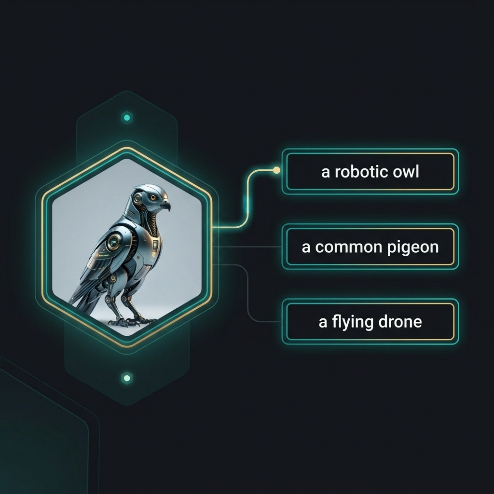

## Agenda

```{=html}
<div style="display: grid; grid-template-columns: repeat(2, 1fr); gap: 1.2rem; margin-top: 1.4rem;">
  <div style="background:rgba(28,53,94,0.08); padding:1.4rem; border-radius:12px;">
    <div style="font-size:2rem; text-align:center;">✂️</div>
    <strong>SAM3</strong><br>
    <small>Segment any object with a point or box — no training required</small>
  </div>
  <div style="background:rgba(28,53,94,0.08); padding:1.4rem; border-radius:12px;">
    <div style="font-size:2rem; text-align:center;">🔍</div>
    <strong>Vision Embeddings</strong><br>
    <small>Search and classify images by meaning with CLIP & DINOv3</small>
  </div>
  <div style="background:rgba(0,201,167,0.10); padding:1.4rem; border-radius:12px;">
    <div style="font-size:2rem; text-align:center;">🧠</div>
    <strong>Vision LLMs</strong><br>
    <small>Ask any question about an image — Qwen3.5 & Gemma4</small>
  </div>
  <div style="background:rgba(0,201,167,0.10); padding:1.4rem; border-radius:12px;">
    <div style="font-size:2rem; text-align:center;">📄</div>
    <strong>OCR & Documents</strong><br>
    <small>Read text, extract invoice fields — all with one VLM</small>
  </div>
</div>
```

::: {.callout-tip appearance="minimal"}
Prerequisites: Parts 1–5 complete. You know YOLO detect / segment / train / export.
:::

## From YOLO to HuggingFace

:::: {.columns}

::: {.column width="50%"}
**What YOLO gives you**

::: {.fragment .fade-up}
- Detect, segment, classify, track — fast
:::
::: {.fragment .fade-up}
- Pre-trained on COCO (80 classes)
:::
::: {.fragment .fade-up}
- Fine-tune on your own data
:::
::: {.fragment .fade-up}
- Export to ONNX / TensorRT for production
:::
:::

::: {.column width="50%"}
**What HuggingFace adds**

::: {.fragment .fade-up}
- 500k+ models across all AI tasks
:::
::: {.fragment .fade-up}
- Read text, understand documents
:::
::: {.fragment .fade-up}
- Segment **anything** without training data
:::
::: {.fragment .fade-up}
- Answer natural language questions about images
:::
:::

::::

::: {.fragment .fade-up}
::: {.callout-tip appearance="minimal"}
HuggingFace is not a competitor to YOLO — it's the rest of the toolkit.
:::
:::

# 1. The HuggingFace Ecosystem {.sdaia-dark background-gradient="linear-gradient(135deg, #1C355E, #00C9A7)"}

One hub. One API. Every model.

## What Is HuggingFace?

```{=html}
<div style="display: grid; grid-template-columns: repeat(3, 1fr); gap: 1rem; margin-top: 1.2rem;">
  <div style="text-align:center; background:rgba(28,53,94,0.08); padding:1.4rem; border-radius:12px;">
    <div style="font-size:2.2rem;">🗂️</div>
    <strong>Hub</strong><br>
    <small>500k+ models, 100k+ datasets — download any model in one line of Python</small>
  </div>
  <div style="text-align:center; background:rgba(28,53,94,0.08); padding:1.4rem; border-radius:12px;">
    <div style="font-size:2.2rem;">⚡</div>
    <strong><code>transformers</code></strong><br>
    <small>One unified Python library for inference, fine-tuning, and deployment of any model</small>
  </div>
  <div style="text-align:center; background:rgba(0,201,167,0.12); padding:1.4rem; border-radius:12px;">
    <div style="font-size:2.2rem;">🚀</div>
    <strong>Spaces</strong><br>
    <small>Deploy interactive Gradio apps in minutes — share your model with the world</small>
  </div>
</div>
```

```{python}
#| echo: false
#| fig-align: center
import matplotlib.pyplot as plt
import matplotlib.patches as mpatches
from matplotlib.patches import FancyBboxPatch, FancyArrowPatch

fig, ax = plt.subplots(figsize=(9, 2.2))
fig.patch.set_alpha(0.0)
ax.set_xlim(0, 10)
ax.set_ylim(0, 2)
ax.axis('off')

boxes = [
    (0.3,  "Image",         "#1C355E"),
    (2.8,  "AutoProcessor", "#1C355E"),
    (5.3,  "AutoModel",     "#00C9A7"),
    (7.8,  "Output",        "#FF8C00"),
]
for x, label, color in boxes:
    ax.add_patch(FancyBboxPatch((x, 0.55), 1.9, 0.9,
                                boxstyle="round,pad=0.08",
                                facecolor=color, edgecolor='none', alpha=0.9))
    ax.text(x + 0.95, 1.0, label, ha='center', va='center',
            fontsize=10, fontweight='bold', color='white')

for x in [2.2, 4.7, 7.2]:
    ax.annotate('', xy=(x + 0.6, 1.0), xytext=(x, 1.0),
                arrowprops=dict(arrowstyle='->', color='#1C355E', lw=2))

plt.tight_layout()
plt.show()
```

## The `pipeline()` API

:::: {.columns}

::: {.column width="50%"}
**Standardized interface for 40+ tasks**

```{=html}
<div style="background:rgba(0,174,141,0.05); border-left: 5px solid #00AE8D; padding: 1rem; border-radius: 0 12px 12px 0; margin: 1rem 0;">
  <div style="font-family: monospace; font-size: 0.85em;">
    <span style="color: #625D9C;">from</span> transformers <span style="color: #625D9C;">import</span> pipeline<br><br>
    pipe = pipeline(<br>
    &nbsp;&nbsp;<span style="color: #E96852;">"image-classification"</span>,<br>
    &nbsp;&nbsp;model=<span style="color: #E96852;">"google/vit-base"</span><br>
    )<br>
    res &nbsp;= pipe(<span style="color: #E96852;">"cat.jpg"</span>)
  </div>
</div>
```

::: {.callout-tip appearance="minimal"}
One function to rule them all. No need to learn new code for every new model.
:::
:::

::: {.column width="50%"}

| Feature | YOLO | HuggingFace |
|---------|------|-------------|
| **Load** | `YOLO(pt)` | `pipeline(task)` |
| **Run** | `.predict()` | `pipe()` |
| **Storage** | Local `.pt` | `~/.cache/hf` |
| **Scope** | Core CV | **Everything AI** |

<br>

```{=html}
<div style="text-align: center; background: #1C355E; color: white; padding: 0.8rem; border-radius: 12px; font-weight: bold; font-size: 0.9em;">
  HF is the "App Store" for AI models.
</div>
```
:::

::::


## The `AutoModel` Pattern

::: {.panel-tabset}

### Quick — `pipeline()`
```python
from transformers import pipeline

# Download + load + run in 3 lines
pipe = pipeline("image-to-text", model="Qwen/Qwen3.5-27B")
result = pipe("invoice.png", text="What text is in this image?")
print(result)
```

### Full Control — `AutoModel`
```python
from transformers import AutoProcessor, AutoModelForCausalLM
from PIL import Image
import torch

# Load separately for fine-tuning, batching, or custom logic
processor = AutoProcessor.from_pretrained("Qwen/Qwen3.5-27B")
model     = AutoModelForCausalLM.from_pretrained(
                "Qwen/Qwen3.5-27B", device_map="auto"
            )

image   = Image.open("invoice.png").convert("RGB")
inputs  = processor(images=image, text="What text is in this image?",
                    return_tensors="pt").to(model.device)
outputs = model.generate(**inputs, max_new_tokens=256)
print(processor.decode(outputs[0], skip_special_tokens=True))
```

:::

::: {.callout-tip appearance="minimal"}
Use `pipeline()` for exploration. Use `AutoModel` when you need batching, fine-tuning, or integration into a training loop.
:::

# 2. SAM3 — Segment Anything {.sdaia-dark background-gradient="linear-gradient(135deg, #1C355E, #00C9A7)"}

Zero-shot segmentation. Any object. No labels needed.

## You've Already Met SAM

:::: {.columns}

::: {.column width="55%"}
In **Part 3**, you used SAM as a **labeling superpower**. 

- Click an object → **Instant mask**
- Huge time saver for training datasets

**Today:** We use SAM3 as an **inference engine**.

- No custom training data required
- **SAM3.1** (2025): Better edges + video tracking
- High-quality cutouts for any application
:::

::: {.column width="45%"}
```{python}
#| echo: false
#| fig-align: center
import matplotlib.pyplot as plt
from matplotlib.patches import FancyBboxPatch

fig, ax = plt.subplots(figsize=(5, 5))
fig.patch.set_alpha(0.0)
ax.set_xlim(0, 10)
ax.set_ylim(0, 12)
ax.axis('off')

# Evolution path
boxes = [
    (1, 9, 8, 2, "#1C355E", "IMAGE SOURCE"),
    (1, 5, 3.5, 2.5, "#625D9C", "Part 3:\nLabeling Tool"),
    (5.5, 5, 3.5, 2.5, "#00AE8D", "Today:\nDirect App"),
    (1, 1, 3.5, 1.5, "#5b6678", "Train YOLO"),
    (5.5, 1, 3.5, 1.5, "#E96852", "Final Product")
]

for x, y, w, h, color, label in boxes:
    ax.add_patch(FancyBboxPatch((x, y), w, h, boxstyle="round,pad=0.1", 
                                facecolor=color, edgecolor='none', alpha=0.9))
    ax.text(x + w/2, y + h/2, label, ha='center', va='center', 
            color='white', fontsize=10, fontweight='bold')

# Arrows
arrow_props = dict(arrowstyle='->', color='#1C355E', lw=2, mutation_scale=15)
ax.annotate('', xy=(2.75, 7.6), xytext=(3.5, 8.9), arrowprops=arrow_props)
ax.annotate('', xy=(7.25, 7.6), xytext=(6.5, 8.9), arrowprops=arrow_props)
ax.annotate('', xy=(2.75, 2.6), xytext=(2.75, 4.9), arrowprops=arrow_props)
ax.annotate('', xy=(7.25, 2.6), xytext=(7.25, 4.9), arrowprops=arrow_props)

plt.show()
```
:::

::::


## The Prompting Idea

```{python}
#| echo: false
#| fig-align: center
import matplotlib.pyplot as plt
import matplotlib.patches as mpatches
import numpy as np

fig, axes = plt.subplots(1, 3, figsize=(10, 3.5))
fig.patch.set_alpha(0.0)

bg_color = np.full((200, 300, 3), 0.88)

titles = ["Point Prompt", "Box Prompt", "Output Mask"]
colors = ["#1C355E", "#1C355E", "#00C9A7"]

for i, ax in enumerate(axes):
    ax.imshow(bg_color)
    ax.set_title(titles[i], fontsize=12, fontweight='bold', color=colors[i], pad=8)
    ax.axis('off')

# Subplot 0: point
axes[0].plot(150, 100, marker='*', color='#FF8C00', markersize=22)
axes[0].text(150, 155, "click on\nthe object", ha='center', va='top',
             fontsize=9, color='#1C355E')

# Subplot 1: box
rect = mpatches.Rectangle((60, 40), 180, 120,
                            linewidth=2.5, edgecolor='#1C355E',
                            facecolor='none')
axes[1].add_patch(rect)
axes[1].text(150, 170, "draw a box\naround it", ha='center', va='top',
             fontsize=9, color='#1C355E')

# Subplot 2: mask
mask = np.zeros((200, 300))
mask[40:160, 60:240] = 1
axes[2].imshow(bg_color)
axes[2].imshow(mask, alpha=0.55, cmap='Greens', vmin=0, vmax=1)
axes[2].text(150, 175, "pixel-perfect\nmask", ha='center', va='top',
             fontsize=9, color='#00C9A7')

plt.tight_layout()
plt.show()
```

::: {.callout-tip appearance="minimal"}
SAM does not need class labels. Give it a location — it figures out the object boundary.
:::

## SAM3: Point Prompt

```python
from transformers import SamModel, SamProcessor
from PIL import Image
import torch

# Load model (cached after first download)
processor = SamProcessor.from_pretrained("facebook/sam3.1")
model     = SamModel.from_pretrained("facebook/sam3.1")
model.eval()

image = Image.open("car.jpg").convert("RGB")

# Point prompt: [x, y] pixel coordinates of the object
input_points = [[[450, 300]]]

inputs = processor(
    image,
    input_points=input_points,
    return_tensors="pt"
)

with torch.no_grad():
    outputs = model(**inputs)

# Post-process: pick the highest-confidence mask
masks = processor.image_processor.post_process_masks(
    outputs.pred_masks.cpu(),
    inputs["original_sizes"].cpu(),
    inputs["reshaped_input_sizes"].cpu()
)
best_mask = masks[0][0][outputs.iou_scores.argmax()].numpy()
# best_mask is a boolean array — True = object pixel
```

::: {.callout-tip appearance="minimal"}
`iou_scores` ranks the 3 candidate masks SAM returns. Always pick `argmax()` for the most confident one.
:::

## SAM3: Box Prompt — YOLO → SAM

:::: {.columns}

::: {.column width="50%"}
**The specific "Where" makes SAM better.**

```python
# 1. YOLO finds the box
yolo_res = yolo.predict(img)[0]
box = yolo_res.boxes.xyxy[0].tolist()

# 2. SAM converts box to mask
inputs = processor(img, input_boxes=[[box]])
with torch.no_grad():
    res = model(**inputs)

# 3. Post-process to pixel mask
mask = processor.post_process_masks(
    res.pred_masks, ...
)[0][0][argmax]
```


:::

::: {.column width="50%"}
```{python}
#| echo: false
#| fig-align: center
import matplotlib.pyplot as plt
from matplotlib.patches import FancyBboxPatch

fig, ax = plt.subplots(figsize=(5, 5))
fig.patch.set_alpha(0.0)
ax.set_xlim(0, 10)
ax.set_ylim(0, 10)
ax.axis('off')

# Simple handshake diagram
ax.add_patch(FancyBboxPatch((1, 7.5), 8, 1.5, boxstyle="round,pad=0.1", facecolor="#1C355E"))
ax.text(5, 8.25, "YOLO: WHERE is the object?", color='white', ha='center', fontweight='bold')

ax.annotate('', xy=(5, 5.5), xytext=(5, 7.3), arrowprops=dict(arrowstyle='->', lw=3, color='#5b6678'))
ax.text(5.3, 6.4, "Bounding Box [x1, y1, x2, y2]", fontsize=9, color='#1C355E')

ax.add_patch(FancyBboxPatch((1, 3.5), 8, 1.5, boxstyle="round,pad=0.1", facecolor="#00AE8D"))
ax.text(5, 4.25, "SAM: Exactly WHAT pixels?", color='white', ha='center', fontweight='bold')

ax.annotate('', xy=(5, 1.5), xytext=(5, 3.3), arrowprops=dict(arrowstyle='->', lw=3, color='#5b6678'))
ax.text(5.3, 2.4, "Pixel Mask", fontsize=9, color='#00AE8D')

ax.add_patch(FancyBboxPatch((2, 0), 6, 1.2, boxstyle="round,pad=0.1", facecolor="#E96852"))
ax.text(5, 0.6, "Your Resulting App", color='white', ha='center', fontweight='bold')

plt.show()
```
:::
::: {.callout-tip appearance="minimal"}
YOLO acts as the "eyes" (pointing) and SAM as the "surgeon" (precise cutting).
:::
::::


## SAM3 Use Cases

```{=html}
<div style="display: grid; grid-template-columns: repeat(2, 1fr); gap: 1.2rem; margin-top: 1.4rem;">
  <div style="background:rgba(28,53,94,0.08); padding:1.2rem; border-radius:12px;">
    <div style="font-size:2rem; text-align:center;">🏗️</div>
    <strong>Construction Monitoring</strong><br>
    <small>Segment excavation zones, equipment, and safety areas from drone or aerial imagery</small>
  </div>
  <div style="background:rgba(28,53,94,0.08); padding:1.2rem; border-radius:12px;">
    <div style="font-size:2rem; text-align:center;">🌴</div>
    <strong>Crop & Land Analysis</strong><br>
    <small>Segment individual date palm trees from satellite imagery for yield estimation</small>
  </div>
  <div style="background:rgba(0,201,167,0.10); padding:1.2rem; border-radius:12px;">
    <div style="font-size:2rem; text-align:center;">🏥</div>
    <strong>Medical Imaging</strong><br>
    <small>Segment organs or lesions in MRI/CT scans — zero labeled training images required</small>
  </div>
  <div style="background:rgba(0,201,167,0.10); padding:1.2rem; border-radius:12px;">
    <div style="font-size:2rem; text-align:center;">🛒</div>
    <strong>Retail Product Cutouts</strong><br>
    <small>Isolate products from shelf images for catalog photography without manual editing</small>
  </div>
</div>
```

# 3. Vision Embeddings {.sdaia-dark background-gradient="linear-gradient(135deg, #1C355E, #00C9A7)"}

Teaching images to live in meaning-space.

## What Is an Embedding?

:::: {.columns}

::: {.column width="45%"}
**Pixels** tell you what color is at `x, y`.
**Embeddings** tell you what the image **means**.

- Dense vector (e.g., 768 numbers)
- **Close together** = similar concepts
- **Far apart** = different meanings

::: {.callout-tip appearance="minimal"}
It's a "mental map" for AI. It doesn't see lines; it sees identity.
:::
:::

::: {.column width="55%"}
```{python}
#| echo: false
#| fig-align: center
import matplotlib.pyplot as plt
import numpy as np

np.random.seed(42)
colors = ["#1C355E", "#00AE8D", "#E96852"]
labels = ["Cars", "Cats", "Buildings"]
centers = [(-2, -2), (2, 2), (-1, 3)]

fig, ax = plt.subplots(figsize=(6, 5))
fig.patch.set_alpha(0.0)

for i, center in enumerate(centers):
    pts = np.random.randn(20, 2) * 0.5 + center
    ax.scatter(pts[:, 0], pts[:, 1], color=colors[i], s=80, alpha=0.7)
    
    # Concept circles
    circle = plt.Circle(center, 1.5, color=colors[i], alpha=0.1)
    ax.add_artist(circle)
    ax.text(center[0], center[1]+1.8, labels[i], ha='center', 
            fontweight='bold', color=colors[i], fontsize=12)

ax.set_xlabel("Semantic Dimension A", color='#5b6678')
ax.set_ylabel("Semantic Dimension B", color='#5b6678')
ax.spines['top'].set_visible(False)
ax.spines['right'].set_visible(False)
ax.spines['bottom'].set_color('#dbe2ea')
ax.spines['left'].set_color('#dbe2ea')
ax.tick_params(colors='#5b6678')
plt.show()
```
:::

::::


## CLIP: Logic Over Pixels

:::: {.columns}

::: {.column width="45%"}
**CLIP** (OpenAI) connects words to images by watching 400M pairs.

- **Contrastive Learning**: Makes images and text describe each other.
- Shared "Meaning Space".

::: {.callout-important appearance="minimal"}
With CLIP, you don't "label" a model. You "describe" what you want to find.
:::
:::

::: {.column width="55%"}
```{python}
#| echo: false
#| fig-align: center
import matplotlib.pyplot as plt
from matplotlib.patches import FancyBboxPatch

fig, ax = plt.subplots(figsize=(6, 5))
fig.patch.set_alpha(0.0)
ax.set_xlim(0, 10)
ax.set_ylim(0, 10)
ax.axis('off')

# Diagram
ax.add_patch(FancyBboxPatch((0.5, 7), 3, 2, boxstyle="round,pad=0.1", facecolor="#1C355E"))
ax.text(2, 8, "🖼 IMAGE\nEncoder", color='white', ha='center', fontweight='bold')

ax.add_patch(FancyBboxPatch((0.5, 1), 3, 2, boxstyle="round,pad=0.1", facecolor="#625D9C"))
ax.text(2, 2, "📝 TEXT\nEncoder", color='white', ha='center', fontweight='bold')

# Middle bridge
ax.add_patch(FancyBboxPatch((6, 3), 3.5, 4, boxstyle="round,pad=0.2", facecolor="#00AE8D"))
ax.text(7.75, 5, "Shared\nMeaning\nSpace", color='white', ha='center', fontweight='bold', fontsize=14)

# Connection arrows
ax.annotate('', xy=(5.8, 5.5), xytext=(3.7, 8), arrowprops=dict(arrowstyle='->', lw=3, color='#5b6678'))
ax.annotate('', xy=(5.8, 4.5), xytext=(3.7, 2), arrowprops=dict(arrowstyle='->', lw=3, color='#5b6678'))

plt.show()
```
:::

::::


## CLIP: Zero-Shot Classification

:::: {.columns}

::: {.column width="45%"}
### Classify anything you can describe

CLIP scores labels against images without needing any labeled training data.

- **Any Class**: "overexposed", "foggy", "night-time"
- **Rare Objects**: Things YOLO wasn't trained on
- **Domain Specific**: Complex terminology

::: {.fragment .fade-up}
> [!TIP]
> Think of it as "Visual Entailment" — how well does this text describe this image?
:::
:::

::: {.column width="55%"}

:::

::::

## CLIP: Zero-Shot Implementation

```python
model     = CLIPModel.from_pretrained("openai/clip-vit-base-patch32")
processor = CLIPProcessor.from_pretrained("openai/clip-vit-base-patch32")

image  = Image.open("scene.jpg")
labels = ["construction site", "street market", "desert", "office"]

inputs = processor(text=labels, images=image, return_tensors="pt", padding=True)
output = model(**inputs)
probs  = output.logits_per_image.softmax(dim=1)

for label, prob in zip(labels, probs[0]):
    print(f"{label}: {prob.item():.3f}")
```

## CLIP: Image Similarity Search

:::: {.columns}

::: {.column width="50%"}
### Search by Visual "Meaning"

Instead of keyword matching, find images that *look* like the query image.

1. **Embed**: Convert image library into vectors (once).
2. **Query**: Embed the target image.
3. **Match**: Calculate dot product / cosine similarity.

::: {.fragment .fade-up}
::: {.callout-note appearance="minimal"}
For millions of images, use a vector DB like **FAISS** or **Qdrant** for scalability.
:::
:::
:::

::: {.column width="50%"}
**Common Use Cases:**

- E-commerce recommendations
- Quality control (finding defects)
- Duplicate detection in datasets
:::

::::

## CLIP: Similarity Implementation

```python
def embed(path):
    img    = Image.open(path).convert("RGB")
    inputs = processor(images=img, return_tensors="pt")
    with torch.no_grad():
        feat = model.get_image_features(**inputs)
    return F.normalize(feat, dim=-1)

# 1. Build index
image_paths = ["img1.jpg", "img2.jpg", ...]
index = torch.cat([embed(p) for p in image_paths])

# 2. Query
query  = embed("query.jpg")
scores = (query @ index.T).squeeze()
top5   = scores.topk(5).indices
```

## DINOv3: The Vision Backbone

:::: {.columns}

::: {.column width="50%"}
### Why DINOv3?

DINO (Self-Distillation with No Labels) learns from images alone — no text captions needed.

- **Universal Backbone**: Works for any domain (X-ray, Satellite).
- **Spatial Precision**: Excellent for segmentation and depth.
- **Robustness**: Learns a deeper understanding of object geometry.
:::

::: {.column width="50%"}
**CLIP vs. DINO:**

- **CLIP**: Best for text-image tasks (search, zero-shot).
- **DINO**: Best for pure vision tasks (dense retrieval, geometry).
:::

::::

## DINOv3: Feature Extraction

```python
MODEL = "facebook/dinov3-vitb16-pretrain-lvd1689m"
model = AutoModel.from_pretrained(MODEL, device_map="auto")
proc  = AutoImageProcessor.from_pretrained(MODEL)

image  = load_image("satellite_crop.jpg")
inputs = proc(images=image, return_tensors="pt").to(model.device)

with torch.inference_mode():
    out = model(**inputs)

# Global embedding (image-level)
global_feat = out.pooler_output

# Patch-level features (pixel-level detail)
patch_feats = out.last_hidden_state
```


## CLIP vs DINOv3

```{=html}
<table style="width:92%; margin: 1.6rem auto; border-collapse: separate; border-spacing: 8px; font-size: 0.95em; text-align: center;">
  <tr>
    <td style="width:22%"></td>
    <th style="padding:0.6rem; color:#1C355E;">CLIP</th>
    <th style="padding:0.6rem; color:#1C355E;">DINOv3</th>
  </tr>
  <tr>
    <th style="color:#1C355E; text-align:right; padding-right:0.8rem;">Training data</th>
    <td style="background:#d4edda; padding:0.75rem; border-radius:8px;">Image + text pairs</td>
    <td style="background:#d4edda; padding:0.75rem; border-radius:8px;">Images only (self-supervised)</td>
  </tr>
  <tr>
    <th style="color:#1C355E; text-align:right; padding-right:0.8rem;">Zero-shot via text</th>
    <td style="background:#d4edda; padding:0.75rem; border-radius:8px;">✅ Yes</td>
    <td style="background:#fff3cd; padding:0.75rem; border-radius:8px;">❌ Image-only search</td>
  </tr>
  <tr>
    <th style="color:#1C355E; text-align:right; padding-right:0.8rem;">Spatial detail</th>
    <td style="background:#fff3cd; padding:0.75rem; border-radius:8px;">Moderate (global)</td>
    <td style="background:#d4edda; padding:0.75rem; border-radius:8px;">Excellent (patch-level)</td>
  </tr>
  <tr>
    <th style="color:#1C355E; text-align:right; padding-right:0.8rem;">Best for</th>
    <td style="background:rgba(0,201,167,0.12); padding:0.75rem; border-radius:8px;">Text-guided search, zero-shot classify</td>
    <td style="background:rgba(0,201,167,0.12); padding:0.75rem; border-radius:8px;">Image-only retrieval, fine-grained tasks</td>
  </tr>
</table>
```

::: {.callout-tip appearance="minimal"}
**Rule of thumb:** if you can describe what you're looking for in words, use CLIP. If you have an example image, DINOv3 gives richer features.
:::

## Embedding Use Cases

```{=html}
<div style="display: grid; grid-template-columns: repeat(2, 1fr); gap: 1.2rem; margin-top: 1.4rem;">
  <div style="background:rgba(28,53,94,0.08); padding:1.2rem; border-radius:12px; text-align:center;">
    <div style="font-size:2rem;">🛒</div>
    <strong>E-Commerce Search</strong><br>
    <small>Customers upload a photo → find visually matching products in your catalog</small>
  </div>
  <div style="background:rgba(28,53,94,0.08); padding:1.2rem; border-radius:12px; text-align:center;">
    <div style="font-size:2rem;">🏥</div>
    <strong>Medical Retrieval</strong><br>
    <small>Find historical scans similar to a patient's current imaging — no labels needed</small>
  </div>
  <div style="background:rgba(0,201,167,0.10); padding:1.2rem; border-radius:12px; text-align:center;">
    <div style="font-size:2rem;">🛰️</div>
    <strong>Satellite & Geospatial</strong><br>
    <small>Query large-scale image archives by visual similarity — land cover, change detection</small>
  </div>
  <div style="background:rgba(0,201,167,0.10); padding:1.2rem; border-radius:12px; text-align:center;">
    <div style="font-size:2rem;">🔬</div>
    <strong>Dataset Curation</strong><br>
    <small>Find near-duplicate images or cluster unlabeled data before training</small>
  </div>
</div>
```

# 4. Vision Language Models {.sdaia-dark background-gradient="linear-gradient(135deg, #1C355E, #00C9A7)"}

Models that see, reason, and answer in language.

## The Vision Intelligence Ladder

```{python}
#| echo: false
#| fig-align: center
import matplotlib.pyplot as plt
from matplotlib.patches import FancyBboxPatch, FancyArrowPatch

steps = [
    ('Classification\n"Is this a car?"',     "#2a4a7f"),
    ('Detection\n"Where is the car?"',        "#1C6B8A"),
    ('Segmentation\n"Which pixels?"',          "#0f8a78"),
    ('Embeddings\n"How similar are images?"', "#00A889"),
    ("Vision LLM\nSee · Reason · Answer",     "#FF8C00"),
]

fig, ax = plt.subplots(figsize=(10, 3.2))
fig.patch.set_alpha(0.0)
ax.set_xlim(0, 11)
ax.set_ylim(0, 3)
ax.axis('off')

w_base = 1.6
gap    = 0.12
for i, (label, color) in enumerate(steps):
    x = i * (w_base + gap)
    h = 0.55 + i * 0.28
    y = 1.5 - h / 2
    ax.add_patch(FancyBboxPatch((x, y), w_base, h,
        boxstyle="round,pad=0.06", facecolor=color,
        edgecolor='none', alpha=0.93))
    ax.text(x + w_base / 2, y + h / 2, label,
            ha='center', va='center', fontsize=7.8,
            fontweight='bold', color='white',
            multialignment='center')
    if i < len(steps) - 1:
        ax.annotate('', xy=(x + w_base + gap, 1.5),
                    xytext=(x + w_base, 1.5),
                    arrowprops=dict(arrowstyle='->', color='#888', lw=1.6))

ax.text(5.5, 0.05, "← harder question about the image →",
        ha='center', va='bottom', fontsize=8.5,
        color='#1C355E', fontstyle='italic')

plt.tight_layout()
plt.show()
```

::: {.callout-tip appearance="minimal"}
You've now learned every level of this ladder across Parts 1–6.
:::

## What Is a Vision LLM?

```{=html}
<div style="margin-top: 1.5rem; text-align: center; font-size: 1.1em; line-height: 2.2;">
  <span style="background:rgba(28,53,94,0.10); padding:0.4rem 0.9rem; border-radius:8px;">🖼  Image</span>
  &nbsp;+&nbsp;
  <span style="background:rgba(28,53,94,0.10); padding:0.4rem 0.9rem; border-radius:8px;">💬 "How many people are wearing helmets?"</span>
  &nbsp;→&nbsp;
  <span style="background:rgba(0,201,167,0.18); padding:0.4rem 0.9rem; border-radius:8px; color:#006655; font-weight:bold;">Model</span>
  &nbsp;→&nbsp;
  <span style="background:rgba(255,140,0,0.15); padding:0.4rem 0.9rem; border-radius:8px; color:#a05000; font-weight:bold;">"3 out of 5 workers are wearing helmets."</span>
</div>
```

<br>

::: {.fragment .fade-up}
Three things the model does:

1. **Sees** the image — encodes it into visual tokens (similar to how CLIP or DINOv3 works)
2. **Reads** your question — processes it as text tokens
3. **Generates** an answer — attends to both image and text together
:::

::: {.fragment .fade-up}
::: {.callout-tip appearance="minimal"}
No class list. No bounding boxes. Just ask your question in plain language.
:::
:::

## The `pipeline` Entry Point

:::: {.columns}

::: {.column width="50%"}
The fastest way to get started — same pattern as always.

```python
from transformers import pipeline
from PIL import Image

# Visual question answering
vqa = pipeline(
    "visual-question-answering",
    model="Qwen/Qwen3.5-27B",
    device_map="auto"
)

image = Image.open("factory_floor.jpg")

result = vqa(
    image=image,
    question="Are all workers wearing safety helmets?"
)
print(result)
# [{'answer': 'No, one worker on the left is not
#              wearing a helmet.', 'score': 0.94}]
```
:::

::: {.column width="50%"}
::: {.fragment .fade-up}
Tasks available via `pipeline()`:

| Task string | Use for |
|---|---|
| `"visual-question-answering"` | VQA |
| `"image-to-text"` | Captioning / OCR |
| `"any-to-any"` | Gemma4 multimodal |

:::

::: {.fragment .fade-up}
::: {.callout-tip appearance="minimal"}
`device_map="auto"` distributes the model across available GPUs automatically.
:::
:::
:::

::::

## Qwen3.5: Multilingual Visual Reasoning

:::: {.columns}

::: {.column width="46%"}
**`Qwen/Qwen3.5-27B`**

- Vision + video + text — unified multimodal
- 262K token context window
- Strong Arabic and multilingual support
- Apache 2.0 license
- Thinking mode by default (generates reasoning before answering)

::: {.fragment .fade-up}
::: {.callout-tip appearance="minimal"}
Ideal for Arabic-language applications — government documents, Arabic signage, mixed Arabic/English invoices.
:::
:::
:::

::: {.column width="54%"}
```python
from transformers import AutoProcessor, AutoModelForCausalLM
from PIL import Image
import torch

processor = AutoProcessor.from_pretrained("Qwen/Qwen3.5-27B")
model     = AutoModelForCausalLM.from_pretrained(
                "Qwen/Qwen3.5-27B", device_map="auto",
                torch_dtype=torch.bfloat16)

image = Image.open("construction_site.jpg").convert("RGB")

messages = [{
    "role": "user",
    "content": [
        {"type": "image",  "image": image},
        {"type": "text",
         "text": "كم عدد العمال الذين يرتدون الخوذات؟"},
        # "How many workers are wearing helmets?"
    ]
}]

inputs  = processor.apply_chat_template(
    messages, return_tensors="pt"
).to(model.device)

outputs = model.generate(**inputs, max_new_tokens=256)
print(processor.decode(outputs[0], skip_special_tokens=True))
```
:::

::::

## Gemma4: Lightweight On-Device Vision

:::: {.columns}

::: {.column width="46%"}
**`google/gemma-4-E2B-it`**

- **2.3B effective parameters** — fast and practical
- True multimodal: image + text + audio inputs
- Open weights, Apache 2.0 license
- Runs on a single consumer GPU
- Uses `pipeline("any-to-any")`

::: {.fragment .fade-up}
::: {.callout-tip appearance="minimal"}
E2B = "Effective 2B" — a Mixture-of-Experts model activating only 2.3B params per token, with a much larger total capacity.
:::
:::
:::

::: {.column width="54%"}
```python
from transformers import pipeline
from PIL import Image

pipe = pipeline(
    "any-to-any",
    model="google/gemma-4-E2B-it",
    device_map="auto"
)

image = Image.open("invoice.jpg")

messages = [{
    "role": "user",
    "content": [
        {"type": "image",  "image": image},
        {"type": "text",
         "text": "Describe what you see in this image."},
    ]
}]

result = pipe(messages, max_new_tokens=200,
              return_full_text=False)
print(result[0]["generated_text"])
```

::: {.fragment .fade-up}
::: {.callout-warning appearance="minimal"}
For Arabic text in images, prefer **Qwen3.5** — Gemma4 E2B has stronger performance in English.
:::
:::
:::

::::

## OCR as a VLM Use Case

:::: {.columns}

::: {.column width="46%"}
**Why use a VLM for OCR?**

- Handles Arabic, handwriting, curved text, and mixed scripts without special models
- Understands **context** — not just characters, but what the text means
- Works on full documents, not just single-line crops
- One model for everything

::: {.fragment .fade-up}
::: {.callout-tip appearance="minimal"}
No TrOCR. No LayoutLM. No separate OCR pipeline — just ask the model.
:::
:::
:::

::: {.column width="54%"}
```python
from transformers import AutoProcessor, AutoModelForCausalLM
from PIL import Image
import torch

processor = AutoProcessor.from_pretrained("Qwen/Qwen3.5-27B")
model     = AutoModelForCausalLM.from_pretrained(
                "Qwen/Qwen3.5-27B", device_map="auto",
                torch_dtype=torch.bfloat16)

image = Image.open("arabic_sign.jpg").convert("RGB")

messages = [{
    "role": "user",
    "content": [
        {"type": "image", "image": image},
        {"type": "text",  "text": "What text appears in this image? "
                                  "Transcribe it exactly."},
    ]
}]

inputs  = processor.apply_chat_template(
    messages, return_tensors="pt"
).to(model.device)
outputs = model.generate(**inputs, max_new_tokens=256)
print(processor.decode(outputs[0], skip_special_tokens=True))
```
:::

::::

## Document Understanding

:::: {.columns}

::: {.column width="46%"}
Plain OCR gives you raw text.

A VLM gives you **structured understanding** — it knows that a number at the bottom-right of an invoice is likely the total.

Use case: Invoice and document processing

- Extract fields like totals, dates, and IDs
- Return structured JSON — no regex, no templates
- Works across different layouts and languages

::: {.fragment .fade-up}
::: {.callout-tip appearance="minimal"}
State-of-the-art document extraction in 5 lines.
:::
:::
:::

::: {.column width="54%"}
```python
import json
from PIL import Image

image = Image.open("invoice.jpg").convert("RGB")

prompt = """Extract the following fields from this invoice
and return a JSON object:
{
  "vendor_name": "...",
  "invoice_date": "...",
  "invoice_number": "...",
  "subtotal": "...",
  "tax_amount": "...",
  "total": "..."
}
Return only the JSON, no extra text."""

messages = [{
    "role": "user",
    "content": [
        {"type": "image", "image": image},
        {"type": "text",  "text": prompt},
    ]
}]

inputs  = processor.apply_chat_template(
    messages, return_tensors="pt"
).to(model.device)
outputs = model.generate(**inputs, max_new_tokens=512)
text    = processor.decode(outputs[0], skip_special_tokens=True)

data = json.loads(text)
print(data["total"])  # "1,150.00"
```
:::

::::

## When to Use What

```{python}
#| echo: false
#| fig-align: center
import matplotlib.pyplot as plt
from matplotlib.patches import FancyBboxPatch, FancyArrowPatch

fig, ax = plt.subplots(figsize=(11, 5))
fig.patch.set_alpha(0.0)
ax.set_xlim(0, 11)
ax.set_ylim(0, 5.2)
ax.axis('off')

def box(ax, x, y, w, h, label, color, fontsize=8.5):
    ax.add_patch(FancyBboxPatch((x, y), w, h,
        boxstyle="round,pad=0.07", facecolor=color,
        edgecolor='none', alpha=0.9))
    ax.text(x + w/2, y + h/2, label, ha='center', va='center',
            fontsize=fontsize, fontweight='bold', color='white',
            multialignment='center')

def diamond(ax, cx, cy, label, color):
    from matplotlib.patches import Polygon
    hw, hh = 1.0, 0.42
    pts = [(cx, cy+hh), (cx+hw, cy), (cx, cy-hh), (cx-hw, cy)]
    ax.add_patch(Polygon(pts, closed=True, facecolor=color,
                         edgecolor='none', alpha=0.9))
    ax.text(cx, cy, label, ha='center', va='center',
            fontsize=7.5, fontweight='bold', color='white',
            multialignment='center')

def arr(ax, x1, y1, x2, y2):
    ax.annotate('', xy=(x2, y2), xytext=(x1, y1),
        arrowprops=dict(arrowstyle='->', color='#555', lw=1.5))

# Root
box(ax, 4.0, 4.4, 3.0, 0.65, "What do you need?", "#1C355E", fontsize=10)
arr(ax, 5.5, 4.4, 2.0, 3.65)
arr(ax, 5.5, 4.4, 5.5, 3.65)
arr(ax, 5.5, 4.4, 9.2, 3.65)

# Branch 1 — Segmentation
box(ax, 0.1, 3.0, 2.6, 0.65, "Pixel-level\nsegmentation", "#2a4a7f", fontsize=8)
arr(ax, 1.4, 3.0, 1.4, 2.3)
box(ax, 0.1, 1.7, 2.6, 0.6, "SAM3\nfacebook/sam3.1", "#00C9A7", fontsize=8.5)

# Branch 2 — Search
box(ax, 3.9, 3.0, 3.2, 0.65, "Search / rank\nimages", "#2a4a7f", fontsize=8)
arr(ax, 4.7, 3.0, 4.0, 2.3)
arr(ax, 5.5, 3.0, 6.4, 2.3)
box(ax, 2.9, 1.7, 1.9, 0.6, "CLIP\n(text query)", "#00C9A7", fontsize=8)
box(ax, 5.1, 1.7, 2.0, 0.6, "DINOv3\n(image query)", "#00C9A7", fontsize=8)

# Branch 3 — VLM
box(ax, 7.9, 3.0, 2.9, 0.65, "Understand / read /\nanswer questions", "#2a4a7f", fontsize=8)
arr(ax, 8.7, 3.0, 8.0, 2.3)
arr(ax, 9.4, 3.0, 9.8, 2.3)
box(ax, 6.8, 1.7, 2.4, 0.6, "Qwen3.5-27B\n(Arabic + multilingual)", "#FF8C00", fontsize=7.8)
box(ax, 9.4, 1.7, 1.5, 0.6, "Gemma4 E2B\n(fast, on-device)", "#FF8C00", fontsize=7.8)

plt.tight_layout()
plt.show()
```

# Conclusion {.sdaia-dark background-gradient="linear-gradient(135deg, #1C355E, #00C9A7)"}

Your expanded Computer Vision toolkit.

## Your Complete Toolkit

```{=html}
<div style="display: grid; grid-template-columns: repeat(2, 1fr); gap: 1.2rem; margin-top: 1.4rem;">
  <div style="text-align:center; background:rgba(28,53,94,0.08); padding:1.4rem; border-radius:12px;">
    <div style="font-size:2.2rem;">🎯</div>
    <strong>YOLO (Ultralytics)</strong><br>
    <small>Detect · Segment · Pose · Track — fast, production-ready, exportable</small>
  </div>
  <div style="text-align:center; background:rgba(28,53,94,0.08); padding:1.4rem; border-radius:12px;">
    <div style="font-size:2.2rem;">✂️</div>
    <strong>SAM3</strong><br>
    <small>Zero-shot segmentation — any object, any domain, point or box prompt</small>
  </div>
  <div style="text-align:center; background:rgba(0,201,167,0.12); padding:1.4rem; border-radius:12px;">
    <div style="font-size:2.2rem;">🔍</div>
    <strong>CLIP + DINOv3</strong><br>
    <small>Semantic image search — by text description or visual similarity</small>
  </div>
  <div style="text-align:center; background:rgba(0,201,167,0.12); padding:1.4rem; border-radius:12px;">
    <div style="font-size:2.2rem;">🧠</div>
    <strong>Qwen3.5 + Gemma4</strong><br>
    <small>Visual reasoning, OCR, document understanding — ask anything in any language</small>
  </div>
</div>
```

## When to Use What

- **Detect / count / track known classes at speed** → YOLO

::: {.fragment .fade-up}
- **Segment any object without training data** → SAM3 (`facebook/sam3.1`)
:::

::: {.fragment .fade-up}
- **Search images by text description** → CLIP (`openai/clip-vit-base-patch32`)
:::

::: {.fragment .fade-up}
- **Search images by visual similarity only** → DINOv3 (`facebook/dinov3-vitb16-pretrain-lvd1689m`)
:::

::: {.fragment .fade-up}
- **Answer questions, read text, understand documents** → Qwen3.5 / Gemma4
:::

::: {.fragment .fade-up}
- **Arabic language or multilingual** → Qwen3.5 (`Qwen/Qwen3.5-27B`)
:::

::: {.fragment .fade-up}
- **Fast, lightweight, on-device** → Gemma4 E2B (`google/gemma-4-E2B-it`)
:::

::: {.fragment .fade-up}
::: {.callout-tip appearance="minimal"}
The pattern is always the same: `Processor + Model + generate/predict`. Learning one teaches you the template for all.
:::
:::

## Q&A {.sdaia-dark background-color="#1C355E"}

::: {.r-fit-text}
**Thank You!**

Any questions?
:::
