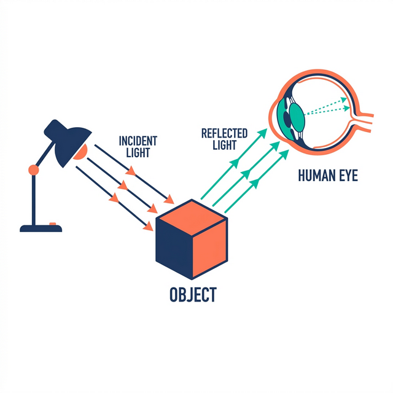
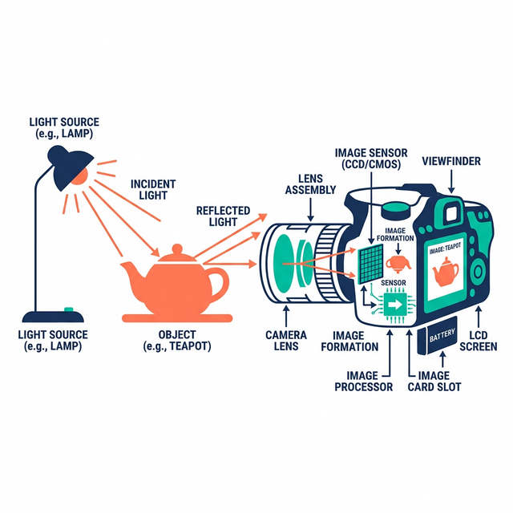

```{python}
#| echo: false
#| output: false
import matplotlib.pyplot as plt
try:
    import matplotlib_inline.backend_inline
    matplotlib_inline.backend_inline.set_matplotlib_formats('svg')
except:
    pass
plt.rcParams['svg.fonttype'] = 'none'

def fix_ar(text):
    return text
```


# 1. أساسيات الصور الرقمية {.sdaia-dark data-background-gradient="linear-gradient(135deg, #1C355E, #00C9A7)"}

كيف تقوم أجهزة الكمبيوتر بتخزين الصور

## الضوء والعين البشرية {.smaller}

:::: {.columns}
::: {.column width="50%"}
- **الإضاءة**: يصطدم الضوء الصادر من مصدر بجسم ما.
- **الانعكاس**: يمتص الجسم ألواناً ويعكس أخرى.
- **الالتقاط**: يدخل الضوء للعين من خلال **البؤبؤ**.
- **المعالجة**: تركز العدسة الضوء على **الشبكية**. 

> **ملاحظة:** تنقسم المستقبلات إلى **العصي** للرؤية الليلية وتحديد الأشكال، و **المخاريط** لتمييز الألوان.
:::
::: {.column width="50%"}
{fig-align="center"}
:::
::::

## الكاميرا الرقمية {.smaller}

:::: {.columns}
::: {.column width="50%"}
- **الالتقاط**: تلتقط الكاميرا الضوء المنعكس.
- **العدسة**: يدخل الضوء ويتم تركيزه بالعدسات.
- **المستشعر**: يصطدم الضوء بـ **مستشعر رقمي** (CMOS/CCD).
- **الرقمنة**: تحول *البكسلات* الفوتونات لشحنات تترجم لمصفوفة رقمية.

> **ملاحظة:** زيادة عدد البكسلات (الميجابكسل) تزيد من دقة التفاصيل، لكنها تتطلب مساحة تخزين أكبر.
:::
::: {.column width="50%"}
{fig-align="center"}
:::
::::

## التدرج الرمادي (Grayscale) {.smaller}

- الصور هي مصفوفات ثنائية الأبعاد. نقطة الأصل `(0,0)` أعلى اليسار.
- في الصور القياسية (8-bit)، تتراوح قيم البكسل من `0` (أسود تام) إلى `255` (أبيض ناصع).

::::: {.columns}
:::: {.column width="50%"}
```python
# مصفوفة مبسطة 8×8
img = np.array([
    [0,0,0,0,0,0,0,0],
    [0,1,1,0,0,1,1,0],
    [0,1,1,0,0,1,1,0],
    [0,0,0,0,0,0,0,0],
    [0,1,0,0,0,0,1,0],
    [0,0,1,1,1,1,0,0],
    [0,1,0,0,0,0,1,0],
    [0,0,0,0,0,0,0,0]
])
```
::::
:::: {.column width="50%"}
```{python}
#| echo: false
#| fig-align: center

import numpy as np
import matplotlib.pyplot as plt

img = np.array([
    [0,0,0,0,0,0,0,0],
    [0,1,1,0,0,1,1,0],
    [0,1,1,0,0,1,1,0],
    [0,0,0,0,0,0,0,0],
    [0,1,0,0,0,0,1,0],
    [0,0,1,1,1,1,0,0],
    [0,1,0,0,0,0,1,0],
    [0,0,0,0,0,0,0,0]
])

fig, ax = plt.subplots(figsize=(3, 3))
ax.imshow(img, cmap='gray')
for i in range(8):
    for j in range(8):
        color = 'black' if img[i, j] == 1 else 'white'
        ax.text(j, i, img[i, j], ha='center', va='center', color=color)
ax.axis('off')
plt.show()
```
::::
:::::

## الصور الملونة: قنوات RGB {.smaller}

- مصفوفات ثلاثية الأبعاد (الارتفاع × العرض × **3 قنوات**).
- **RGB**: (أحمر Red، أخضر Green، أزرق Blue).
- تتراوح القيم في كل قناة من `0` (مطفأ) إلى `255` (مضاء).

```{python}
#| echo: false
#| fig-align: center

import numpy as np
import matplotlib.pyplot as plt

H, W, C = 4, 4, 3
fig = plt.figure(figsize=(4.5, 4.5))
ax = fig.add_subplot(111, projection='3d')
voxels = np.ones((C, W, H), dtype=bool)
colors = np.empty(voxels.shape, dtype=object)
colors[0, :, :] = '#ff6666'
colors[1, :, :] = '#66ff66'
colors[2, :, :] = '#6666ff'

ax.voxels(voxels, facecolors=colors, edgecolor='black', linewidth=0.5, alpha=0.8)
ax.set_xlabel('Channels (X)', labelpad=10)
ax.set_ylabel('Width (Y)', labelpad=10)
ax.set_zlabel('Height (Z)', labelpad=10)
ax.view_init(elev=20, azim=-35)
ax.grid(False)
ax.set_xticklabels([])
ax.set_yticklabels([])
ax.set_zticklabels([])
ax.xaxis.pane.fill = False
ax.yaxis.pane.fill = False
ax.zaxis.pane.fill = False
ax.xaxis.pane.set_edgecolor('w')
ax.yaxis.pane.set_edgecolor('w')
ax.zaxis.pane.set_edgecolor('w')
plt.tight_layout()
plt.show()
```

## مسابقة سريعة

**اختبر معلوماتك**

ما هي أقصى قيمة لونية يمكن أن يأخذها بكسل واحد في قناة الألوان الحمراء (R) في صورة قياسية (8-bit)؟

<div style="display: flex; justify-content: center; gap: 15px; margin: 30px 0;">
  <button class="quiz-btn" onclick="checkQ1(100)">100</button>
  <button class="quiz-btn" onclick="checkQ1(1)">1</button>
  <button class="quiz-btn" onclick="checkQ1(255)">255</button>
</div>

<p id="feedback1" style="font-weight: bold; font-size: 1.1em; min-height: 40px; text-align: center; color: #00C9A7;"></p>

<script>
function checkQ1(ans) {
  var fb = document.getElementById("feedback1");
  if(ans === 255) {
    fb.style.color = "#00C9A7";
    fb.innerHTML = "✅ إجابة صحيحة! تتراوح القيم من 0 إلى 255 حيث 255 هو أقصى درجات السطوع للون.";
  } else {
    fb.style.color = "#FF6666";
    fb.innerHTML = "❌ إجابة خاطئة. النظام مبني على 8 بت (256 قيمة من 0 إلى 255).";
  }
}
</script>

## مكتبة OpenCV (العامل السريع!) {.smaller}

تخيل أنك في مصنع يحتاج لفرز ملايين الصور بسرعة هائلة. مكتبة `OpenCV` هي "العامل الآلي" السريع جداً في هذا المصنع.

:::: {.columns}
::: {.column width="50%"}
- **متى نستخدمها؟** 
  - عندما نتعامل مع **كاميرات المراقبة** (فيديو مباشر).
  - عندما نريد تعديل ملايين الصور بلمح البصر.
- **تنبيه ⚠️:** هذا "العامل الآلي" له طريقة غريبة في رؤية الألوان! فهو يقرأ الألوان معكوسة **(أزرق، أخضر، أحمر - BGR)** بدلاً من (أحمر، أخضر، أزرق).
:::
::: {.column width="50%"}
**مثال بسيط جداً:**
```python
import cv2

# اطلب من العامل قراءة الصورة
img = cv2.imread('image.jpg')

# اطلب منه تغيير مقاسها لتصغيرها
resized = cv2.resize(img, (224, 224))

# احفظ النتيجة
cv2.imwrite('output.jpg', resized)
```
:::
::::

## مكتبة Pillow أو PIL (استوديو التصوير) {.smaller}

إذا كانت OpenCV هي المصنع، فإن `Pillow` هي "استوديو تصوير منزلي" أو برنامج (الرسام) المبسط.

:::: {.columns}
::: {.column width="50%"}
- **متى نستخدمها؟** 
  - في المشاريع البسيطة واللطيفة.
  - لعمليات التعديل البسيطة (مثل: تدوير الصورة، إضافة نص، قص جزء منها).
  - لتجهيز الصورة قبل إعطائها للذكاء الاصطناعي.
- **ميزتها:** ترى الألوان بشكل طبيعي كما نراها نحن **(RGB)**، فلا تسبب أي ارتباك !
:::
::: {.column width="50%"}
**مثال بسيط جداً:**
```python
from PIL import Image

# افتح الصورة داخل الاستوديو
img = Image.open('image.jpg')

# قم بتدوير الصورة 90 درجة
rotated = img.rotate(90)

# احفظها
rotated.save('output.jpg')
```
:::
::::

## مكتبة NumPy (المُترجم الرقمي) {.smaller}

الكمبيوتر لا يمتلك أعيناً ليرى الصورة كـ "أشجار وسماء"، بل يراها كـ "جدول ضخم من الأرقام". `NumPy` هي "المُترجم" الذي يقوم بهذا العمل.

:::: {.columns}
::: {.column width="50%"}
- **كيف تعمل؟**
  - تأخذ الصورة من (Pillow) وتترجمها إلى **جدول أرقام** (يسمى مصفوفة أو Tensor).
  - كل خانة في الجدول تمثل لون بكسل معين (مثلاً الرقم 255 يعني ساطع، و 0 يعني مظلم).
- **النتيجة:** الآن فقط يستطيع الذكاء الاصطناعي فهم الصورة والتعلم منها!
:::
::: {.column width="50%"}
**كيف نترجم الصورة؟**
```python
import numpy as np
from PIL import Image

img = Image.open('image.jpg')

# المُترجم يحول الصورة إلى جدول أرقام!
img_array = np.array(img)

# طباعة أبعاد هذا الجدول (كم صف وكم عمود)
print(img_array.shape) 
```
:::
::::

## الصورة الكاملة: كيف تعمل هذه المكتبات معاً؟ {.smaller}

تخيل أنك تبني مصنعاً ذكياً للصور، كل أداة لها وظيفة محددة تسلّمها للأخرى:

1. **الخطوة الأولى (استلام الصورة):** نستخدم `Pillow` أو `OpenCV` كأداة إدخال لفتح الصورة الموجودة في الكمبيوتر.
2. **الخطوة الثانية (التجهيز):** نستخدم نفس المكتبة في التعديلات الأولية كقص الأطراف، تغيير المقاس، أو التدوير.
3. **الخطوة الثالثة (الترجمة):** نُسلم الصورة لمكتبة `NumPy` لتحولها إلى **جدول ضخم من الأرقام**.
4. **الخطوة الرابعة (الذكاء الاصطناعي):** نأخذ هذا الجدول الرقمي وندخله في النماذج الذكية (مثل YOLO) لتحليله واستخراج الكائنات منه.

<div style="text-align: center; margin-top: 30px; padding: 20px; background: rgba(0,201,167,0.1); border-radius: 10px; font-weight: bold; font-size: 1.2em; color: #1C355E;">
صورة ➡️ Pillow (للقراءة) ➡️ NumPy (للترجمة لأرقام) ➡️ الذكاء الاصطناعي (للتحليل)
</div>

## تحدي الإحداثيات: كيف نقص جزءاً من الصورة؟ {.smaller}

:::: {.columns}
::: {.column width="50%"}
- **الطريقة الهندسية المعتادة:** عندما ترسم مربعاً حول وجه لتقصه، فأنت تفكر هندسياً: كم يبعد المربع عن اليسار **(x)** وكم يبعد عن الأعلى **(y)**.
- **طريقة الكمبيوتر:** الكمبيوتر يرى الصورة كـ "عمارة سكنية" (جدول NumPy):
  - **الارتفاع (y):** هو رقم "الدور" (الصف).
  - **العرض (x):** هو رقم "الشقة" (العمود).
- **الخلاصة:** عندما تطلب من `NumPy` قص الصورة، يجب أن تعطيه **(رقم الدور أولاً، ثم الشقة)**، أي `صورة[y, x]` وليس `صورة[x, y]`.
:::
::: {.column width="50%"}
```python
# الإحداثيات التي رسمتها بيدك: (x1, y1, x2, y2)

# ❌ خطأ: الكمبيوتر لن يفهم وسيقتص منطقة خاطئة
crop = img[x1:x2, y1:y2] 

# ✅ صحيح: أعطه (الارتفاع/الدور y) ثم (العرض/الشقة x)
crop = img[y1:y2, x1:x2] 
```
:::
::::

## لغز الألوان: لماذا تبدو الوجوه زرقاء؟ (تأثير السنافر) {.smaller}

:::: {.columns}
::: {.column width="50%"}
- شاشاتنا تعتمد على دمج الألوان **RGB** (أحمر، أخضر، أزرق) لتكوين الصور.
- **المشكلة:** مكتبة `OpenCV` تقرأ الألوان بالعكس! فهي تقرأها **BGR** (أزرق، أخضر، أحمر).
- إذا قرأنا صورة وجه بـ OpenCV وحاولنا عرضها مباشرة على الشاشة، ستظن الشاشة أن القناة الأولى هي "أحمر" بينما هي في الحقيقة "أزرق"! 
- **النتيجة:** يتم تبديل اللون الأحمر بالأزرق.. وتصبح الوجوه زرقاء كالسنافر!
:::
::: {.column width="50%"}
#### الحل السحري لتعديل الألوان:
```python
import cv2
import matplotlib.pyplot as plt

# 1. OpenCV تقرأ الصورة بألوان معكوسة (BGR)
img_bgr = cv2.imread('face.jpg')

# 2. الحل: سطر واحد نعكس فيه الألوان لطبيعتها (RGB)
img_rgb = cv2.cvtColor(img_bgr, cv2.COLOR_BGR2RGB)

# 3. الآن ستظهر الوجوه بلونها الطبيعي
plt.imshow(img_rgb)
plt.show()
```
:::
::::

# الخاتمة {.sdaia-dark data-background-gradient="linear-gradient(135deg, #1C355E, #00C9A7)"}

ختام أساسيات الصور

## ملخص سريع {.smaller}

- **الضوء والكاميرات**: المحاكاة التقنية للعين البشرية.
- **البكسلات والقنوات**: المصفوفات الثنائية والثلاثية الأبعاد.
- **المكتبات**: OpenCV للسرعة، Pillow للمعالجة السهلة، و NumPy للعمليات.
- **أخطاء شائعة**: "تأثير السنافر" بسبب BGR واختلاف إحداثيات (x,y) مع (y,x).

## الخطوات القادمة

في القسم التالي: **الاستدلال باستخدام YOLO**

- إدخال الصور كأرقام لنماذج رؤية الكمبيوتر.
- استخراج الكائنات الجاهزة.

# أسئلة وأجوبة {.sdaia-dark data-background-gradient="linear-gradient(135deg, #1C355E, #00C9A7)" data-state="sdaia-bg"}

::: {style="display: flex; flex-direction: column; align-items: center; justify-content: center; height: 100%; text-align: center; margin-top: 5rem;"}
[شكراً لاهتمامكم ووقتكم]{style="font-size: 3.5rem; font-weight: 800; color: white; display: block; margin-bottom: 1rem;"}

[يُسعدني الإجابة على استفساراتكم ومناقشاتكم]{style="font-size: 1.8rem; color: #00C9A7; font-weight: 600; opacity: 0.9;"}
:::

<style>
  /* Fix RTL overflow and styling */
  .reveal .slide {
    text-align: right;
    direction: rtl;
  }
  /* Style quiz buttons to match the SDAIA theme */
  .quiz-btn {
    background-color: var(--r-main-color);
    color: var(--r-background-color);
    border: 2px solid var(--r-main-color);
    padding: 10px 20px;
    font-size: 1em;
    border-radius: 8px;
    cursor: pointer;
    font-family: inherit;
    transition: 0.3s;
  }
  .quiz-btn:hover {
    background-color: transparent;
    color: var(--r-main-color);
  }
</style>
