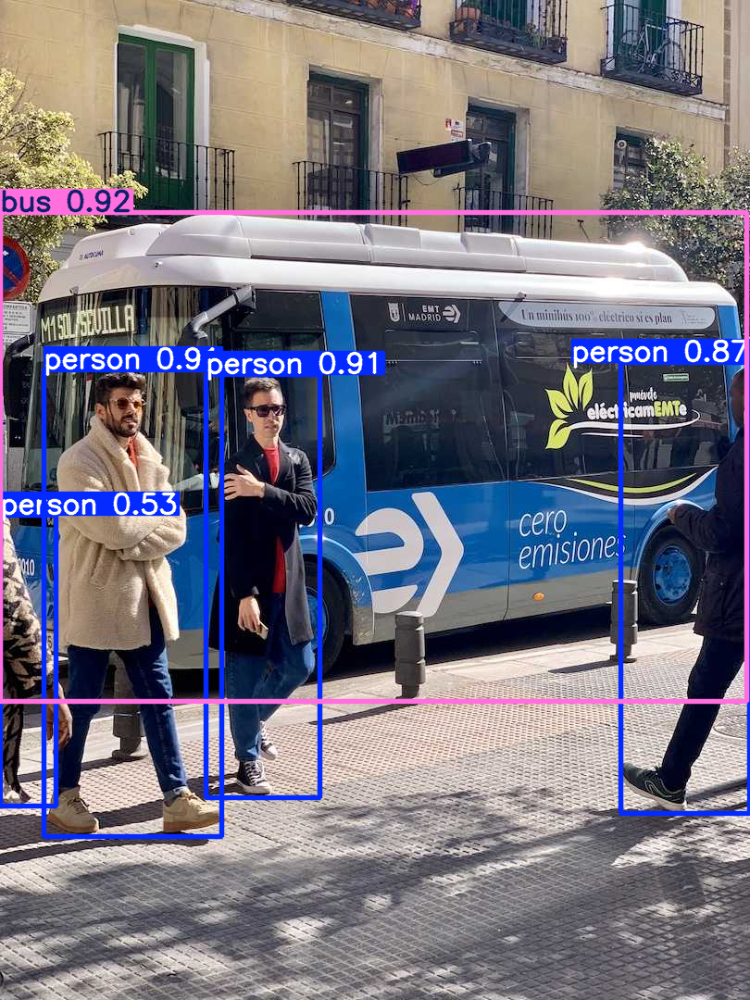
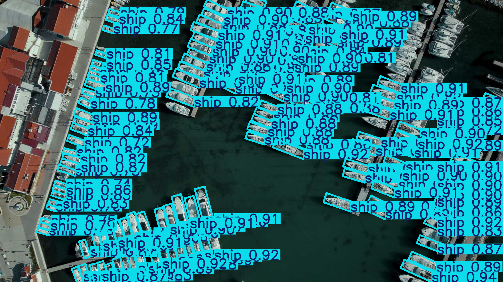

# 1. First Steps: What can YOLO do? {.sdaia-dark background-gradient="linear-gradient(135deg, #1C355E, #00C9A7)"}

Start using AI immediately without training!

## Programs vs. Machine Learning

```{dot}
//| echo: false
//| fig-width: 10
//| fig-height: 4.2
digraph concept {
    graph [rankdir=LR fontname="Helvetica" nodesep=0.4 ranksep=1.5]
    node  [fontname="Helvetica" fontcolor=white style=filled shape=box penwidth=0 margin="0.25,0.15" fontsize=13]
    edge  [penwidth=2.5 arrowsize=1.0 fontname="Helvetica" fontsize=12]

    // ── Traditional row ──
    subgraph cluster_trad {
        label="Traditional Programming" fontcolor="#8899bb" fontsize=13 style=dashed color="#3A5070" margin=18
        ti [label="Input" fillcolor="#2D4E7E"]
        tf [label="f(x)\nyou write it" fillcolor="#4a4a6a"]
        to [label="Output" fillcolor="#2D4E7E"]
        ti -> tf [color="#8899bb"]
        tf -> to [color="#8899bb"]
    }

    // ── Machine Learning row ──
    subgraph cluster_ml {
        label="Machine Learning" fontcolor="#00C9A7" fontsize=13 style=dashed color="#00C9A7" margin=18
        mi   [label="Input" fillcolor="#2D4E7E"]
        mf   [label="f(x)\nlearned from data" fillcolor="#00C9A7" fontcolor="#1C355E" fontname="Helvetica-Bold"]
        mo   [label="Output" fillcolor="#2D4E7E"]
        data [label="Data" fillcolor="#1a4060" shape=cylinder]
        { rank=same; mf; data }
        mi   -> mf [color="#00C9A7"]
        mf   -> mo [color="#00C9A7"]
        data -> mf [label="trains" color="#5599aa" style=dashed fontcolor="#5599aa" fontsize=11]
    }
}
```

::: {.fragment}
We'll explore each of these output shapes hands-on during this session!
:::


## AI Model for Computer Vision

```{dot}
//| echo: false
//| fig-width: 10
//| fig-height: 4.2
digraph cv {
    graph [rankdir=LR fontname="Helvetica" nodesep=0.55 ranksep=1.4]
    node  [fontname="Helvetica" fontcolor=white style=filled shape=box penwidth=0 margin="0.2,0.13" fontsize=12]
    edge  [color="#00C9A7" penwidth=2.5 arrowsize=0.9]

    input [label="Image / Video" shape=cylinder fillcolor="#2D4E7E" fontsize=13]
    model [label="Learned f(x)\n(AI Model)" fillcolor="#00C9A7" fontcolor="#1C355E" fontname="Helvetica-Bold" fontsize=13 width=1.6]

    cls  [label="Classification\n(C,)"        fillcolor="#3A6186"]
    det  [label="Detection\n(N, 6)"           fillcolor="#3A6186"]
    seg  [label="Segmentation\n(N, H, W)"     fillcolor="#3A6186"]
    pose [label="Pose\n(N, 17, 3)"            fillcolor="#3A6186"]

    { rank=same; cls det seg pose }

    input -> model
    model -> cls
    model -> det
    model -> seg
    model -> pose
}
```

## The YOLO CLI Structure

Interacting with Ultralytics is simple:

::: {.r-fit-text}
`yolo TASK MODE ARGS`
:::

- **TASK**: What to solve? (`detect`, `segment`, `classify`, `pose`, `obb`)
- **MODE**: What ML stage? (`predict`, `train`, `val`, `export`, `track`, `benchmark`)
- **ARGS**: Settings like `model=yolo26n.pt` or `source="image.jpg"`


## Predefined Classes & Weights

Models pre-trained on the **COCO dataset** recognize **80 common classes** right out of the box. Using `.pt` models means we utilize these pre-learned weights without training!

**Model Naming Convention** (e.g., `yolo26n-seg.pt`, `yolo11x-cls.pt`):

- **Family**: e.g., `yolo26`, `yolo11`
- **Size**: `n` (Nano, fastest) up to `x` (Extra Large, most accurate)
- **Task**: default is detection. `-seg` (Segmentation), `-cls` (Classification), `-pose` (Pose Estimation)


# 2. Exploring Tasks (Live!) {.sdaia-dark background-gradient="linear-gradient(135deg, #1C355E, #00C9A7)"}

Let's see the tasks in action using the `predict` mode.

```{python}
#| echo: false
import matplotlib.pyplot as plt
import numpy as np
import matplotlib.patches as patches
import sys; import os; sys.path.insert(0, os.path.abspath('.')); sys.path.insert(0, os.path.abspath('slides')); from plot_utils import draw_base_car, draw_base_human
```

## Image Classification Output Concept

::::: {.columns}

:::: {.column width="55%"}
```{python}
#| echo: false
#| fig-align: center
fig, ax = plt.subplots(figsize=(4.8, 4.8))
fig.patch.set_alpha(0.0)
ax.patch.set_alpha(1.0)
ax.set_facecolor('white')

draw_base_car(ax)

plt.tight_layout()
plt.show()
```
::::

:::: {.column width="45%"}

The model outputs **`probs`**, a probability for **every** possible class:

| Class ID | Class Name | Probability |
|----------|------------|-------------|
| 0        | car        | **0.95**    |
| 1        | bus        | 0.03        |
| 2        | person     | 0.01        |
| …        | …          | …           |

::::


:::::


## From `probs` to `top1`

::::: {.columns}

:::: {.column width="55%"}
```{python}
#| echo: false
#| fig-align: center
fig, ax = plt.subplots(figsize=(4.8, 4.8))
fig.patch.set_alpha(0.0)
ax.patch.set_alpha(1.0)
ax.set_facecolor('white')

draw_base_car(ax)

plt.tight_layout()
plt.show()
```
::::

:::: {.column width="45%" .incremental}

Ultralytics pre-computes the answer for us:

- **`probs`**: Raw probability array for *all* classes.
- **`probs.top1`** → `0` : Index of the highest-probability class.
- **`probs.top1conf`** → `0.95` : Its confidence score.

::::

:::::

::: {.callout-note appearance="simple" icon="false" .fragment}
**Single-Class vs. Multi-Label Classification**
We just read `top1` that is **single-class** (one winner). But because `probs` scores *every* class, we can also do **multi-label** classification: keep all classes whose probability exceeds a threshold (e.g., `prob > 0.50`) to assign several labels to one image.
:::  


## Image Classification in Action

Identify what the entire image contains.

```bash
yolo task=classify mode=predict model=yolo26n-cls.pt source="https://ultralytics.com/images/bus.jpg"
```

```python
# Python Equivalent
from ultralytics import YOLO

model = YOLO("yolo26n-cls.pt")
results = model.predict(source="https://ultralytics.com/images/bus.jpg")

# Access Output Format
probs = results[0].probs
print(f"Top-1 Class: {probs.top1}")          # Index of the most likely class
print(f"Top-1 Confidence: {probs.top1conf}") # Confidence score
print(f"All Probabilities: {probs.data}")    # Tensor of all class probabilities
```

*Docs Reference: [Classification](https://docs.ultralytics.com/tasks/classify/)*


## Classification Output Example


## Object Detection Output & Confidence {auto-animate=true}

::::: {.columns data-id="model-output"}

:::: {.column width="55%"}
```{python}
#| echo: false
#| fig-align: center
fig, ax = plt.subplots(figsize=(4.8, 4.8))
fig.patch.set_alpha(0.0)
ax.patch.set_alpha(1.0)
ax.set_facecolor('white')

draw_base_car(ax)

# 2. Add the Predicted Box
rect = patches.Rectangle((3.5, 4.0), 8, 7, linewidth=3.5, edgecolor='#00ff00', facecolor='none', zorder=2)
ax.add_patch(rect)

# 3. Add Visual Annotations mapping to the Tensor
# Center dot (Black for better contrast)
ax.plot(7.5, 7.5, marker='o', color='black', markersize=9, zorder=3)

# Width dimension (Orange)
ax.annotate('', xy=(3.5, 3.2), xytext=(11.5, 3.2),
            arrowprops=dict(arrowstyle='<->', color='#ff8c00', lw=2.5))
ax.text(7.5, 2.7, 'w', color='#ff8c00', fontsize=14, ha='center', fontweight='bold')

# Height dimension (Blue)
ax.annotate('', xy=(12.2, 4.0), xytext=(12.2, 11.0),
            arrowprops=dict(arrowstyle='<->', color='#0088cc', lw=2.5))
ax.text(12.7, 7.5, 'h', color='#0088cc', fontsize=14, va='center', ha='left', fontweight='bold')

plt.tight_layout()
plt.show()
```
::::

:::: {.column width="45%" .incremental}

Model Output:

- **<code style="color: #000000;">cx, cy</code> (7.5, 7.5)**: The center coordinates.
- **<code style="color: #ff8c00;">w</code> (8.0)** & **<code style="color: #0088cc;">h</code> (7.0)**: The box width and height.
- **`conf` (0.85)**: The confidence score.
- **`cls` (0)**: The class ID.

::::

:::::

::: {.callout-note appearance="simple" icon="false"}
**Filtering Predictions**
We use a **Confidence Threshold** to automatically drop weak predictions (e.g., ignoring any box with `conf < 0.50`).
:::


## Confidence: Model's Belief vs. Ground Truth

- **Question:** Does `conf=1.0` mean there is a true object 100% of the time?
 
. . .

- **Answer:** **No.**

::: {.incremental}
- **Confidence** is just a "feeling": How strongly the model **believes** this is the answer.
- It does **NOT** guarantee the answer is correct in the real world.
:::

::: {.fragment}
You'll learn how to actually measure correctness in **Part 4** using Precision and Recall
:::


## Mapping to Bounding Boxes {auto-animate=true}

::::: {.columns data-id="model-output"}

:::: {.column width="55%"}
```{python}
#| echo: false
#| fig-align: center
fig, ax = plt.subplots(figsize=(5, 5))
fig.patch.set_alpha(0.0)
ax.patch.set_alpha(1.0)
ax.set_facecolor('white')

draw_base_car(ax)

# 2. Add the Predicted Box
rect = patches.Rectangle((3.5, 4.0), 8, 7, linewidth=3.5, edgecolor='#00ff00', facecolor='none', zorder=2)
ax.add_patch(rect)

# 3. Add Visual Annotations mapping to the Tensor
# Center dot (Black for better contrast)
ax.plot(7.5, 7.5, marker='o', color='black', markersize=9, zorder=3)
ax.text(7.7, 7.7, '$(c_x, c_y)$', color='black', fontsize=13, fontweight='bold')

# w/2 dimension (Orange)
ax.annotate('', xy=(3.5, 7.5), xytext=(7.5, 7.5),
            arrowprops=dict(arrowstyle='<->', color='#ff8c00', lw=2.5))
ax.text(5.5, 7.1, '$w/2$', color='#ff8c00', fontsize=14, ha='center', fontweight='bold')

# h/2 dimension (Blue)
ax.annotate('', xy=(7.5, 4.0), xytext=(7.5, 7.5),
            arrowprops=dict(arrowstyle='<->', color='#0088cc', lw=2.5))
ax.text(7.8, 5.75, '$h/2$', color='#0088cc', fontsize=14, va='center', ha='left', fontweight='bold')

# x_min, y_min point
ax.plot(3.5, 4.0, marker='o', color='#e63946', markersize=8, zorder=3)
ax.text(3.3, 3.5, '$(x_{min}, y_{min})$', color='#e63946', fontsize=13, ha='right', fontweight='bold')

# x_max, y_max point
ax.plot(11.5, 11.0, marker='o', color='#e63946', markersize=8, zorder=3)
ax.text(11.7, 11.5, '$(x_{max}, y_{max})$', color='#e63946', fontsize=13, ha='left', fontweight='bold')

plt.tight_layout()
plt.show()
```
::::

:::: {.column width="45%" .incremental}

**Mapping to $(x_{min}, y_{min}, x_{max}, y_{max})$:**

$$
\begin{align*}
x_{min} &= cx - \frac{w}{2} = 7.5 - 4.0 = 3.5 \\
y_{min} &= cy - \frac{h}{2} = 7.5 - 3.5 = 4.0 \\
x_{max} &= cx + \frac{w}{2} = 7.5 + 4.0 = 11.5 \\
y_{max} &= cy + \frac{h}{2} = 7.5 + 3.5 = 11.0
\end{align*}
$$

::::

:::::


## The Concept of N Objects

Rarely does an image contain exactly one object!

:::{.incremental}
- YOLO evaluates the image and can predict multiple bounding boxes at once.
- The single 6-element array `[cx, cy, w, h, conf, cls]` is stacked $N$ times.
- Resulting Output Shape: **$(N, 6)$** (where $N$ is the number of detected objects).
:::

## Object Detection in Action 

Find and localize objects using bounding boxes.

```bash
# Live Example: Try this in your terminal!
yolo task=detect mode=predict model=yolo26n.pt source="https://ultralytics.com/images/bus.jpg"
```

```python
# Python Equivalent
from ultralytics import YOLO

model = YOLO("yolo26n.pt")
results = model.predict(source="https://ultralytics.com/images/bus.jpg")

# Access Output Shape and Data
boxes = results[0].boxes
print(f"Boxes shape: {boxes.shape}")  # (N, 6) -> N boxes: x1, y1, x2, y2, conf, cls
```


*Docs Reference: [Detection](https://docs.ultralytics.com/tasks/detect/)*

## Deep Dive: Accessing Bounding Boxes

The `result.boxes` object provides several ways to access coordinates:

- **`.xyxy`**: $[x_{min}, y_{min}, x_{max}, y_{max}]$ (Top-left, Bottom-right)
- **`.xywh`**: $[c_x, c_y, w, h]$ (Center coordinates, width, height)
- **`.xyxyn` / `.xywhn`**: Normalized versions (values between 0.0 and 1.0)

**Code Example:**
```python
# Accessing raw tensors
boxes = result.boxes.xyxy   # [N, 4] tensor
conf = result.boxes.conf    # [N] tensor
cls = result.boxes.cls      # [N] tensor

# Extracting first detection
x1, y1, x2, y2 = boxes[0].tolist() 
```

::: {.callout-tip}
Always use `.xyxy` when you want to crop images using Pillow!
:::


## Detection Output Example




## The Problem with Absolute Pixels

Why not just train the model on absolute pixel values like `w = 8.0`?

::: {.r-stack}
{.fragment width="400" height="300" style="margin-bottom: 20px;"}

{.fragment width="500" height="280" style="margin-bottom: 20px;"}
:::

::: {.fragment .incremental}
- Images come in all shapes and sizes (4K, 1080p, square, portrait).
- A car that is `800` pixels wide in a 4K image might only be `200` pixels wide in a 1080p image.
- If the model learns "cars are 800 pixels wide", it will fail on smaller images!
:::

## The Solution: Normalized Coordinates

. . .

Instead of pixels, we teach the model using **fractions of the image size** (0.0 to 1.0).

. . .

- $cx_{norm} = cx_{pixel} / image\_width$
- $w_{norm} = w_{pixel} / image\_width$

. . .

***A car that takes up half the image width is always $w = 0.5$, regardless of whether the image is 4K or 1080p!***

::: {.callout-note appearance="simple" icon="false"}
**Training vs. Predicting**
You **MUST** provide normalized coordinates (0.0 to 1.0) when *training* the model. However, when you use `model.predict()`, the Ultralytics Python API conveniently un-normalizes them back into standard absolute pixels (like `boxes.xyxy`) for immediate use!
:::


## Instance Segmentation Output Concept

::::: {.columns}

:::: {.column width="55%"}
```{python}
#| echo: false
#| fig-align: center
fig, ax = plt.subplots(figsize=(4.8, 4.8))
fig.patch.set_alpha(0.0)
ax.patch.set_alpha(1.0)
ax.set_facecolor('white')

draw_base_car(ax)

# Add Bitmap Mask overlay with 1s and 0s
mask_matrix = np.zeros((16, 16))
mask_matrix[4:6, 6:10] = 1
mask_matrix[6:10, 4:12] = 1
mask_matrix[9:11, 5:7] = 1
mask_matrix[9:11, 9:11] = 1

mask_rgba = np.zeros((16, 16, 4))
mask_rgba[mask_matrix == 1] = [0, 1, 0, 0.4]
ax.imshow(mask_rgba, zorder=2)

for y in range(16):
    for x in range(16):
        if mask_matrix[y, x] == 1:
            ax.text(x, y, '1', color='black', fontsize=8, ha='center', va='center', fontweight='bold', zorder=3)
        else:
            ax.text(x, y, '0', color='#555555', fontsize=6, ha='center', va='center', alpha=0.6, zorder=1)

# Derived Polygon outline
polygon = np.array([
    [3.5, 5.5], [5.5, 5.5], [5.5, 3.5], [9.5, 3.5], [9.5, 5.5], [11.5, 5.5],
    [11.5, 9.5], [10.5, 9.5], [10.5, 10.5], [8.5, 10.5], [8.5, 9.5],
    [6.5, 9.5], [6.5, 10.5], [4.5, 10.5], [4.5, 9.5], [3.5, 9.5]
])

# Plot polygon points
ax.plot(polygon[:, 0], polygon[:, 1], 'o', color='#ff8c00', markersize=6, zorder=4)

# Add line connecting points
polygon_closed = np.vstack((polygon, polygon[0]))
ax.plot(polygon_closed[:, 0], polygon_closed[:, 1], '--', color='#ff8c00', linewidth=1.5, zorder=4)

plt.tight_layout()
plt.show()
```
::::

:::: {.column width="45%" .incremental}

Model Output (Mask / Polygon):

- **Mask Tensor**: A 2D array (bitmap) of pixels indicating the object's exact shape (`1` = object, `0` = background).
- **Coordinates**: Sequence of $(x, y)$ polygon coordinates derived from the mask.
- **`conf` (0.89)**: Confidence score.
- **`cls` (0)**: Class ID.

::::

:::::


## Instance Segmentation in Action

Outline the exact shape (pixels) of each object instance.

```bash
# Live Example: See the masks!
yolo task=segment mode=predict model=yolo26n-seg.pt source="https://ultralytics.com/images/bus.jpg"
```

```python
# Python Equivalent
from ultralytics import YOLO

model = YOLO("yolo26n-seg.pt")
results = model.predict(source="https://ultralytics.com/images/bus.jpg")

# Access Output Shape and Data
masks = results[0].masks
print(f"Masks shape: {masks.data.shape}")  # (N, H, W) -> N masks of HxW size
print(masks.xy)                            # Polygon coordinates
```

*Docs Reference: [Segmentation](https://docs.ultralytics.com/tasks/segment/)*


## Segmentation Output Example


## Pose Estimation Output Concept

::::: {.columns}

:::: {.column width="55%"}
```{python}
#| echo: false
#| fig-align: center
fig, ax = plt.subplots(figsize=(4.8, 4.8))
fig.patch.set_alpha(0.0)
ax.patch.set_alpha(1.0)
ax.set_facecolor('white')

draw_base_human(ax)

# Keypoints for the human (Nose, Elbows, Knees)
keypoints = [(8.5, 3.5), (5.0, 7.0), (12.0, 7.0), (7.0, 12.5), (10.0, 12.5)]
labels = ['Nose', 'L-Elbow', 'R-Elbow', 'L-Knee', 'R-Knee']

for (x, y), label in zip(keypoints, labels):
    ax.plot(x, y, marker='o', color='#ff8c00', markersize=9, zorder=3)
    ax.text(x, y - 0.9, label, color='black', fontsize=11, ha='center', fontweight='bold', bbox=dict(facecolor='white', alpha=0.7, edgecolor='none', pad=1))

# Draw skeleton lines connecting joints
ax.plot([8.5, 8.5], [3.5, 5.0], '-', color='#00ff00', linewidth=2, zorder=2) # Nose to Neck
ax.plot([5.0, 8.5], [7.0, 5.0], '-', color='#00ff00', linewidth=2, zorder=2) # L-Elbow to Neck
ax.plot([12.0, 8.5], [7.0, 5.0], '-', color='#00ff00', linewidth=2, zorder=2) # R-Elbow to Neck
ax.plot([7.0, 8.5], [12.5, 10.0], '-', color='#00ff00', linewidth=2, zorder=2) # L-Knee to Pelvis
ax.plot([10.0, 8.5], [12.5, 10.0], '-', color='#00ff00', linewidth=2, zorder=2) # R-Knee to Pelvis
ax.plot([8.5, 8.5], [5.0, 10.0], '-', color='#00ff00', linewidth=2, zorder=2) # Neck to Pelvis

plt.tight_layout()
plt.show()
```
::::

:::: {.column width="45%" .incremental}

Model Output (Keypoints):

- **`x, y`**: Coordinate pair for each predefined keypoint.
- **`kp_conf`** (per keypoint): Confidence score for each keypoint's location.
- **`conf` (0.92)**: Overall person detection confidence score.
- **`cls` (0)**: Class ID (always 0 = person for pose models).

::::

:::::


## Pose Estimation in Action

Estimate human body keypoints (elbows, knees).

```bash
# Live Example: Track keypoints!
yolo task=pose mode=predict model=yolo26n-pose.pt source="https://ultralytics.com/images/bus.jpg"
```

```python
# Python Equivalent
from ultralytics import YOLO

model = YOLO("yolo26n-pose.pt")
results = model.predict(source="https://ultralytics.com/images/bus.jpg")

# Access Output Shape and Data
keypoints = results[0].keypoints
print(f"Keypoints shape: {keypoints.data.shape}")  # (N, 17, 3) -> N persons, 17 keypoints, (x, y, conf)
print(keypoints.xy)                                # Keypoint coordinates
```

*Docs Reference: [Pose](https://docs.ultralytics.com/tasks/pose/)*


## Pose Estimation Output Example


## OBB (Oriented Bounding Box) Output Concept

::::: {.columns}

:::: {.column width="55%"}
```{python}
#| echo: false
#| fig-align: center
import matplotlib.transforms as transforms

fig, ax = plt.subplots(figsize=(4.8, 4.8))
fig.patch.set_alpha(0.0)
ax.patch.set_alpha(1.0)
ax.set_facecolor('white')

draw_base_car(ax)

# Add a rotated Predicted Box
rect = patches.Rectangle((3.5, 4.0), 8, 7, linewidth=3.5, edgecolor='#00ff00', facecolor='none', zorder=2)
# Rotate it by 15 degrees around its center (7.5, 7.5) to illustrate OBB
t = transforms.Affine2D().rotate_deg_around(7.5, 7.5, 15) + ax.transData
rect.set_transform(t)
ax.add_patch(rect)

# Add Center dot (Black)
ax.plot(7.5, 7.5, marker='o', color='black', markersize=9, zorder=3)

plt.tight_layout()
plt.show()
```
::::

:::: {.column width="45%" .incremental}

Model Output (Oriented Box):

- **<code style="color: #000000;">cx, cy</code>**: The center coordinates.
- **`w`** & **`h`**: The box width and height.
- **`angle`**: The rotation angle of the box.
- **`conf`**: The confidence score.
- **`cls`**: The class ID.

::::

:::::


## OBB in Action

Detect objects with oriented bounding boxes (useful for aerial/satellite imagery or rotated objects).

```bash
yolo task=obb mode=predict model=yolo26n-obb.pt source="https://ultralytics.com/images/boats.jpg"
```

```python
from ultralytics import YOLO

model = YOLO("yolo26n-obb.pt")
results = model.predict(source="https://ultralytics.com/images/boats.jpg")

# Access Output Shape and Data
obb = results[0].obb
print(f"OBB shape: {obb.data.shape}")  # (N, 7) -> N boxes: cx, cy, w, h, angle, conf, cls
print(obb.xywhr)                       # Center x, y, width, height, rotation angle
```

*Docs Reference: [OBB](https://docs.ultralytics.com/tasks/obb/)*


## OBB Output Example




## Object Tracking in Action {.smaller}

Assign distinct IDs to objects and track them continuously across video frames!

```bash
yolo task=detect mode=track model=yolo26n.pt source="path/to/video.mp4"
```

```python
from ultralytics import YOLO

model = YOLO("yolo26n.pt")
# Use track() with stream=True for memory-efficient video processing
results = model.track(source="path/to/video.mp4", stream=True)

# Iterate through the video frames
for result in results:
    boxes = result.boxes
    if boxes.id is not None:
        # Extract IDs as a list of integers
        ids = boxes.id.int().tolist()
        print(f"Tracking IDs: {ids}")  # e.g., [1, 2]
```

*Docs Reference: [Tracking](https://docs.ultralytics.com/modes/track/)*


## Tracking Output Example


## Predict Usage (Python): Batch Input

Process multiple sources or directories efficiently!

```python
from ultralytics import YOLO

# Load your model
model = YOLO("yolo26n.pt")

# Option 1: A list of specific sources
sources = [
    "https://ultralytics.com/images/bus.jpg",
    "path/to/local/image.jpg",
    "another_image.png"
]
results = model.predict(source=sources)

# Option 2: An entire directory
# results = model.predict(source="path/to/my_images_folder/")
```

## Predict Usage (Python): Processing Results

Process the batch results or use a memory-efficient stream.

```python
# Process the batch results
for result in results:
    boxes = result.boxes  # Bounding boxes
    probs = result.probs  # Classification probabilities
    result.show()         # Display each result
    result.save(filename=f"result_{result.path.name}")
```

**Stream/Generator:**
For very large datasets, you can use `stream=True` in the predict call:
```python
model.predict(source="dir/", stream=True)
```


# Conclusion {.sdaia-dark background-gradient="linear-gradient(135deg, #1C355E, #00C9A7)"}

Wrapping Up Day 1

## Summary

- **YOLO Basics**: We explored how to use the CLI and Python API for various tasks.
- **Tasks**: Object Detection, Image Classification, Instance Segmentation, Pose Estimation, and OBB.
- **Coordinates**: The importance of normalized coordinates over absolute pixels.
- **Inference**: How to predict on single images, videos, and batches efficiently.

## Next Steps

Next up: **Real World Use Cases & Solutions**

- Learn how to extract actionable insights from trained models.
- Discover out-of-the-box solutions for real-world problems.
- Integrate object tracking, counting, and more into your applications.

## Q&A {.sdaia-dark background-color="#1C355E"}

::: {.r-fit-text}
**Thank You!**

Any questions?
:::
