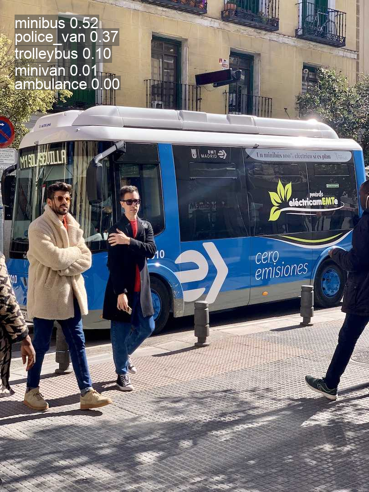
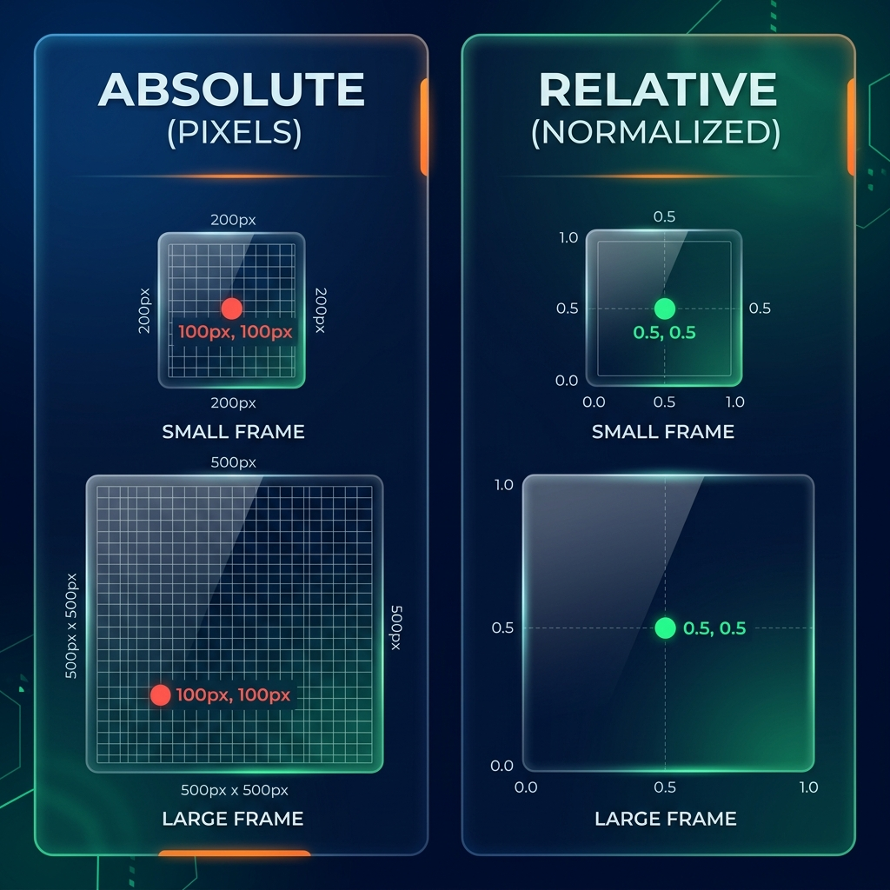

```{python}
#| echo: false
#| output: false
import matplotlib.pyplot as plt
try:
    import matplotlib_inline.backend_inline
    matplotlib_inline.backend_inline.set_matplotlib_formats('svg')
except:
    pass
plt.rcParams['svg.fonttype'] = 'none'

def fix_ar(text):
    return text
```


# 1. الخطوات الأولى: ماذا يمكن لـ YOLO أن يفعل؟ {.sdaia-dark data-background-gradient="linear-gradient(135deg, #1C355E, #00C9A7)"}

سنتعلم كيف نجعل الكمبيوتر "يرى" و "يفهم" ما حوله في ثوانٍ!

::: {.incremental}
- هل يمكن للكمبيوتر أن يعرف الفرق بين القطة والكلب؟
- هل يمكنه تتبع حركة اللاعبين في الملعب؟
- **الإجابة هي: نعم، وبسهولة مع YOLO!**
:::

## كيف يتعلم الكمبيوتر؟ (تشبيه بسيط) {.smaller}

:::: {.columns}
::: {.column width="50%"}
- **البرمجة التقليدية (مثل وصفة الأكل):**
  - أنت تعطيه التعليمات خطوة بخطوة: "لو شفت ذيل طويل وأذنين مثلثتين، إذن هذا قط".
- **تعلم الآلة (مثل التذوق):**
  - أنت لا تعطيه قواعد، بل تعطيه 1000 صورة لقطط، وهو من كثرة ما "شاهد" يفهم بنفسه كيف يبدو القط!
:::
::: {.column width="50%"}
```{dot}
//| echo: false
//| fig-width: 5
//| fig-height: 4.2
digraph concept {
    graph [rankdir=LR fontname="Helvetica" nodesep=0.4 ranksep=1.5 bgcolor="transparent"]
    node  [fontname="Helvetica" fontcolor=white style=filled shape=box penwidth=0 margin="0.25,0.15" fontsize=13]
    edge  [penwidth=2.5 arrowsize=1.0 fontname="Helvetica" fontsize=12]

    // ── Traditional row ──
    subgraph cluster_trad {
        label="برمجة تقليدية" fontcolor="#8899bb" fontsize=13 style=dashed color="#3A5070" margin=18
        ti [label="مدخلات" fillcolor="#2D4E7E"]
        tf [label="قواعد\n(أنت تكتبها)" fillcolor="#4a4a6a"]
        to [label="مخرجات" fillcolor="#2D4E7E"]
        ti -> tf [color="#8899bb"]
        tf -> to [color="#8899bb"]
    }

    // ── Machine Learning row ──
    subgraph cluster_ml {
        label="تعلم الآلة" fontcolor="#00C9A7" fontsize=13 style=dashed color="#00C9A7" margin=18
        mi   [label="مدخلات" fillcolor="#2D4E7E"]
        mf   [label="قواعد\n(يتعلمها من البيانات)" fillcolor="#00C9A7" fontcolor="#1C355E" fontname="Helvetica-Bold"]
        mo   [label="مخرجات" fillcolor="#2D4E7E"]
        data [label="البيانات" fillcolor="#1a4060" shape=cylinder]
        { rank=same; mf; data }
        mi   -> mf [color="#00C9A7"]
        mf   -> mo [color="#00C9A7"]
        data -> mf [label="يتدرب" color="#5599aa" style=dashed fontcolor="#5599aa" fontsize=11]
    }
}
```
:::
::::

## 🧠 تحدي سريع (30 ثانية): أي مهمة أحتاج؟

تخيل أنك تبني تطبيقاً لـ:

1. **فرز التمور:** هل هذه التمرة ممتازة أم لا؟ -> (......)
2. **كاميرا مراقبة:** ارسم مربعاً حول أي لص يدخل المحل -> (......)
3. **سيارة ذاتية القيادة:** حدد شكل رصيف الشارع بدقة لنمشي بجانبه -> (......)

. . .

**الإجابات:** 1. تصنيف (Classify) | 2. اكتشاف (Detect) | 3. تجزئة (Segment)

## كيف نكلم YOLO؟ (لغة الأوامر) {.smaller}

التعامل مع YOLO يشبه إعطاء أمر لمساعدك الشخصي. المعادلة بسيطة:

::: {.r-fit-text style="text-align: center; background: rgba(0, 193, 222, 0.1); border: 1px solid rgba(0, 193, 222, 0.2); border-radius: 12px; padding: 0.25em 0.5em; font-family: 'JetBrains Mono', monospace; white-space: nowrap; margin-bottom: 0.5em;"}
yolo **ماذا تفعل؟** **بأي وضع؟** **الإعدادات**
:::

- **المهمة (TASK)**: (اكتشف `detect` الأشخاص، أو صنف `classify` الصورة).
- **الوضع (MODE)**: (توقع `predict` الآن، أو تدرب `train` من جديد).
- **المتغيرات (ARGS)**: (استخدم هذا النموذج `model` أو هذه الصورة `source`).

::: {.callout-tip}
**مسابقة سريعة:** من يكتب أولاً في الشات أمر YOLO لاكتشاف الأشياء في صورة باسم `test.jpg`؟
:::


## موديلات جاهزة للعمل فوراً! (COCO) {.smaller}

تخيل أن YOLO قد ذهب للمدرسة مسبقاً وتعلّم **80 شيئاً مختلفاً**! هذه المدرسة تسمى مجموعة بيانات **COCO**.

**ماذا يعرف YOLO حالياً؟**
- سيارات، أشخاص، كراسي، كلاب، طائرات، وحتى "مظلات المطر"!

**لعبة فك الشفرة:** ماذا يعني اسم `yolo11n.pt`؟
- `yolo11`: الإصدار الجديد والذكي.
- `n`: (Nano) الصغير والسريع جداً (مناسب للجوالات).
- `.pt`: امتداد ملف "عقل" النموذج (PyTorch).


# 2. استكشاف المهام (عملياً!) {.sdaia-dark data-background-gradient="linear-gradient(135deg, #1C355E, #00C9A7)"}

لنجرب الآن كيف يرى النموذج الصور في وضع التوقع `predict`.

```{python}
#| echo: false
import matplotlib.pyplot as plt
import numpy as np
import matplotlib.patches as patches
import sys; import os; sys.path.insert(0, os.path.abspath('.')); sys.path.insert(0, os.path.abspath('slides')); from plot_utils import draw_base_car, draw_base_human
```

## التصنيف (Image Classification) {.smaller data-background-gradient="linear-gradient(135deg, #1C355E, #00C9A7)"}

::::: {.columns}

:::: {.column width="55%"}
```{python}
#| echo: false
#| fig-align: center
fig, ax = plt.subplots(figsize=(4.8, 4.8))
fig.patch.set_alpha(0.0)
ax.patch.set_alpha(1.0)
ax.set_facecolor('white')

draw_base_car(ax)

plt.tight_layout()
plt.show()
```
::::

:::: {.column width="45%"}

يخرج النموذج قائمة بـ **الاحتمالات (`probs`)** لكل صنف ممكن:

| المعرف | الصنف | الاحتمال |
|----------|------------|-------------|
| 0        | سيارة (car)| **0.95**    |
| 1        | حافلة (bus)| 0.03        |
| 2        | شخص        | 0.01        |
| …        | …          | …           |

::::


:::::


## من هو الفائز؟ (مفهوم الـ `top1`) {.smaller data-background-gradient="linear-gradient(135deg, #1C355E, #00C9A7)"}

تخيل أن هناك **سباقاً** بين الأصناف داخل عقل YOLO:

::: {.incremental}
- **المتسابق الأول (سيارة):** وصل بنسبة ثقة **95%**.
- **المتسابق الثاني (حافلة):** تعثر ووصل بنسبة **3%**.
- **المتسابق الثالث (كلب):** بعيد جداً بنسبة **2%**.
:::

. . .

**إذن، من هو الـ `top1`؟** هو "السيارة" لأنها صاحبة أعلى نسبة.

::: {.callout-tip}
**مثال واقعي:** لو سألت طفلاً "ما هذا؟" وقال لك: "أنا متأكد بنسبة كبيرة أنها قطة، وبنسبة بسيطة ربما تكون نمر"، فإن إجابته النهائية (قطة) هي الـ **top1**.
:::
```{python}
#| echo: false
#| fig-align: center
fig, ax = plt.subplots(figsize=(4.8, 4.8))
fig.patch.set_alpha(0.0)
ax.patch.set_alpha(1.0)
ax.set_facecolor('white')

draw_base_car(ax)

plt.tight_layout()
plt.show()
```
::::

:::: {.column width="45%" .incremental}

تقوم مكتبة Ultralytics بتسهيل الأمر وتحسب النتيجة النهائية فوراً:

- **`probs`**: قائمة الاحتمالات لجميع الأصناف.
- **`probs.top1`** → `0` : رقم (ID) الصنف الفائز (الأعلى احتمالاً).
- **`probs.top1conf`** → `0.95` : نسبة الثقة في هذه الإجابة (95%).

::::

:::::

::: {.callout-note appearance="simple" icon="false" .fragment}
**تعدد الأشياء (Multi-Label): مثل قائمة الناجحين!**
بدلاً من البحث عن "الأول على الفصل" فقط (`top1`)، نحن نبحث عن "كل الناجحين". أي صنف يحصل على درجة أعلى من 50% نعتبره موجوداً في الصورة. 
*مثال:* لو كانت الصورة فيها "بيتزا" (90%) و"طاولة" (85%)، فكلاهما ناجح وموجود!
:::


## التصنيف عملياً بالكود {.smaller data-background-gradient="linear-gradient(135deg, #1C355E, #00C9A7)"}

تحديد "ما هو الشيء الموجود في الصورة بشكل عام".

```bash
yolo task=classify mode=predict model=yolo26n-cls.pt source="https://ultralytics.com/images/assets/bus.jpg"
```

```python
# كود بايثون
from ultralytics import YOLO

model = YOLO("yolo26n-cls.pt")
results = model.predict(source="https://ultralytics.com/images/assets/bus.jpg")

# الوصول للنتيجة
probs = results[0].probs
print(f"الصنف الفائز: {probs.top1}")          # رقم الصنف
print(f"نسبة الثقة: {probs.top1conf}") # نسبة التأكد
print(f"كل الاحتمالات: {probs.data}")    # مصفوفة جميع القيم
```

*المرجع: [التصنيف في المستندات](https://docs.ultralytics.com/tasks/classify/)*


## مثال: مخرجات التصنيف




## 1. الاكتشاف (Detection): "لعبة الصناديق" {.smaller}

تخيل أنك تعطي طفلاً مجموعة من الصناديق وتقول له: "ضع كل سيارة تراها داخل صندوق".
- **ماذا يفعل YOLO؟** يرسم صندوقاً حول كل شيء يراه (سيارة، شخص، كلب).
- **مثال:** كاميرا مراقبة في مواقف السيارات، ترسم صندوقاً أخضر حول كل سيارة موجودة.

---

## 2. التجزئة (Segmentation): "التلوين بدقة" {.smaller}

بدلاً من الصندوق، تخيل أنك تطلب من الطفل أن **يلون** السيارة نفسها فقط دون الخروج عن الخطوط.
- **الفائدة:** نعرف شكل السيارة بالضبط، وليس فقط مكانها.
- **مثال:** طبيب يستخدم الذكاء الاصطناعي لتحديد حجم "ورم" بدقة بيكسل ببيكسل لتجهيز الجراحة.

---

## 3. الهيكل (Pose): "الرجل العصا" {.smaller}

تخيل أننا نرسم خطوطاً بين مفاصل الإنسان (الركبة، المرفق، الرأس) كأننا نصنع "رجل عصا" (Stick Figure).
- **الفائدة:** فهم كيف يتحرك الشخص.
- **مثال:** تطبيق رياضي يخبرك إذا كانت وضعية "القرفصاء" (Squat) التي تقوم بها صحيحة أم لا.

---

## 4. المربعات المائلة (OBB): "الصناديق الذكية" {.smaller}

أحياناً تكون الأشياء مائلة (مثل سفينة في البحر). الصندوق العادي سيأخذ مساحة كبيرة فارغة.
- **الحل:** نميل الصندوق ليكون على مقاس الشيء بالضبط.
- **مثال:** تصوير الطائرات من الأعلى لمعرفة اتجاه السفن في الموانئ.


## ما هي "الثقة" (Confidence)؟ {.smaller}

- **تحدي ذهني:** لو قال لك الكمبيوتر "أنا متأكد بنسبة 90% أن هذه سيارة"، هل يعني هذا أنها سيارة حتماً؟

. . .

- **الجواب الحقيقي:** ليس دائماً! 
- الثقة هي **"يقين النموذج"** الداخلي. أحياناً يكون النموذج واثقاً جداً ولكنه "مخطئ" (مثلاً يظن أن صورة سيارة لعبة هي سيارة حقيقية).

::: {.callout-warning}
في المشاريع الحساسة (مثل الطب)، لا نكتفي بكلمة "أنا واثق"، بل نختبر النموذج بآلاف الصور لنعرف دقته الحقيقية.
:::


## الإحداثيات: من المركز للأطراف {auto-animate=true .smaller}

::::: {.columns data-id="model-output"}

:::: {.column width="55%"}
```{python}
#| echo: false
#| fig-align: center
fig, ax = plt.subplots(figsize=(5, 5))
fig.patch.set_alpha(0.0)
ax.patch.set_alpha(1.0)
ax.set_facecolor('white')

draw_base_car(ax)

# 2. Add the Predicted Box
rect = patches.Rectangle((3.5, 4.0), 8, 7, linewidth=3.5, edgecolor='#00ff00', facecolor='none', zorder=2)
ax.add_patch(rect)

# 3. Add Visual Annotations mapping to the Tensor
# Center dot (Black for better contrast)
ax.plot(7.5, 7.5, marker='o', color='black', markersize=9, zorder=3)
ax.text(7.7, 7.7, '$(c_x, c_y)$', color='black', fontsize=13, fontweight='bold')

# w/2 dimension (Orange)
ax.annotate('', xy=(3.5, 7.5), xytext=(7.5, 7.5),
            arrowprops=dict(arrowstyle='<->', color='#ff8c00', lw=2.5))
ax.text(5.5, 7.1, '$w/2$', color='#ff8c00', fontsize=14, ha='center', fontweight='bold')

# h/2 dimension (Blue)
ax.annotate('', xy=(7.5, 4.0), xytext=(7.5, 7.5),
            arrowprops=dict(arrowstyle='<->', color='#0088cc', lw=2.5))
ax.text(7.8, 5.75, '$h/2$', color='#0088cc', fontsize=14, va='center', ha='left', fontweight='bold')

# x_min, y_min point
ax.plot(3.5, 4.0, marker='o', color='#e63946', markersize=8, zorder=3)
ax.text(3.3, 3.5, '$(x_{min}, y_{min})$', color='#e63946', fontsize=13, ha='right', fontweight='bold')

# x_max, y_max point
ax.plot(11.5, 11.0, marker='o', color='#e63946', markersize=8, zorder=3)
ax.text(11.7, 11.5, '$(x_{max}, y_{max})$', color='#e63946', fontsize=13, ha='left', fontweight='bold')

plt.tight_layout()
plt.show()
```
::::

:::: {.column width="45%" .incremental}

**كيف نحصل على أطراف المربع؟**
إذا عرفنا نقطة المركز، نقوم بطرح نصف العرض للحصول على الطرف الأيسر، وجمع نصف العرض للطرف الأيمن:

$$
\begin{align*}
x_{min} &= cx - \frac{w}{2} = 7.5 - 4.0 = 3.5 \\
y_{min} &= cy - \frac{h}{2} = 7.5 - 3.5 = 4.0 \\
x_{max} &= cx + \frac{w}{2} = 7.5 + 4.0 = 11.5 \\
y_{max} &= cy + \frac{h}{2} = 7.5 + 3.5 = 11.0
\end{align*}
$$

::::

:::::


## أكثر من كائن في الصورة (N Objects) {.smaller}

من النادر أن تحتوي الصورة على كائن واحد فقط!

:::{.incremental}
- يرى YOLO الصورة بالكامل ويستطيع اكتشاف عدة أشياء في نفس الوقت.
- إذا وجد 3 أشياء، سيقوم بإنشاء 3 مربعات، كل مربع يحتوي على `[cx, cy, w, h, conf, cls]`.
- يُسمى هذا المخرج مصفوفة أبعادها: **$(N, 6)$** (حيث $N$ هو عدد الكائنات).
:::

## اكتشاف الكائنات عملياً بالكود {.smaller}

إيجاد أماكن الأشياء (مربعات الإحاطة).

```bash
# جرب هذا الأمر!
yolo task=detect mode=predict model=yolo26n.pt source="https://ultralytics.com/images/assets/bus.jpg"
```

```python
# كود بايثون
import os
from ultralytics import YOLO

model_path = "yolo26n.pt"
if not os.path.exists(model_path):
    model_path = "../yolo26n.pt"
model = YOLO(model_path)
results = model.predict(source="https://ultralytics.com/images/assets/bus.jpg")

# استخراج شكل البيانات
boxes = results[0].boxes
print(f"شكل المربعات: {boxes.shape}")  # ستكون (N, 6)
```


*المرجع: [الاكتشاف في المستندات](https://docs.ultralytics.com/tasks/detect/)*

## استخراج الإحداثيات بطرق مختلفة {.smaller}

كائن `result.boxes` يوفر لك الإحداثيات بعدة صيغ جاهزة للاستخدام:

- **`.xyxy`**: الطرفيات الأربعة $[x_{min}, y_{min}, x_{max}, y_{max}]$.
- **`.xywh`**: المركز والأبعاد $[c_x, c_y, w, h]$.
- **`.xyxyn` / `.xywhn`**: القيم كنسبة مئوية (Normalized) بين 0.0 و 1.0.

**مثال تطبيقي:**
```python
# استخراج القيم كمصفوفات
boxes = result.boxes.xyxy   
conf = result.boxes.conf    
cls = result.boxes.cls      

# قراءة إحداثيات الكائن الأول فقط
x1, y1, x2, y2 = boxes[0].tolist() 
```


## مثال: مخرجات الاكتشاف


## مشكلة "اختلاف أحجام الصور" {.smaller}

:::: {.columns}
::: {.column width="50%"}
تخيل لو قلت لك: "ارسم نقطة على بعد 5 سم من حافة الورقة".
- لو الورقة صغيرة (A5)، النقطة ستكون في المنتصف.
- لو الورقة كبيرة (A3)، النقطة ستكون قريبة جداً من الحافة!

**هذه مشكلة!** الذكاء الاصطناعي سيحتار لو تغير حجم الصورة (مثل الفرق بين جودة 4K وصورة واتساب).
:::

::: {.column width="50%"}
{fig-align="center"}
:::
::::


---

## الحل السحري: "النسبة المئوية" (0 إلى 1) {.smaller}

بدلاً من "5 سم"، سنقول: "ضع النقطة في **منتصف** الورقة دائماً".
- في الورقة الصغيرة، المنتصف هو المنتصف.
- في الورقة الكبيرة، المنتصف يبقى هو المنتصف!
- **بالمثل في YOLO:** نقول له السيارة في النقطة `0.5` (يعني في نص الصورة بالضبط) مهما كان حجم الصورة عملاقاً أو صغيراً.


## التجزئة (Instance Segmentation) {.smaller}

::::: {.columns}

:::: {.column width="55%"}
```{python}
#| echo: false
#| fig-align: center
fig, ax = plt.subplots(figsize=(4.8, 4.8))
fig.patch.set_alpha(0.0)
ax.patch.set_alpha(1.0)
ax.set_facecolor('white')

draw_base_car(ax)

# Add Bitmap Mask overlay with 1s and 0s
mask_matrix = np.zeros((16, 16))
mask_matrix[4:6, 6:10] = 1
mask_matrix[6:10, 4:12] = 1
mask_matrix[9:11, 5:7] = 1
mask_matrix[9:11, 9:11] = 1

mask_rgba = np.zeros((16, 16, 4))
mask_rgba[mask_matrix == 1] = [0, 1, 0, 0.4]
ax.imshow(mask_rgba, zorder=2)

for y in range(16):
    for x in range(16):
        if mask_matrix[y, x] == 1:
            ax.text(x, y, '1', color='black', fontsize=8, ha='center', va='center', fontweight='bold', zorder=3)
        else:
            ax.text(x, y, '0', color='#555555', fontsize=6, ha='center', va='center', alpha=0.6, zorder=1)

# Derived Polygon outline
polygon = np.array([
    [3.5, 5.5], [5.5, 5.5], [5.5, 3.5], [9.5, 3.5], [9.5, 5.5], [11.5, 5.5],
    [11.5, 9.5], [10.5, 9.5], [10.5, 10.5], [8.5, 10.5], [8.5, 9.5],
    [6.5, 9.5], [6.5, 10.5], [4.5, 10.5], [4.5, 9.5], [3.5, 9.5]
])

# Plot polygon points
ax.plot(polygon[:, 0], polygon[:, 1], 'o', color='#ff8c00', markersize=6, zorder=4)

# Add line connecting points
polygon_closed = np.vstack((polygon, polygon[0]))
ax.plot(polygon_closed[:, 0], polygon_closed[:, 1], '--', color='#ff8c00', linewidth=1.5, zorder=4)

plt.tight_layout()
plt.show()
```
::::

:::: {.column width="45%" .incremental}

هنا لا نرسم مربعاً عادياً، بل نرسم شكل السيارة بدقة بيكسل ببيكسل! 

- **قناع البيكسل (Mask Tensor)**: جدول يحمل رقم `1` إذا كان البيكسل يمثل السيارة، و `0` إذا كان يمثل الخلفية.
- **الإحداثيات**: زوايا المضلع $(x, y)$ التي تشكل حدود السيارة بدقة.
- **`conf`**: نسبة الثقة.
- **`cls`**: الصنف (سيارة).

::::

:::::


## التجزئة عملياً بالكود {.smaller}

استخراج الشكل الدقيق للأشياء في الصورة!

```bash
# جرب هذا الأمر وشاهد النتائج الملونة!
yolo task=segment mode=predict model=yolo26n-seg.pt source="https://ultralytics.com/images/assets/bus.jpg"
```

```python
# كود بايثون
from ultralytics import YOLO

model = YOLO("yolo26n-seg.pt")
results = model.predict(source="https://ultralytics.com/images/assets/bus.jpg")

# استخراج معلومات الأقنعة (Masks)
masks = results[0].masks
print(f"شكل الأقنعة: {masks.data.shape}")  # (N, H, W)
print(masks.xy)                            # إحداثيات المضلعات الدقيقة
```

*المرجع: [التجزئة في المستندات](https://docs.ultralytics.com/tasks/segment/)*


## مثال: مخرجات التجزئة


## الهيكل (Pose Estimation) {.smaller}

::::: {.columns}

:::: {.column width="55%"}
```{python}
#| echo: false
#| fig-align: center
fig, ax = plt.subplots(figsize=(4.8, 4.8))
fig.patch.set_alpha(0.0)
ax.patch.set_alpha(1.0)
ax.set_facecolor('white')

draw_base_human(ax)

# Keypoints for the human (Nose, Elbows, Knees)
keypoints = [(8.5, 3.5), (5.0, 7.0), (12.0, 7.0), (7.0, 12.5), (10.0, 12.5)]
labels = ['Nose', 'L-Elbow', 'R-Elbow', 'L-Knee', 'R-Knee']

for (x, y), label in zip(keypoints, labels):
    ax.plot(x, y, marker='o', color='#ff8c00', markersize=9, zorder=3)
    ax.text(x, y - 0.9, label, color='black', fontsize=11, ha='center', fontweight='bold', bbox=dict(facecolor='white', alpha=0.7, edgecolor='none', pad=1))

# Draw skeleton lines connecting joints
ax.plot([8.5, 8.5], [3.5, 5.0], '-', color='#00ff00', linewidth=2, zorder=2) # Nose to Neck
ax.plot([5.0, 8.5], [7.0, 5.0], '-', color='#00ff00', linewidth=2, zorder=2) # L-Elbow to Neck
ax.plot([12.0, 8.5], [7.0, 5.0], '-', color='#00ff00', linewidth=2, zorder=2) # R-Elbow to Neck
ax.plot([7.0, 8.5], [12.5, 10.0], '-', color='#00ff00', linewidth=2, zorder=2) # L-Knee to Pelvis
ax.plot([10.0, 8.5], [12.5, 10.0], '-', color='#00ff00', linewidth=2, zorder=2) # R-Knee to Pelvis
ax.plot([8.5, 8.5], [5.0, 10.0], '-', color='#00ff00', linewidth=2, zorder=2) # Neck to Pelvis

plt.tight_layout()
plt.show()
```
::::

:::: {.column width="45%" .incremental}

هنا نتعرف على "مفاصل" الجسم وتشكيله (مفيد جداً لتحليل الحركة والرياضة):

- **`x, y`**: الإحداثيات لكل مفصل (مثل الأنف، المرفق، الركبة).
- **`kp_conf`**: نسبة التأكد من مكان هذا المفصل بالذات.
- **`conf`**: نسبة التأكد من وجود الشخص كاملاً.
- **`cls` (0)**: دائماً الصنف 0 (شخص) في نماذج الهيكل.

::::

:::::


## الهيكل عملياً بالكود {.smaller}

استخراج وتتبع المفاصل البشرية.

```bash
yolo task=pose mode=predict model=yolo26n-pose.pt source="https://ultralytics.com/images/assets/bus.jpg"
```

```python
# كود بايثون
from ultralytics import YOLO

model = YOLO("yolo26n-pose.pt")
results = model.predict(source="https://ultralytics.com/images/assets/bus.jpg")

# استخراج نقاط المفاصل
keypoints = results[0].keypoints
print(f"شكل المفاصل: {keypoints.data.shape}")  # (N, 17, 3) 17 مفصلاً لكل شخص
print(keypoints.xy)                                # إحداثيات المفاصل
```

*المرجع: [استخراج الهيكل في المستندات](https://docs.ultralytics.com/tasks/pose/)*


## مثال: مخرجات الهيكل


## المربعات المائلة (OBB) {.smaller}

::::: {.columns}

:::: {.column width="55%"}
```{python}
#| echo: false
#| fig-align: center
import matplotlib.transforms as transforms

fig, ax = plt.subplots(figsize=(4.8, 4.8))
fig.patch.set_alpha(0.0)
ax.patch.set_alpha(1.0)
ax.set_facecolor('white')

draw_base_car(ax)

# Add a rotated Predicted Box
rect = patches.Rectangle((3.5, 4.0), 8, 7, linewidth=3.5, edgecolor='#00ff00', facecolor='none', zorder=2)
# Rotate it by 15 degrees around its center (7.5, 7.5) to illustrate OBB
t = transforms.Affine2D().rotate_deg_around(7.5, 7.5, 15) + ax.transData
rect.set_transform(t)
ax.add_patch(rect)

# Add Center dot (Black)
ax.plot(7.5, 7.5, marker='o', color='black', markersize=9, zorder=3)

plt.tight_layout()
plt.show()
```
::::

:::: {.column width="45%" .incremental}

هذه مربعات إحاطة ولكن "مائلة"! مفيدة جداً في صور الأقمار الصناعية والطائرات بدون طيار (الدرون).

- **<code style="color: #000000;">cx, cy</code>**: نقطة المركز.
- **`w`** و **`h`**: العرض والارتفاع.
- **`angle`**: **زاوية الدوران**.
- **`conf`**: نسبة الثقة.
- **`cls`**: رقم الصنف.

::::

:::::


## المربعات المائلة (OBB) عملياً {.smaller}

ممتازة للتعرف على السفن، السيارات من الأعلى، أو الأشياء المائلة.

```bash
yolo task=obb mode=predict model=yolo26n-obb.pt source="https://ultralytics.com/images/boats.jpg"
```

```python
from ultralytics import YOLO

model = YOLO("yolo26n-obb.pt")
results = model.predict(source="https://ultralytics.com/images/boats.jpg")

# استخراج المعلومات
obb = results[0].obb
print(f"شكل المربعات المائلة: {obb.data.shape}")  # (N, 7)
print(obb.xywhr)                       # المركز، الأبعاد، وزاوية الدوران
```

*المرجع: [OBB في المستندات](https://docs.ultralytics.com/tasks/obb/)*


## مثال: مخرجات المربعات المائلة (OBB)


## تتبع الكائنات (Tracking) {.smaller}

إعطاء (بطاقة هوية ID) خاصة لكل كائن وتتبعه عبر إطارات الفيديو (ممتاز لكاميرات المراقبة)!

```bash
yolo task=detect mode=track model=weights/yolo26n.pt source="path/to/video.mp4"
```

```python
from ultralytics import YOLO

model = YOLO("weights/yolo26n.pt")
# استخدم track() بدلاً من predict() للفيديو
results = model.track(source="path/to/video.mp4", stream=True)

# المرور على إطارات الفيديو
for result in results:
    boxes = result.boxes
    if boxes.id is not None:
        # استخراج أرقام الهوية
        ids = boxes.id.int().tolist()
        print(f"أرقام التتبع: {ids}")  # مثال: [1, 2]
```

*المرجع: [التتبع في المستندات](https://docs.ultralytics.com/modes/track/)*


## عرض توضيحي: التتبع المستمر {.center}




## طريقة التوقع الاحترافية: الدفعات (Batches) {.smaller}

كيف تعالج مئات الصور مرة واحدة وبسرعة؟

```python
from ultralytics import YOLO

model = YOLO("weights/yolo26n.pt")

# الطريقة 1: تمرير قائمة من الصور
sources = [
    "https://ultralytics.com/images/assets/bus.jpg",
    "path/to/local/image.jpg",
    "another_image.png"
]
results = model.predict(source=sources)

# الطريقة 2: تمرير مجلد كامل!
# results = model.predict(source="path/to/my_images_folder/")
```

## معالجة مخرجات الدفعات {.smaller}

```python
# المرور على نتائج الصور
for result in results:
    boxes = result.boxes  # المربعات
    probs = result.probs  # الاحتمالات 
    result.show()         # عرض النتيجة على الشاشة
    result.save(filename=f"result_{result.path.name}") # الحفظ
```

**معالجة الفيديوهات الضخمة (Stream):**
استخدم `stream=True` لضمان عدم امتلاء الذاكرة أثناء معالجة فيديو طويل جداً:
```python
model.predict(source="dir/", stream=True)
```


# 🏁 مسابقة نهاية اليوم الأول {.sdaia-dark data-background-gradient="linear-gradient(135deg, #1C355E, #00C9A7)"}

**تحدي "الخبير الصغير":**

1. ما هو اسم المهمة التي ترسم "نقاطاً" على مفاصل الإنسان؟
2. أيهما أسرع: نموذج `yolo11n` أم `yolo11x`؟
3. هل يمكن لـ YOLO تتبع الأشخاص في فيديو؟

::: {.fragment}
**الإجابات:** 1. الهيكل (Pose) | 2. يولو نانو (n) هو الأسرع | 3. نعم، باستخدام وضع التتبع (Track).
:::

---

# الخاتمة {.sdaia-dark data-background-gradient="linear-gradient(135deg, #1C355E, #00C9A7)"}

لقد قطعت الشوط الأول بنجاح! 👏
الآن أنت تعرف كيف تجعل الآلة "تبصر".

في اللقاء القادم: سننزل للميدان ونرى كيف تستخدم الشركات العالمية هذه التقنية!

<div style="text-align: center; font-size: 2em; line-height: 1.5; margin-top: 50px;">
**شكراً لاهتمامكم ووقتكم** <br>
<span style="font-size: 0.7em; color: #00C9A7;">نلتقي في الجزء القادم بإذن الله</span>
</div>

<style>
  /* Fix RTL overflow and styling */
  .reveal .slide {
    text-align: right;
    direction: rtl;
  }
</style>
