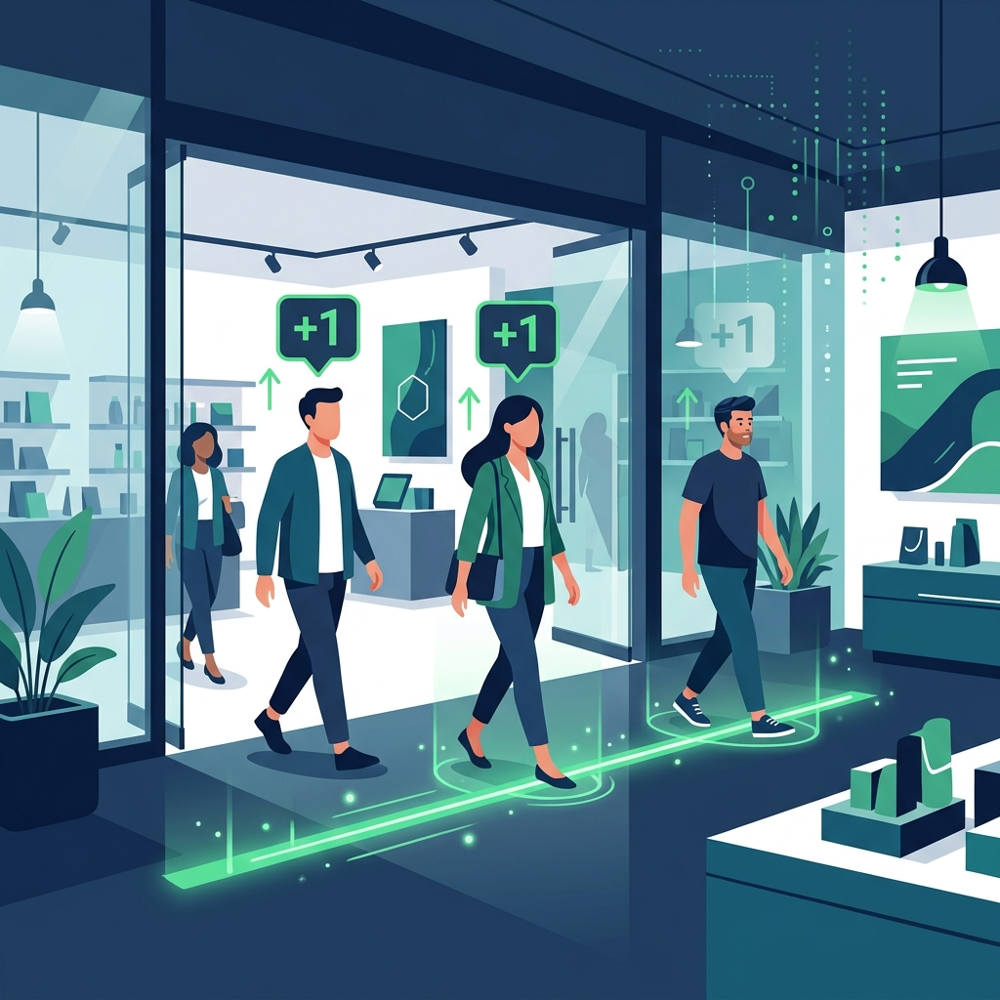
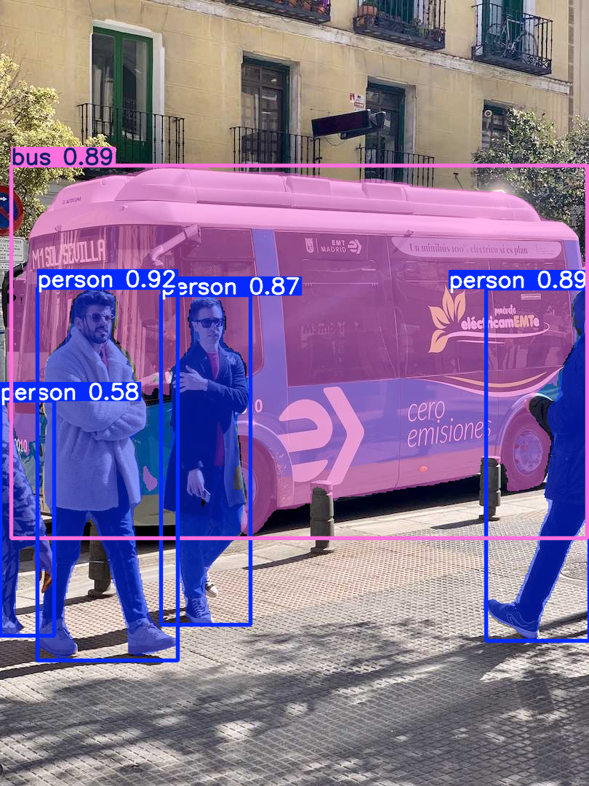
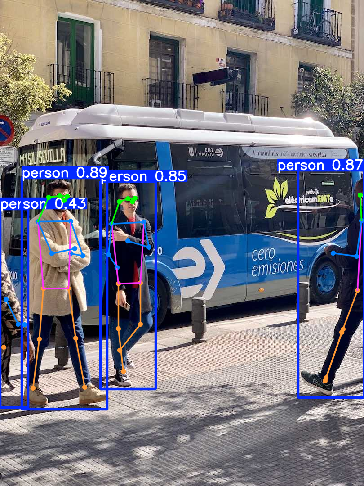

```{python}
#| echo: false
#| output: false
import matplotlib.pyplot as plt
try:
    import matplotlib_inline.backend_inline
    matplotlib_inline.backend_inline.set_matplotlib_formats('svg')
except:
    pass
plt.rcParams['svg.fonttype'] = 'none'

def fix_ar(text):
    return text
```


# 3. حالات الاستخدام والحلول الواقعية {.sdaia-dark data-background-gradient="linear-gradient(135deg, #1C355E, #00C9A7)" data-state="sdaia-bg"}

أبعد من مجرد مربعات على شاشة: كيف نستفيد من النتائج؟

## قصة المساعد الذكي {.smaller}

تخيل أن لديك مساعداً يراقب الكاميرات، هو ذكي جداً ويستطيع رؤية "مربعات" حول كل شيء، لكنه يحتاج لتعليمات واضحة:

- **الرؤية (Inference):** هي قدرة المساعد على قول: "هذه سيارة، وهذا إنسان".
- **الفعل (Solution):** هو ما تطلبه منه فعله بهذه المعلومة.

::: {.callout-tip}
### فكر فيها كأنها:
"المساعد رأى لصاً (رؤية).. الآن يجب عليه أن يدق الجرس (حل واقعي)!"
:::

## حلول Ultralytics الجاهزة {.smaller}

توفر Ultralytics مجموعة من **الحلول (Solutions)** الجاهزة التي تغلف نموذج الذكاء الاصطناعي وتسهل استخدامه.

تسمح لك هذه الحلول ببناء أنظمة رؤية حاسوبية احترافية ببضعة أسطر برمجية فقط!

## فئات الحلول {.smaller}

1. **تحليلات المناطق والحدود:** عد الأشياء، مراقبة المناطق، إدارة المواقف، وخطوط الانتظار.
2. **القياسات الحركية والمكانية:** حساب السرعة، قياس المسافات، ومجال الرؤية.
3. **تجميع البيانات وتصورها:** التحليلات الإحصائية، والخرائط الحرارية (Heatmaps).
4. **تعديل مخرجات الصور:** قص الأشياء، أو طمسها (التمويه للخصوصية).
5. **النماذج المتخصصة:** تتبع التجزئة، وتتبع التمارين الرياضية (Workouts).
6. **التكامل مع الأنظمة:** البث المباشر (Streamlit)، وأنظمة الإنذار الأمنية.

## أين تُحفظ نتائجي؟ {.smaller}

افتراضياً، تقوم Ultralytics بإنشاء مجلد باسم `runs/` في نفس مكان عملك الحالي:

```text
مجلد_مشروعك/
└── runs/
    ├── detect/
    │   ├── predict/          # نتائج التوقع (الصور والفيديوهات)
    │   └── train/            # نتائج التدريب (الأوزان، الرسوم البيانية)
    ├── segment/
    │   └── predict/
    └── solutions/            # إحصائيات الحلول (كالجداول الزمنية للعد)
```

::: {.callout-note}
يمكنك تغيير مكان الحفظ واسم المجلد باستخدام أوامر `project` و `name` في الأكواد.
:::

# تحليلات المناطق والحدود {.sdaia-dark data-background-gradient="linear-gradient(135deg, #1C355E, #00C9A7)" data-state="sdaia-bg"}

العد، المناطق، والطوابير

## تحليل المناطق والحدود {.smaller}

تعتمد هذه الحلول على رسم خطوط أو مضلعات وهمية (رقمية) على الفيديو، ومراقبة الكائنات عندما تتقاطع معها.

- **عد الكائنات (Object Counting):** يحسب عدد الأشياء التي تعبر خطاً معيناً.
- **مراقبة المناطق:** يتأكد مما إذا كانت الأشياء داخل أو خارج منطقة محددة.
- **إدارة المواقف (Parking):** يراقب المواقف (مشغول/فارغ) برسم مضلعات صغيرة عليها.
- **إدارة الطوابير (Queues):** يقيس مدة انتظار الأشخاص في منطقة معينة.

## مثال: عد الكائنات (Object Counting) {.smaller}

ببساطة: "عد أي شخص يلمس هذا الخط الأخضر".

:::: {.columns}
::: {.column width="50%"}
```python
from ultralytics import solutions

# 1. حدد الخط أو المنطقة
line = [(100, 500), (900, 500)] 

# 2. شغل العداد
counter = solutions.ObjectCounter(
    region=line, 
    model="yolo11n.pt"
)
```
:::

::: {.column width="50%"}
{fig-align="center" width="450"}
:::
::::


## عرض توضيحي: عد الكائنات {.center}




## مثال: إدارة مواقف السيارات {.smaller}

تنظيم وتوجيه حركة السيارات في المواقف ومعرفة الشاغر منها.

```python
import cv2
from ultralytics import solutions

cap = cv2.VideoCapture("videos/traffic.mp4")
# إحداثيات كل موقف سيارة على حدة
parking_spots = [
    [(10, 10), (10, 50), (100, 50), (100, 10)],
    [(110, 10), (110, 50), (200, 50), (200, 10)]
]

manager = solutions.ParkingManagement(
    model="weights/yolo26n.pt", region=parking_spots, show=True
)

while cap.isOpened():
    success, im0 = cap.read()
    if not success: break
    results = manager(im0)
```


# القياسات الحركية والمكانية {.sdaia-dark data-background-gradient="linear-gradient(135deg, #1C355E, #00C9A7)" data-state="sdaia-bg"}

السرعة، المسافات، ومجال الرؤية

## المسطرة الذكية (القياس المكاني) {.smaller}

كيف يعرف الكمبيوتر المسافة وهو يرى مجرد "بكسلات" (نقاط) على الشاشة؟

::: {.callout-tip}
### تشبيه المسطرة
تخيل أنك تضع مسطرة على شاشة التلفاز؛ المسطرة تقيس بالسنتيمتر، لكن في الحقيقة السيارة التي تراها قد قطعت كيلومترات!
نحن نعلم الكمبيوتر "كم متراً حقيقياً يساويه كل بكسل على الشاشة".
:::

- **حساب المسافة (Distance)**: مثل "المتر الرقمي" يقيس الفراغ بين شخصين (مثلاً للتباعد الاجتماعي).
- **عين الرؤية (VisionEye)**: مثل "رادار ثابت" يقيس بعدك عن الكاميرا.
- **تقدير السرعة (Speed Estimation)**: مثل "ساهر الرقمي" يحسب المسافة المقطوعة مقسومة على الزمن.

## مثال: تقدير السرعة {.smaller}

الجزء الأهم هو `meter_per_pixel`؛ هو الجسر الذي يربط الشاشة بالواقع.

```python
import cv2
from ultralytics import solutions

cap = cv2.VideoCapture("videos/traffic.mp4")
# ضبط ساهر الرقمي
speed_radar = solutions.SpeedEstimator(
    show=True, model="yolo11n.pt",
    meter_per_pixel=0.01 
)

while cap.isOpened():
    success, im0 = cap.read()
    if not success: break
    results = speed_radar(im0)
```

::: {.callout-note}
### لماذا نحتاج السرعة؟
1. **رصد المخالفات**: تجاوز السرعة المسموحة في الطرق.
2. **تحليل الرياضة**: حساب سرعة ركض اللاعبين أو سرعة الكرة.
3. **الأمان**: تنبيه الآلات في المصانع إذا اقتربت منها سيارة بسرعة عالية.
:::

## عرض توضيحي: تقدير السرعة {.center}



# تجميع البيانات وتصورها {.sdaia-dark data-background-gradient="linear-gradient(135deg, #1C355E, #00C9A7)" data-state="sdaia-bg"}

التحليلات والخرائط الحرارية (Heatmaps)

## دفتر الملاحظات الذكي (تجميع البيانات) {.smaller}

بدلاً من مجرد رؤية الكائنات، يقوم الكمبيوتر بتسجيل "تاريخ" ما حدث في تقارير بصرية.

::: {.callout-tip}
### تخيلها كأنها:
- **التحليلات (Analytics)**: هي "التقرير الإحصائي"؛ كم سيارة مرت اليوم؟ متى كان وقت الذروة؟ (تظهر كرسوم بيانية).
- **الخرائط الحرارية (Heatmaps)**: هي "آثار الأقدام"؛ أين وقف الناس أطول مدة؟ أي الرفوف في المتجر هي الأكثر جذباً؟ (تظهر كبقع ملونة فوق الفيديو).
:::

- **الهدف**: ليس مجرد "المراقبة"، بل "فهم السلوك" لاتخاذ قرارات تجارية ذكية.

## مثال: التحليلات الإحصائية {.smaller}

اكتشاف الأنماط واتخاذ قرارات مبنية على بيانات واضحة (رسوم خطية، أعمدة، أو دائرية).

```python
import os, cv2
from ultralytics import solutions

cap = cv2.VideoCapture("assets/Pull_ups.mp4")
analytics = solutions.Analytics(
    show=True,
    analytics_type="line", # الخيارات: "pie", "bar", "area"
    model="weights/yolo26n.pt", 
)

frame_count = 0
while cap.isOpened():
    success, im0 = cap.read()
    if not success: break
    frame_count += 1
    results = analytics(im0, frame_count) 
```

## مثال: الخرائط الحرارية (بصمة الحركة) {.smaller}

تساعدنا في تحويل الفيديو الجاف إلى "خريطة كنز" توضح لنا أين تتركز الأهمية.

```python
import os, cv2
from ultralytics import solutions

cap = cv2.VideoCapture("assets/videos/traffic.mp4")
heatmap = solutions.Heatmap(
    show=True, model="weights/yolo26n.pt",
    colormap=cv2.COLORMAP_JET
)

while cap.isOpened():
    success, im0 = cap.read()
    if not success: break
    results = heatmap(im0)
```


## عرض توضيحي: الخرائط الحرارية {.center}




# تعديل مخرجات الصور {.sdaia-dark data-background-gradient="linear-gradient(135deg, #1C355E, #00C9A7)" data-state="sdaia-bg"}

القص والتمويه (Blurring)

## تعديل مخرجات الصور {.smaller}

خطوات معالجة للصور تتم بعد الاستدلال باستخدام إحداثيات المربعات.

- **قص الكائنات (Cropping)**: استخراج الأشياء من الصورة وحفظ كل كائن في صورة منفصلة (مفيد جداً لبناء قواعد بيانات جديدة).
- **تمويه الكائنات (Blurring)**: وضع تأثير "الضباب" على الكائنات (كالوجوه أو اللوحات) لحماية الخصوصية.

## مثال: تمويه الكائنات (Blurring) {.smaller}

طمس المربعات المكتشفة تلقائياً لحماية خصوصية الأفراد المارة أو لوحات السيارات.

```python
import os, cv2
from ultralytics import solutions

cap = cv2.VideoCapture("assets/Pull_ups.mp4")
blurrer = solutions.ObjectBlurrer(
    show=True,
    model="weights/yolo26n.pt", 
    blur_ratio=0.5, # نسبة قوة التمويه والضبابية
)

while cap.isOpened():
    success, im0 = cap.read()
    if not success: break
    results = blurrer(im0)
```

# النماذج المتخصصة {.sdaia-dark data-background-gradient="linear-gradient(135deg, #1C355E, #00C9A7)" data-state="sdaia-bg"}

التجزئة والهيكل

## أبعد من مجرد مربعات (دقة التفاصيل) {.smaller}

أحياناً المربع لا يكفي؛ نحتاج لمعرفة الشكل الدقيق أو وضعية الجسم.

::: {.callout-tip}
### تخيلها كأنها:
- **التجزئة (Segmentation)**: مثل "قالب البسكويت"؛ هي لا تقول لك "هناك بسكويت" فحسب، بل تقصه من الأطراف بدقة. (تفيد في قياس حجم الأورام أو حدود الطريق للسيارات الذاتية).
- **الهيكل (Pose)**: مثل "رسمة الرجل الخطية"؛ هي ترسم مفاصل الإنسان (أكتاف، ركب، مرافق). (تفيد في تصحيح وضعية التمارين أو اكتشاف السقوط لكبار السن).
:::

- **السر**: نستخدم نماذج متخصصة مثل `YOLO-seg` و `YOLO-pose` للوصول لهذه الدقة.

{width="450"}

## مثال: مراقبة التمارين الرياضية {.smaller}

تتبع وتقييم الأداء الرياضي (مثل العقلة أو الضغط) باستخدام نقاط الهيكل البشري.

```python
import os, cv2
from ultralytics import solutions

cap = cv2.VideoCapture("assets/Pull_ups.mp4")
gym = solutions.AIGym(
    show=True,
    kpts=[6, 8, 10], # النقاط الخاصة بالذراعين (لتمارين العقلة/الضغط)
    model="yolov8n-pose.pt", 
)

while cap.isOpened():
    success, im0 = cap.read()
    if not success: break
    results = gym(im0)
```

{width="450"}

# 🏁 تحدي المبدعين: لعبة التوصيل الذكية {.sdaia-dark data-background-gradient="linear-gradient(135deg, #1C355E, #00C9A7)" data-state="sdaia-bg"}

وصل المشكلة بالحل البرمجي الصحيح

## تحدي التوصيل: هل أنت مستعد؟ {.smaller}

اضغط على **المشكلة** أولاً، ثم اضغط على **الحل** الذي تراه مناسباً:

<div class="matching-game">
  <div class="matching-columns">
    <div class="scenarios-col">
      <div class="match-item" id="s1" onclick="selectScenario(this, 'speed')">🚗 سيارات تسير بسرعة جنونية</div>
      <div class="match-item" id="s2" onclick="selectScenario(this, 'security')">🚨 دخول شخص لمنطقة محظورة</div>
      <div class="match-item" id="s3" onclick="selectScenario(this, 'queue')">🛒 زحام شديد عند المحاسب</div>
      <div class="match-item" id="s4" onclick="selectScenario(this, 'blur')">👤 وجوه تظهر بوضوح في الكاميرا</div>
    </div>
    <div class="solutions-col">
      <div class="match-item" id="sol-blur" onclick="selectSolution(this, 'blur')">Object Blurring</div>
      <div class="match-item" id="sol-speed" onclick="selectSolution(this, 'speed')">Speed Estimation</div>
      <div class="match-item" id="sol-queue" onclick="selectSolution(this, 'queue')">Queue Management</div>
      <div class="match-item" id="sol-security" onclick="selectSolution(this, 'security')">Security Alarm</div>
    </div>
  </div>
  <div id="game-feedback" style="margin-top:20px; font-weight:bold; text-align:center; min-height:1.5em;"></div>
</div>

::: {.fragment .fade-up}
> [!IMPORTANT]
> **الذكاء الحقيقي هو توظيف التقنية لحل مشاكل الناس اليومية!**
:::

# الخاتمة {.sdaia-dark data-background-gradient="linear-gradient(135deg, #1C355E, #00C9A7)" data-state="sdaia-bg"}

نهاية الجزء الثاني

## ملخص ما تعلمناه {.smaller}

- **الحلول الجاهزة**: أدوات مبنية مسبقاً لتسهيل التتبع والعد والتحليلات.
- **البيانات المتقدمة**: توليد الخرائط الحرارية والرسوم البيانية من حركات الأشياء.
- **التكامل الواقعي**: بناء أنظمة إنذار أمني وحل مشاكل العمل الحقيقية.

## الخطوات القادمة {.smaller}

في الدرس القادم: **البيانات المخصصة والتدريب**

- كيف نجهز بياناتنا الخاصة (صورنا الخاصة) لندرب YOLO عليها؟
- تدريب نماذج خاصة لاكتشاف كائنات غير موجودة في النماذج الجاهزة.
- فهم معايير الضبط وتقييم النماذج.

## أسئلة وأجوبة {.sdaia-dark background-color="#1C355E" data-state="sdaia-bg"}

<br><br><br>
<div style="text-align: center; font-size: 2em; line-height: 1.5;">
**شكراً لاهتمامكم ووقتكم** <br>
<span style="font-size: 0.7em; color: #00C9A7;">يُسعدني الإجابة على استفساراتكم ومناقشاتكم</span>
</div>

<style>
  /* Fix RTL overflow and styling */
  .reveal .slide {
    text-align: right;
    direction: rtl;
  }
</style>
