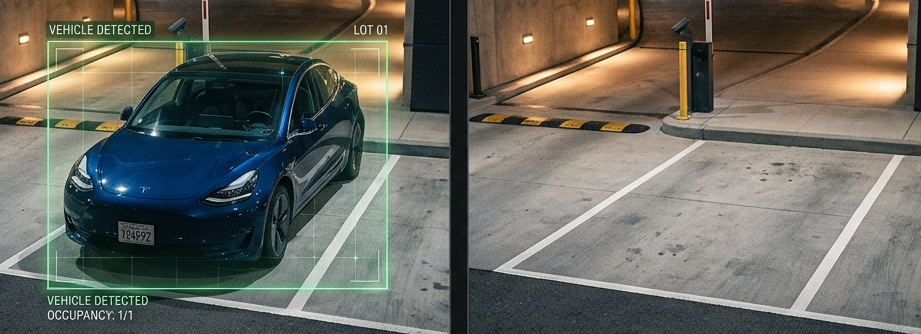
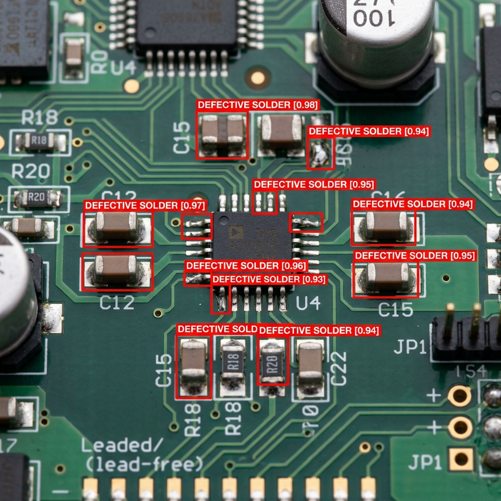

```{python}
#| echo: false
#| output: false
import matplotlib.pyplot as plt
try:
    import matplotlib_inline.backend_inline
    matplotlib_inline.backend_inline.set_matplotlib_formats('svg')
except:
    pass
plt.rcParams['svg.fonttype'] = 'none'

def fix_ar(text):
    return text
```


# 7. تقييم النموذج {.sdaia-dark data-background-gradient="linear-gradient(135deg, #1C355E, #00C9A7)"}

ما مدى جودة نموذجك فعلياً؟

## أساسيات التصنيف الثنائي {.smaller}

كل توقع يخرج من النموذج يقع في واحدة من أربع فئات. مثال: اكتشاف **"سيارة"**

```{=html}
<table style="width:90%; margin: 1.5rem auto; border-collapse: separate; border-spacing: 8px; font-size: 1em; text-align: center;" dir="rtl">
  <tr>
    <td style="width:20%"></td>
    <th style="padding:0.6rem; color:#1C355E;">Prediction: سيارة</th>
    <th style="padding:0.6rem; color:#1C355E;">Prediction: ليست سيارة</th>
  </tr>
  <tr>
    <th style="color:#1C355E; text-align:right; padding-right:0.8rem;">الحقيقة: سيارة</th>
    <td style="background:#d4edda; padding:1rem; border-radius:8px;">✅ <strong>إيجابي صحيح (TP)</strong><br><small>اكتشاف صحيح</small></td>
    <td style="background:#f8d7da; padding:1rem; border-radius:8px;">❌ <strong>سلبي خاطئ (FN)</strong><br><small>سيارة تم تفويتها</small></td>
  </tr>
  <tr>
    <th style="color:#1C355E; text-align:right; padding-right:0.8rem;">الحقيقة: ليست سيارة</th>
    <td style="background:#fff3cd; padding:1rem; border-radius:8px;">⚠️ <strong>إيجابي خاطئ (FP)</strong><br><small>إنذار خاطئ</small></td>
    <td style="background:#d4edda; padding:1rem; border-radius:8px;">✅ <strong>سلبي صحيح (TN)</strong><br><small>رفض صحيح (بقعة فارغة)</small></td>
  </tr>
</table>
```

## سيناريو: كاميرا المواقف الذكية {.smaller}

::: {style="font-size: 0.9em;"}
كاميرا عند مدخل موقف سيارات تصنف كل إطار كـ **سيارة موجودة** أو **لا يوجد شيء**: 
:::

{fig-align="center" width="80%"}

**بيانات الاختبار:** 24 ساعة، 10,000 إطار (إطار كل 9 ثوانٍ تقريباً)

| الحالة | العدد | النسبة |
|---|---|---|
| سيارة موجودة | 500 | 5% |
| بقعة فارغة | 9,500 | 95% |

في معظم الأوقات، الموقف يكون فارغاً.


## مشكلة "الدقة" (Accuracy) {.smaller}

تخيل نموذجاً "كسولاً" **يتوقع دائماً "فارغ"** مهما رأى:

::: {.fragment .fade-up}
- يجد **0 سيارات** (فشل في كل السيارات)
- يصيب في كل الـ 9,500 بقعة فارغة
:::

::: {.fragment .fade-up}
$$Accuracy (الدقة) = \frac{9{,}500}{10{,}000} = 95\%$$
:::

::: {.fragment .fade-up}
**95% دقة!** — ومع ذلك لم يكتشف سيارة واحدة. هذه هي **مشكلة اختلال توازن البيانات (Class Imbalance)**.
:::


## لغة التقييم: كيف يرى النموذج العالم؟ {.smaller}

لفهم دقة النموذج، نستخدم أربعة مصطلحات أساسية تصف "إصابته" أو "خطأه":

| المصطلح | المعنى البسيط | مثال كاميرا الأمان (لص) | النتيجة |
| :--- | :--- | :--- | :--- |
| **True Positive (TP)** | **صيد صحيح** | الكاميرا رصدت شخصاً، وطلع فعلاً "لص". | **نجاح! ✅** |
| **False Positive (FP)** | **إنذار خاطئ** | الكاميرا دقت جرس الإنذار، لكن طلع "قطة". | **إزعاج 📣** |
| **False Negative (FN)** | **صيد ضائع** | اللص دخل البيت، والكاميرا لم ترسل أي تنبيه. | **خطر! 🙈** |
| **True Negative (TN)** | **تجاهل صحيح** | لم يمر أحد، والكاميرا بقيت هادئة. | **أمان 💤** |

---

## مصفوفة الحيرة (Confusion Matrix) {.smaller}

هي مجرد "جدول" يجمع كل الحالات السابقة لنعرف أين يقع الخلل الأكبر في النموذج.

::: {.columns}
::: {.column width="50%"}
**لماذا نهتم؟**
- في **السيارات ذاتية القيادة**: الـ **FN** (عدم رؤية سيارة أمامك) أخطر بكثير من الـ **FP**.
- في **فلترة الرسائل المزعجة (Spam)**: الـ **FP** (حذف إيميل مهم) أسوأ من الـ **FN**.
:::

::: {.column width="50%"}
| | الواقع: إيجابي (لص) | الواقع: سلبي (فارغ) |
| :--- | :--- | :--- |
| **توقع: إيجابي** | **TP** (صيد صحيح) | **FP** (إنذار كاذب) |
| **توقع: سلبي** | **FN** (صيد ضائع) | **TN** (تجاهل صحيح) |
:::
:::

::: notes
- الـ True تعني أن النموذج "أصاب" في حكمه.
- الـ False تعني أن النموذج "أخطأ" في حكمه.
- الـ Positive تعني أن النموذج "توقع وجود" الشيء.
- الـ Negative تعني أن النموذج "توقع عدم وجود" الشيء.
:::


## Balanced Accuracy: المشكلة المخفية {.smaller}

**ماذا لو كان النموذج يكتشف كل سيارة، ولكنه "مفرط الحساسية" (يرى أشباحاً)؟**

:::: {.columns}

::: {.column width="55%"}
```{python}
import matplotlib.pyplot as plt


#| echo: false
#| fig-align: center
import matplotlib.pyplot as plt
import numpy as np


fig, ax = plt.subplots(figsize=(5, 3.5))
fig.patch.set_alpha(0.0)
ax.patch.set_alpha(0.0)

# Arabic labels
categories = ['إيجابيات صحيحة\n(تم صيد السيارات)', 'إيجابيات خاطئة\n(فارغ ← "سيارة"', 'سلبيات خاطئة\n(سيارات ضاعت)', 'سلبيات صحيحة\n(رفض صحيح)']
values = [500, 1900, 0, 7600]
colors = ['#28a745', '#dc3545', '#ffc107', '#17a2b8']

bars = ax.barh(categories, values, color=colors, height=0.5, edgecolor='white', linewidth=1.5)
for bar, val in zip(bars, values):
    ax.text(bar.get_width() + 100, bar.get_y() + bar.get_height()/2,
            f'{val:,}', va='center', ha='left', fontsize=11, fontweight='bold', color='#1C355E')

ax.set_xlim(0, 9000)
ax.spines['top'].set_visible(False)
ax.spines['right'].set_visible(False)
ax.spines['bottom'].set_color('#1C355E')
ax.spines['left'].set_visible(False)
ax.tick_params(left=False, colors='#1C355E', labelsize=9)
ax.set_title('نتائج النموذج مفرط الحساسية', fontsize=13, fontweight='bold', color='#1C355E')
plt.tight_layout()
plt.show()
```
:::

::: {.column width="45%"}
::: {style="font-size: 0.85em;"}
::: {.fragment .fade-up}
- **دقة فئة السيارات:** 100%
- **دقة فئة الفارغ:** 80%

$$\frac{100\% + 80\%}{2} = \mathbf{90\%}$$
:::

::: {.fragment .fade-up}
::: {.callout-warning appearance="minimal"}
**90% تبدو رائعة** — ولكنها تخفي **1,900 إنذار خاطئ** داخل الرقم.
:::
:::

::: {.fragment .fade-up}
::: {.callout-tip appearance="minimal"}
**فخ الـ TN:** الـ **7,600 سلبي صحيح** (تجاهل البقع الفارغة بشكل صحيح) هي التي رفعت الدقة بشكل خادع بينما الإنذارات الخاطئة تغرق نظامك.
:::
:::
:::
:::

::::


## Precision وRecall {.smaller}

مقياسان يتجاهلان "السلبيات الصحيحة" تماماً (البقع الفارغة التي تم تجاهلها بنجاح):

::: {.incremental}
- **Precision:** عندما يقول النموذج "هذه سيارة"، ما مدى احتمال أن تكون سيارة فعلاً؟ *(الجودة)*
  $$Precision = \frac{TP}{TP + FP}$$
- **Recall:** من بين كل السيارات الموجودة فعلاً، كم واحدة نجح النموذج في إيجادها؟ *(الكمية)*
  $$Recall = \frac{TP}{TP + FN}$$
:::


## دراسة حالة: نموذجان {.smaller}

لدينا **500 سيارة حقيقية**. كيف سيتعامل معها هذان النموذجان؟

::: {.incremental}
- **النموذج (أ):** "مفرط الحساسية" (يصيح على كل شيء)
- **النموذج (ب):** "حذر" (لا يتحدث إلا إذا كان متأكداً 100%)
:::


## النموذج (أ): "مفرط الحساسية" {.smaller}

*يصيح على كل شيء — لا يفوت سيارة أبداً*

```{python}
#| echo: false
#| fig-align: center
import matplotlib.pyplot as plt

import numpy as np

fig, ax = plt.subplots(figsize=(7, 4))
fig.patch.set_alpha(0.0)
ax.patch.set_alpha(0.0)

# Data for Model A
categories = ['إيجابيات صحيحة\n(تم مسكها)', 'إيجابيات خاطئة\n(إنذارات كاذبة)', 'سلبيات خاطئة\n(تم تفويتها)']
values = [500, 1900, 0]
colors = ['#28a745', '#dc3545', '#ffc107']

bars = ax.barh(categories, values, color=colors, height=0.5, edgecolor='white', linewidth=1.5)

# Add value labels
for bar, val in zip(bars, values):
    ax.text(bar.get_width() + 30, bar.get_y() + bar.get_height()/2,
            str(val), va='center', ha='left', fontsize=13, fontweight='bold', color='#1C355E')

ax.set_xlim(0, 2400)
ax.spines['top'].set_visible(False)
ax.spines['right'].set_visible(False)
ax.spines['bottom'].set_color('#1C355E')
ax.spines['left'].set_visible(False)
ax.tick_params(left=False, colors='#1C355E', labelsize=11)
ax.set_title('النموذج أ: توقع 2,400 "سيارة"', fontsize=14, fontweight='bold', color='#1C355E')
ax.set_xlabel('العدد', fontsize=12, color='#1C355E')

plt.tight_layout()
plt.show()
```

::: {.fragment .fade-up}
- **Recall:** 500 / 500 = **100%**
- **Precision:** 500 / 2,400 ≈ **20.8%**
:::


## النموذج (ب): "الحذر" {.smaller}

*لا يتحدث إلا عندما يكون متأكداً جداً*

```{python}
#| echo: false
#| fig-align: center
import matplotlib.pyplot as plt

import numpy as np

fig, ax = plt.subplots(figsize=(7, 4))
fig.patch.set_alpha(0.0)
ax.patch.set_alpha(0.0)

# Data for Model B
categories = ['إيجابيات صحيحة\n(تم مسكها)', 'إيجابيات خاطئة\n(إنذارات كاذبة)', 'سلبيات خاطئة\n(تم تفويتها)']
values = [350, 0, 150]
colors = ['#28a745', '#dc3545', '#ffc107']

bars = ax.barh(categories, values, color=colors, height=0.5, edgecolor='white', linewidth=1.5)

# Add value labels
for bar, val in zip(bars, values):
    ax.text(bar.get_width() + 20, bar.get_y() + bar.get_height()/2,
            str(val), va='center', ha='left', fontsize=13, fontweight='bold', color='#1C355E')

ax.set_xlim(0, 550)
ax.spines['top'].set_visible(False)
ax.spines['right'].set_visible(False)
ax.spines['bottom'].set_color('#1C355E')
ax.spines['left'].set_visible(False)
ax.tick_params(left=False, colors='#1C355E', labelsize=11)
ax.set_title('النموذج ب: توقع 350 "سيارة"', fontsize=14, fontweight='bold', color='#1C355E')
ax.set_xlabel('العدد', fontsize=12, color='#1C355E')

plt.tight_layout()
plt.show()
```

::: {.fragment .fade-up}
- **Recall:** 350 / 500 = **70%**
- **Precision:** 350 / 350 = **100%**
:::

## 🎯 محاكي: موازنة الدقة والكمية {background-color="#f0f4f8" .smaller}

::: {style="text-align: center; margin-bottom: 0.5rem; font-size: 0.9rem;"}
حرك المنزلق وشاهد كيف يتأثر أداء النموذج بتغيير "عتبة الثقة"
:::

```{=html}
<div style="background: white; padding: 0.8rem; border-radius: 12px; box-shadow: 0 4px 15px rgba(0,0,0,0.05); max-width: 650px; margin: 0 auto; font-family: sans-serif; border: 1px solid #ddd;">
    
    <!-- Slider Section -->
    <div style="margin-bottom: 1rem; background: #f8f9fa; padding: 0.8rem; border-radius: 8px;">
        <div style="display: flex; justify-content: space-between; font-weight: bold; color: #1C355E; margin-bottom: 0.5rem; font-size: 0.8rem;">
            <span>🔓 متساهل (صيد كثير)</span>
            <span id="thresh-val" style="background: #1C355E; color: white; padding: 1px 6px; border-radius: 4px;">0.50</span>
            <span>🔒 حذر (تأكد تام)</span>
        </div>
        <input type="range" id="threshold-slider" min="0" max="1" step="0.1" value="0.5" style="width: 100%; cursor: pointer; accent-color: #1C355E;">
    </div>

    <!-- Stats Grid -->
    <div style="display: grid; grid-template-columns: repeat(3, 1fr); gap: 0.5rem; text-align: center; margin-bottom: 1rem;">
        <div style="background: #e7f5ee; padding: 0.5rem; border-radius: 8px;">
            <div style="font-size: 0.7rem; color: #155724; font-weight: bold;">✅ صيد صحيح</div>
            <div id="tp-count" style="font-size: 1.4rem; font-weight: bold; color: #28a745;">45</div>
        </div>
        <div style="background: #fff5f5; padding: 0.5rem; border-radius: 8px;">
            <div style="font-size: 0.7rem; color: #721c24; font-weight: bold;">❌ إنذار خاطئ</div>
            <div id="fp-count" style="font-size: 1.4rem; font-weight: bold; color: #dc3545;">10</div>
        </div>
        <div style="background: #fff9e6; padding: 0.5rem; border-radius: 8px;">
            <div style="font-size: 0.7rem; color: #856404; font-weight: bold;">⚠️ صيد ضائع</div>
            <div id="fn-count" style="font-size: 1.4rem; font-weight: bold; color: #ffc107;">5</div>
        </div>
    </div>

    <!-- Simple Message -->
    <div id="msg" style="text-align: center; font-size: 0.85rem; color: #1C355E; padding: 0.5rem; border-top: 1px solid #eee;">
        هذا الوضع متوازن ومناسب لأغلب الحالات.
    </div>
</div>

<script>
(function() {
    const slider = document.getElementById('threshold-slider');
    const tVal = document.getElementById('thresh-val');
    const tp = document.getElementById('tp-count');
    const fp = document.getElementById('fp-count');
    const fn = document.getElementById('fn-count');
    const msg = document.getElementById('msg');

    function update() {
        const v = parseFloat(slider.value);
        tVal.innerText = v.toFixed(1);
        
        // Dynamic logic
        let tp_val = Math.round(50 * (1.1 - v));
        let fp_val = Math.round(40 * (1 - v));
        let fn_val = 50 - tp_val;
        
        tp.innerText = tp_val;
        fp.innerText = fp_val;
        fn.innerText = fn_val;
        
        if (v <= 0.3) {
            msg.innerHTML = "🎯 <b>وضع هجومي:</b> نصطاد كل شيء، لكن نخطئ كثيراً (Recall عالي).";
        } else if (v >= 0.7) {
            msg.innerHTML = "🛡️ <b>وضع دفاعي:</b> لا نتوقع إلا عندما نتأكد تماماً (Precision عالي).";
        } else {
            msg.innerHTML = "⚖️ <b>وضع متوازن:</b> موازنة معقولة بين الدقة والكمية.";
        }
    }
    slider.oninput = update;
    update();
})();
</script>
```

::: notes
شرح التفاعل:
- عندما تكون العتبة (Threshold) منخفضة، النموذج "يخمن" كثيراً، مما يزيد الـ Recall ولكن يقلل الـ Precision.
- عندما تكون العتبة عالية، النموذج "متحفظ"، مما يزيد الـ Precision ولكن يقلل الـ Recall.
:::

:::: {.columns}

::: {.column width="55%"}
```{=html}
<div style="display:flex; flex-direction:column; align-items:center; gap:0.6rem; margin-top:1.2rem; font-size:0.9em;" dir="rtl">
  <div style="background:rgba(28,53,94,0.10); border-radius:10px; padding:0.8rem 1.4rem; text-align:center; width:80%;">
    🧠 <strong>النموذج</strong><br>
    <span style="color:#1C355E;">درجات الثقة الخام (Confidence)</span>
  </div>
  <div style="font-size:1.4rem; color:#1C355E;">↓</div>
  <div style="background:rgba(255,140,0,0.12); border:2px dashed #FF8C00; border-radius:10px; padding:0.8rem 1.4rem; text-align:center; width:80%;">
    ⚙️ <strong>بوابة العتبة (Threshold)</strong><br>
    <span style="color:#FF8C00;">هل Score ≥ العتبة؟</span>
  </div>
  <div style="font-size:1.4rem; color:#1C355E;">↓</div>
  <div style="background:rgba(0,201,167,0.12); border-radius:10px; padding:0.8rem 1.4rem; text-align:center; width:80%;">
    🏷️ <strong>التصنيف</strong><br>
    <span style="color:#00C9A7;">"سيارة" / "ليست سيارة"</span>
  </div>
</div>
```
:::

::: {.column width="45%"}
<br>
**النموذج** يعطي درجات احتمالية، وليس قرارات نهائية:

> "أنا متأكد بنسبة **72%** أن هذه سيارة."

::: {.fragment .fade-up}
**نحن** من نقرر التصنيف النهائي:

- **التصنيف:** أعلى درجة تفوز (`top1`)
- **الاكتشاف:** تظهر الصناديق التي تتجاوز عتبة الثقة المحددة فقط.
:::
:::

::::


## عرض تفاعلي: مقايضة العتبة (Threshold Trade-off) {.smaller}

```{=html}
<iframe class="interactive-demo" src="demo_threshold.html" width="100%" height="90%" style="border:none; overflow:hidden;"></iframe>
```


## المقايضة: الضبط مقابل الاستدعاء {.smaller}

رفع أو خفض عتبة الثقة يغير التوازن:

:::: {.columns}

::: {.column style="background: rgba(220,53,69,0.08)"}
### 🎯 عتبة عالية (`0.80`)
**صارم** — لا يمر إلا "المتأكد منه"

↑ **ضبط (Precision)** عالي (إنذارات خاطئة أقل)

↓ **استدعاء (Recall)** منخفض (تفويت سيارات أكثر)
:::

::: {.column style="background: rgba(0,201,167,0.08)"}
### 🔍 عتبة منخفضة (`0.20`)
**متساهل** — يمسك كل شيء

↑ **استدعاء (Recall)** عالي (تفويت أقل)

↓ **ضبط (Precision)** منخفض (إنذارات خاطئة أكثر)
:::

::::


## F1 Score: موازنة الضبط والاستدعاء {.smaller}

**ما هو الرقم الوحيد الذي يجمع الاثنين معاً؟**

$$F_1 = 2 \times \frac{Precision \times Recall}{Precision + Recall}$$

::: {.callout-note appearance="minimal"}
وجود **صفر** في أي من المقياسين يسحب Score الكلية للأسفل — لا يمكنك الاختباء وراء رقم واحد قوي.
:::


## F1 Score: مقارنة النماذج {.smaller}

```{python}
#| echo: false
#| fig-align: center
import matplotlib.pyplot as plt

import numpy as np

# Arabic labels for plot
models = ['النموذج أ\n(مفرط الحساسية)', 'النموذج ب\n(الحذر)']
precision_vals = [20.8, 100]
recall_vals = [100, 70]
f1_vals = [2 * p * r / (p + r) for p, r in zip(precision_vals, recall_vals)]
balanced_accuracy_vals = [90.0, 85.0]

x = np.arange(len(models))
width = 0.18

fig, ax = plt.subplots(figsize=(10, 5))
fig.patch.set_alpha(0.0)
ax.patch.set_alpha(0.0)

bars1 = ax.bar(x - 1.5*width, precision_vals, width, label='الضبط', color='#1C355E', alpha=0.85)
bars2 = ax.bar(x - 0.5*width, recall_vals, width, label='الاستدعاء', color='#00C9A7', alpha=0.85)
bars3 = ax.bar(x + 0.5*width, f1_vals, width, label='مقياس F1', color='#FF8C00', alpha=0.9)
bars4 = ax.bar(x + 1.5*width, balanced_accuracy_vals, width, label='Balanced Acc', color='#6f42c1', alpha=0.85)

# Add value labels for F1 and Balanced Accuracy
for bar in bars3:
    ax.text(bar.get_x() + bar.get_width()/2., bar.get_height() + 1.5,
            f'{bar.get_height():.1f}%', ha='center', va='bottom',
            fontsize=10, fontweight='bold', color='#FF8C00')

for bar in bars4:
    ax.text(bar.get_x() + bar.get_width()/2., bar.get_height() + 1.5,
            f'{bar.get_height():.1f}%', ha='center', va='bottom',
            fontsize=10, fontweight='bold', color='#6f42c1')

ax.set_ylabel('الدرجة (%)', fontsize=12, color='#1C355E')
ax.set_xticks(x)
ax.set_xticklabels(models, fontsize=11, color='#1C355E')
ax.set_ylim(0, 115)
# Legend in Arabic if possible or keep English for clarity
ax.legend(['الضبط', 'الاستدعاء', 'مقياس F1', 'الدقة المتوازنة'], frameon=False, fontsize=10, loc='upper center', bbox_to_anchor=(0.5, 1.15), ncol=4)
ax.spines['top'].set_visible(False)
ax.spines['right'].set_visible(False)
ax.spines['bottom'].set_color('#1C355E')
ax.spines['left'].set_color('#1C355E')
ax.tick_params(colors='#1C355E')

plt.tight_layout()
plt.show()
```

::: {.callout-tip appearance="minimal"}
F1 Score كشف عيب النموذج (أ): الـ 1,900 إنذار خاطئ رفعت الاستدعاء ولكنها دمرت الضبط — F1 Score = **34.4%**.
:::


## اختيار العتبة المناسبة {.smaller}

```{python}
#| echo: false
#| fig-align: center
import numpy as np
import matplotlib.pyplot as plt


conf = np.linspace(0.01, 0.99, 200)

# Simulate recall: drops off as threshold increases
recall = 1 / (1 + np.exp(8 * (conf - 0.6)))

# Simulate precision: rises as threshold increases
precision = 1 / (1 + np.exp(-8 * (conf - 0.35)))

# F1 score
f1 = 2 * precision * recall / (precision + recall + 1e-9)

best_idx = np.argmax(f1)
best_conf = conf[best_idx]
best_f1 = f1[best_idx]

fig, ax = plt.subplots(figsize=(7, 4.5))
fig.patch.set_alpha(0.0)
ax.patch.set_alpha(0.0)

ax.plot(conf, f1,        color='#FF8C00', linewidth=3,   label='F1')
ax.plot(conf, precision, color='#1C355E', linewidth=2.5, linestyle='--', label='الضبط')
ax.plot(conf, recall,    color='#00C9A7', linewidth=2.5, linestyle='--', label='الاستدعاء')

ax.axvline(best_conf, color='#dc3545', linewidth=2, linestyle=':')
ax.scatter([best_conf], [best_f1], color='#dc3545', zorder=5, s=80)
ax.annotate(f'Best F1 at conf={best_conf:.2f}',
            xy=(best_conf, best_f1),
            xytext=(best_conf + 0.08, best_f1 - 0.12),
            fontsize=10, color='#dc3545',
            arrowprops=dict(arrowstyle='->', color='#dc3545'))

ax.set_xlabel('عتبة الثقة', fontsize=12, color='#1C355E')
ax.set_ylabel('الدرجة', fontsize=12, color='#1C355E')
ax.set_xlim(0, 1)
ax.set_ylim(0, 1.05)
ax.legend(frameon=False, fontsize=11, labelcolor='#1C355E')
ax.spines['top'].set_visible(False)
ax.spines['right'].set_visible(False)
ax.spines['bottom'].set_color('#1C355E')
ax.spines['left'].set_color('#1C355E')
ax.tick_params(colors='#1C355E')
ax.grid(True, linestyle='--', alpha=0.25, color='#1C355E')
plt.tight_layout()
plt.show()
```

::: {.callout-tip appearance="minimal" .fragment .fade-up}
تقوم Ultralytics بحفظ رسوم `F1_curve.png` و `R_curve.png` في نتائج التدريب تلقائياً.
:::


## دراسة حالة: ترجمة المقاييس إلى عوائد (ROI) {.smaller}

المقاييس مثل الدقة و F1 رائعة للمهندسين، ولكن الإدارة تتحدث لغة واحدة: **المال.**

::: {style="font-size: 0.9em;"}
**السيناريو:** مصنع رقمي ينتج لوحات دوائر إلكترونية متطورة. نقوم بنشر نموذج YOLO لاكتشاف "اللحام المعيب" قبل شحن اللوحات للعملاء. 
:::

{fig-align="center" width="75%"}


## تكلفة كل توقع {.smaller}

كل توقع في مصنعنا الرقمي له نتيجة مالية ملموسة:

::: {.incremental}
- ✅ **إيجابي صحيح (TP):** تم اكتشاف العيب، وتم استبعاد اللوحة مبكراً. (لا خسارة إضافية).
- ✅ **سلبي صحيح (TN):** اللوحة سليمة وتم شحنها للعميل. (لا خسارة).
- ❌ **سلبي خاطئ (FN):** لوحة معيبة شُحنت للعميل بالخطأ. **التكلفة: 500$** *(ضمان، شحن، ضرر بالسمعة).*
- ⚠️ **إيجابي خاطئ (FP):** لوحة سليمة تم وسمها كمعيبة. تحتاج فحصاً يدوياً. **التكلفة: 25$** *(عمالة).*
:::


## مصفوفة الارتباك المالية {.smaller}

إذا اختبرنا نموذجنا على دفعة مكونة من **10,000 لوحة** (حيث 5% منها معيبة فعلاً):

```{=html}
<table style="width:90%; margin: 1.5rem auto; border-collapse: separate; border-spacing: 8px; font-size: 1.1em; text-align: center;" dir="rtl">
  <tr>
    <td style="width:20%"></td>
    <th style="padding:0.6rem; color:#1C355E;">Prediction: معيبة</th>
    <th style="padding:0.6rem; color:#1C355E;">Prediction: سليمة</th>
  </tr>
  <tr>
    <th style="color:#1C355E; text-align:right; padding-right:0.8rem;">الحقيقة: معيبة</th>
    <td style="background:#d4edda; padding:1rem; border-radius:8px;">✅ <strong>TP</strong><br><small>التكلفة: 0$</small></td>
    <td style="background:#f8d7da; padding:1rem; border-radius:8px;">❌ <strong>FN (تفويت)</strong><br><small style="color:#dc3545; font-weight:bold;">التكلفة: 500$ لكل واحدة</small></td>
  </tr>
  <tr>
    <th style="color:#1C355E; text-align:right; padding-right:0.8rem;">الحقيقة: سليمة</th>
    <td style="background:#fff3cd; padding:1rem; border-radius:8px;">⚠️ <strong>FP (إنذار كاذب)</strong><br><small style="color:#FF8C00; font-weight:bold;">التكلفة: 25$ لكل واحدة</small></td>
    <td style="background:#d4edda; padding:1rem; border-radius:8px;">✅ <strong>TN</strong><br><small>التكلفة: 0$</small></td>
  </tr>
</table>
```

::: {.fragment .fade-up style="text-align: center; margin-top: 1rem;"}
**إجمالي الخسارة المالية = $(FN \times \$500) + (FP \times \$25)$**
:::


## خطوط الأساس: تكلفة القرارات "الغبية" {.smaller}

ماذا لو لم نستخدم الذكاء الاصطناعي أصلاً؟ لنلقِ نظرة على الأثر المالي لأبسط استراتيجيتين "تقليديتين":

:::: {.columns}

::: {.column width="50%" .fragment}
### 🚢 "اشحن كل شيء"
*افترض أن كل اللوحات سليمة*

- **السلبيات الخاطئة (FN):** 500
- **التكلفة:** $500 \times 500$
- **إجمالي الخسارة:** [**$250,000**]{style="color:#dc3545; font-size:1.2em;"}
:::

::: {.column width="50%" .fragment}
### ⚙️ "استبعد كل شيء"
*افترض أن كل اللوحات معيبة*

- **الإيجابيات الخاطئة (FP):** 9,500
- **التكلفة:** $9,500 \times 25$
- **إجمالي الخسارة:** [**$237,500**]{style="color:#FF8C00; font-size:1.2em;"}
:::

::::

::: {.fragment .fade-up style="text-align: center; margin-top: 1.5rem;"}
::: {.callout-tip appearance="minimal"}
**الخلاصة:** حتى النموذج "البسيط" يوفر للشركة مئات الآلاف من الدولارات في كل دفعة. والآن دعونا نرى كم يمكننا توفيره أكثر عبر التحسين.
:::
:::


## التحسين من أجل الربح، وليس فقط F1 {.smaller}

تذكر كيف يوازن F1 Score بين الضبط والاستدعاء؟ عندما يتعلق الأمر بالمال، يتغير الميزان. تفويت عيب واحد (FN) أغلى بـ 20 مرة من الإنذار الخاطئ (FP).

:::: {.columns}

::: {.column width="50%" .fragment .fade-up}
### الخيار (أ): أعلى درجة F1
عتبة متوازنة (conf=0.35)

- **لوحات معيبة تم تفويتها (FN):** 81 لوحة $\times \$500$ = $\$40,500$
- **إنذارات كاذبة (FP):** 0 لوحة $\times \$25$ = $\$0$
- **إجمالي الخسارة:** <span style="color:#dc3545; font-weight:bold;">$40,500</span>
:::

::: {.column width="50%" .fragment .fade-up}
### الخيار (ب): أعلى عائد (ROI)
عتبة متساهلة (conf=0.20)

- **لوحات معيبة تم تفويتها (FN):** 22 لوحة $\times \$500$ = $\$11,000$
- **إنذارات كاذبة (FP):** 2 لوحة $\times \$25$ = $\$50$
- **إجمالي الخسارة:** <span style="color:#00C9A7; font-weight:bold;">$11,050</span>
:::

::::

::: {.callout-important appearance="minimal" .fragment .fade-up}
عبر خفض العتبة وقبول القليل من الإنذارات الخاطئة، وفرنا للشركة قرابة **30,000$** إضافية في كل دفعة. لقد قمنا بالتحسين من أجل **مقياس العمل التجاري**، وليس مقياس تعلم الآلة فقط.
:::


## منحنى التكلفة (The Cost Curve) {.smaller}

تماماً كما رسمنا منحنى F1، يمكننا رسم **منحنى التكلفة** لإيجاد العتبة المثالية للنشر.

```{python}
#| echo: false
#| fig-align: center
import numpy as np
import matplotlib.pyplot as plt

import matplotlib.ticker as ticker

# Generate synthetic data
np.random.seed(42)  # For reproducible results
total_defects = 500
total_good = 9500

# Defects have a clear but overlapping distribution
scores_defects = np.random.normal(0.55, 0.20, total_defects)
scores_good = np.random.normal(0.10, 0.03, total_good)

# Clip to valid confidence range
scores_defects = np.clip(scores_defects, 0.01, 0.99)
scores_good = np.clip(scores_good, 0.01, 0.99)

# Calculate costs across thresholds
thresholds = np.linspace(0.01, 0.99, 200)
total_costs = []

for t in thresholds:
    fn = np.sum(scores_defects < t)
    fp = np.sum(scores_good >= t)
    total_costs.append(fn * 500 + fp * 25)

total_costs = np.array(total_costs)

# Find minimum cost
best_idx = np.argmin(total_costs)
best_conf = thresholds[best_idx]
min_cost = total_costs[best_idx]

# Plot
fig, ax = plt.subplots(figsize=(8, 4.5))
fig.patch.set_alpha(0.0)
ax.patch.set_alpha(0.0)

ax.plot(thresholds, total_costs, color='#1C355E', linewidth=3, label='إجمالي الخسارة المالية ($)')

# Highlight minimum cost
ax.axvline(best_conf, color='#00C9A7', linewidth=2, linestyle=':')
ax.scatter([best_conf], [min_cost], color='#00C9A7', zorder=5, s=80)
ax.annotate(f'أفضل ROI عند conf={best_conf:.2f}\nالتكلفة: ${min_cost:,.0f}',
            xy=(best_conf, min_cost),
            xytext=(best_conf + 0.05, min_cost + 20000),
            fontsize=11, fontweight='bold', color='#00C9A7',
            arrowprops=dict(arrowstyle='->', color='#00C9A7', lw=2))

# Formatting
ax.set_xlabel('عتبة الثقة', fontsize=12, color='#1C355E')
ax.set_ylabel('إجمالي التكلفة ($)', fontsize=12, color='#1C355E')
ax.set_title('الخسارة المالية مقابل عتبة الثقة', fontsize=14, fontweight='bold', color='#1C355E')
ax.set_xlim(0, 1)

# Clean up spines and match brand colors
ax.spines['top'].set_visible(False)
ax.spines['right'].set_visible(False)
ax.spines['bottom'].set_linewidth(2)
ax.spines['bottom'].set_color('#1C355E')
ax.spines['left'].set_linewidth(2)
ax.spines['left'].set_color('#1C355E')

ax.tick_params(colors='#1C355E', width=2, labelsize=12)
ax.grid(True, linestyle='--', alpha=0.3, color='#1C355E')

# Format Y axis as currency
formatter = ticker.StrMethodFormatter('${x:,.0f}')
ax.yaxis.set_major_formatter(formatter)

ax.legend(loc='upper right', frameon=False, fontsize=12, labelcolor='#1C355E')

plt.tight_layout()
plt.show()
```

## 🧪 معمل 4أ: التقييم القائم على العائد (ROI) {.smaller}

الآن حان دورك لتلعب دور قائد الأعمال!

1. افتح ملف المعمل `labs/04a_roi_evaluation.ipynb`
2. انتقل إلى قسم **"ROI-Driven Evaluation"**.
3. ابحث عن العتبة المثالية لدراسة حالة **"اكتشاف سرقة المتاجر"** في **المعمل 4أ**.

::: {.callout-tip appearance="minimal"}
**ملخص السيناريو:**

- **الهدف:** تقليل إجمالي الخسارة المالية.
- **التكاليف:** تفويت سارق (50$) مقابل اتهام خاطئ لشخص بريء (2,500$).
:::


## معضلة العتبة {.smaller}

كل المقاييس التي رأيناها حتى الآن ($F1$, $ROI$, $Precision$) تتطلب منا **اختيار** عتبة أولاً.

:::: {.columns}

::: {.column width="50%"}
### 🎯 رؤية "القرار"
مفيدة عند **النشر النهائي**.
*"عند عتبة 0.45، كم سيكون ربحي؟"*

- اختيار نقطة واحدة على المنحنى.
- التحسين لحالة عمل محددة.
- مفيدة للقرارات **التشغيلية**.
:::

::: {.column width="50%" .fragment .incremental}
### 📊 رؤية "النموذج"
مفيدة للمقارنة بين النماذج (**Benchmarking**).
*"هل هذا النموذج أفضل جوهرياً من النموذج السابق؟"*

- التقييم عبر **جميع العتبات** الممكنة.
- مقارنة معماريات النماذج بشكل عادل.
- **هنا يأتي دور "متوسط الضبط" (Average Precision - AP).**
:::

::::


## منحنى PR ومتوسط الضبط (AP) {.smaller}


:::: {.columns}

::: {.column width="50%"}
<br>

::: {.fragment .fade-up}
**الخطوة 1: الجمع**
نأخذ كل توقع "سيارة" قام به النموذج عبر كامل مجموعة الاختبار.
:::

<br>

::: {.fragment .fade-up}
**الخطوة 2: الفرز**
نرتبها من أعلى درجة ثقة (مثلاً $0.99$) إلى أقل درجة (مثلاً $0.10$).
:::

<br>

::: {.fragment .fade-up}
**الخطوة 3: الحساب**
نحسب الضبط والاستدعاء عند كل خطوة في تلك القائمة المرتبة.
:::

<br>

:::

::: {.column width="50%"}
```{python}
#| echo: false
#| fig-align: center
import matplotlib.pyplot as plt

import numpy as np

fig, ax = plt.subplots(figsize=(6, 5))
fig.patch.set_alpha(0.0)
ax.patch.set_alpha(0.0)

recall = np.linspace(0, 1, 100)
# Mock PR curve
precision = 1 - recall**3 + 0.1 * np.random.rand(100)
precision = np.clip(precision, 0, 1)
precision = np.maximum.accumulate(precision[::-1])[::-1] # Make it monotonically decreasing

ax.plot(recall, precision, color='#00C9A7', linewidth=4, label='منحنى PR')
ax.fill_between(recall, precision, alpha=0.3, color='#00C9A7', label='AP (المساحة)')

ax.set_xlabel('الاستدعاء', fontsize=14, fontweight='bold', color='#1C355E')
ax.set_ylabel('الضبط', fontsize=14, fontweight='bold', color='#1C355E')
ax.set_xlim(0, 1)
ax.set_ylim(0, 1.05)

# Clean up spines and match brand colors
ax.spines['top'].set_visible(False)
ax.spines['right'].set_visible(False)
ax.spines['bottom'].set_linewidth(2)
ax.spines['bottom'].set_color('#1C355E')
ax.spines['left'].set_linewidth(2)
ax.spines['left'].set_color('#1C355E')

ax.tick_params(colors='#1C355E', width=2, labelsize=12)
ax.grid(True, linestyle='--', alpha=0.3, color='#1C355E')
ax.legend(loc='lower left', frameon=False, fontsize=12, labelcolor='#1C355E')

plt.tight_layout()
plt.show()
```

::: {.fragment .fade-up}
::: {.callout-note appearance="simple"}
**متوسط الضبط (AP)** هو ببساطة المساحة الموجودة تحت منحنى **الضبط والاستدعاء (PR)**!
:::
:::

:::

::::


## ولكن هل المكان يهم؟ {.smaller}

الضبط والاستدعاء يقيسان **ما إذا كان** التصنيف صحيحاً.
أما في اكتشاف الكائنات، يجب على النموذج أيضاً تحديد **المكان** الصحيح.

::: {.fragment .fade-up}
> Prediction الواثق الموضوع في المكان الخاطئ لا يزال توقعاً خاطئاً.
:::

::: {.fragment .fade-up}
هنا يأتي دور **التقاطع فوق الاتحاد (Intersection over Union - IoU)**.
:::

## التقاطع فوق الاتحاد (IoU) {.smaller}

ما مدى دقة تداخل المربع المتوقع مع المربع *الحقيقي* (Ground Truth)؟

```{python}
#| echo: false
#| fig-align: center
import matplotlib.pyplot as plt

import matplotlib.patches as patches
import numpy as np
import sys; import os; sys.path.insert(0, os.path.abspath('.')); sys.path.insert(0, os.path.abspath('slides')); from plot_utils import draw_base_car

fig, axes = plt.subplots(1, 2, figsize=(9, 4))
fig.patch.set_alpha(0.0)

# ---------- Left: car with GT and predicted boxes ----------
ax = axes[0]
ax.patch.set_alpha(1.0)
ax.set_facecolor('white')
draw_base_car(ax)

# Ground Truth box (green)
gt = patches.Rectangle((2.5, 3.0), 10, 9,
                        linewidth=3, edgecolor='#00ff00',
                        facecolor='none', label='الحقيقة (GT)', zorder=3)
ax.add_patch(gt)

# Predicted box (red)
pred = patches.Rectangle((4.0, 4.5), 9, 8,
                          linewidth=3, edgecolor='#ff3333',
                          facecolor='none', label='التوقع', zorder=3)
ax.add_patch(pred)

# Intersection fill (yellow overlay)
intersect = patches.Rectangle((4.0, 4.5), 8.5, 7.5,
                               linewidth=0, facecolor='#ffff00',
                               alpha=0.35, label='التقاطع', zorder=2)
ax.add_patch(intersect)

ax.set_xticks([])
ax.set_yticks([])
for sp in ax.spines.values():
    sp.set_visible(False)
ax.legend(loc='lower center', bbox_to_anchor=(0.5, -0.18),
          ncol=3, fontsize=8, frameon=False)
ax.set_title('السيارة: الحقيقة ضد Prediction', fontsize=10, fontweight='bold')

# ---------- Right: IoU formula diagram ----------
ax2 = axes[1]
ax2.patch.set_alpha(1.0)
ax2.set_facecolor('white')

# Same GT box
gt2 = patches.Rectangle((2.5, 3.0), 10, 9,
                         linewidth=3, edgecolor='#00ff00',
                         facecolor='none', label='الحقيقة (GT)', zorder=3)
ax2.add_patch(gt2)

# Same Predicted box
pred2 = patches.Rectangle((4.0, 4.5), 9, 8,
                           linewidth=3, edgecolor='#ff3333',
                           facecolor='none', label='التوقع', zorder=3)
ax2.add_patch(pred2)

# Same Intersection fill
intersect2 = patches.Rectangle((4.0, 4.5), 8.5, 7.5,
                                linewidth=0, facecolor='#ffff00',
                                alpha=0.35, label='التقاطع', zorder=2)
ax2.add_patch(intersect2)

ax2.set_xlim(-0.5, 15.5)
ax2.set_ylim(15.5, -0.5)
ax2.set_aspect('equal')
ax2.set_xticks([])
ax2.set_yticks([])
for sp in ax2.spines.values():
    sp.set_visible(False)
ax2.legend(loc='lower center', bbox_to_anchor=(0.5, -0.18),
           ncol=3, fontsize=8, frameon=False)
ax2.set_title("IoU = التقاطع / الاتحاد", fontsize=10, fontweight='bold')

plt.tight_layout()
plt.show()
```

**قاعدة عامة**: يعتبر Prediction "إيجابياً صحيحاً" (TP) إذا كان الـ IoU أكبر من **0.50**.

## "العقوبة المزدوجة" في IoU {.smaller}

يجب أن يكون Prediction **دقيقاً في المكان** ($IoU \ge 0.5$) ليُحسب كـ **إيجابي صحيح (TP)**.

:::: {.columns}

::: {.column width="55%"}
```{python}
#| echo: false
#| fig-align: center
import matplotlib.pyplot as plt

import matplotlib.patches as patches
import sys; import os; sys.path.insert(0, os.path.abspath('.')); sys.path.insert(0, os.path.abspath('slides')); from plot_utils import draw_base_car

fig, ax = plt.subplots(figsize=(5, 4))
fig.patch.set_alpha(0.0)
ax.patch.set_alpha(1.0)
ax.set_facecolor('#1C355E')
draw_base_car(ax)

# Ground Truth (green)
gt = patches.Rectangle((2.5, 3.0), 10, 9,
                        linewidth=3, edgecolor='#00ff00',
                        facecolor='none', label='الحقيقة (GT)', zorder=3)
ax.add_patch(gt)

# Bad prediction
pred = patches.Rectangle((8.0, 8.5), 6, 5,
                          linewidth=3, edgecolor='#ff3333',
                          facecolor='none', linestyle='--',
                          label='توقع سيء (IoU < 0.5)', zorder=4)
ax.add_patch(pred)

ax.text(7.5, 2.0, 'GT', color='#00aa00', fontsize=9, ha='center', fontweight='bold')
ax.text(11.0, 14.2, 'التوقع', color='#cc0000', fontsize=9, ha='center', fontweight='bold')

ax.set_xticks([]); ax.set_yticks([])
for sp in ax.spines.values(): sp.set_visible(False)
ax.set_title('IoU منخفض ← عقوبة مزدوجة', fontsize=11, fontweight='bold', color='#1C355E')
ax.legend(loc='lower center', bbox_to_anchor=(0.5, -0.15),
          ncol=1, fontsize=8, frameon=False)
plt.tight_layout()
plt.show()
```
:::

::: {.column width="45%" .fragment}

**ماذا يحدث عندما يكون $IoU < 0.5$؟**

::: {.callout-important appearance="minimal"}
**يؤلم درجتك مرتين:**

- **FP:** الصندوق السيء يُحسب كإنذار خاطئ.
- **FN:** الشيء الحقيقي يُحسب كأنه تم تفويته.
:::

توقع واحد سيء المكان = يُعاقب النموذج كأنه اكتشاف إضافي خاطئ *و* كائن ضائع في نفس الوقت.
:::

::::

## التعامل مع الاكتشافات المتعددة {.smaller}

سؤال شائع: *"ماذا لو توقع النموذج صناديق متعددة لنفس الشيء تماماً؟"*

::::: {.columns}

:::: {.column width="50%"}
```{python}
#| echo: false
#| fig-align: center
import matplotlib.pyplot as plt

import matplotlib.patches as patches
import sys; import os; sys.path.insert(0, os.path.abspath('.')); sys.path.insert(0, os.path.abspath('slides')); from plot_utils import draw_base_car

fig, ax = plt.subplots(figsize=(4, 4))
fig.patch.set_alpha(0.0)
ax.patch.set_alpha(1.0)
ax.set_facecolor('#1C355E')
draw_base_car(ax)

# Ground Truth box (green)
gt = patches.Rectangle((2.5, 3.0), 10, 9,
                        linewidth=3, edgecolor='#00ff00',
                        facecolor='none', zorder=3)
ax.add_patch(gt)
ax.text(7.5, 2.3, 'الحقيقة (GT)', color='#00ff00',
        fontsize=9, ha='center', fontweight='bold')

# Prediction 1 - best IoU
pred1 = patches.Rectangle((3.0, 3.5), 9.5, 8.5,
                           linewidth=3, edgecolor='#ff3333',
                           facecolor='none', zorder=4,
                           linestyle='-')
ax.add_patch(pred1)
ax.text(7.5, 12.4, 'توقع 1 (TP, ثقة=0.91)', color='#ff3333',
        fontsize=8, ha='center', fontweight='bold')

# Prediction 2 - lower IoU
pred2 = patches.Rectangle((5.0, 5.0), 9, 8,
                           linewidth=2.5, edgecolor='#ff8c00',
                           facecolor='none', zorder=4,
                           linestyle='--')
ax.add_patch(pred2)
ax.text(13.3, 9.0, 'توقع 2\n(FP, ثقة=0.74)', color='#ff8c00',
        fontsize=7.5, ha='left', va='center')

ax.set_xticks([])
ax.set_yticks([])
for sp in ax.spines.values():
    sp.set_visible(False)
plt.tight_layout()
plt.show()
```
::::

:::: {.column width="50%" .incremental}
**القاعدة: حقيقة واحدة = TP واحد فقط**

1. **الفائز:** صاحب **أعلى IoU** (Prediction 1) يصبح هو **الإيجابي الصحيح (TP)**.
2. **المكرر:** الصناديق الإضافية (Prediction 2) تصبح **إيجابيات خاطئة (FP)**.
::::

:::::

## متوسط متوسط الضبط (mAP) {.smaller}

بمجرد حصولنا على AP لكل فئة (سيارات، مشاة، أشجار، إلخ)، نأخذ ببساطة المتوسط الحسابي لها.

$$mAP = \frac{AP_{cars} + AP_{pedestrians} + AP_{trees} + ...}{Total\ Number\ of\ Classes}$$

- **mAP50:** الدقة عند اعتبار الاكتشافات "السهلة" فقط (IoU > 0.50).
- **mAP50-95:** تقييم صارم يأخذ متوسط الدقة عبر عدة عتبات IoU (من 0.50 إلى 0.95).

## التجزئة: IoU للأقنعة (mIoU) {.smaller}

في التجزئة (Segmentation)، نقوم بتقييم مدى تداخل **البكسلات**، وليس فقط مربعات الإحاطة.

:::: {.columns}

::: {.column width="50%"}
```{python}
#| echo: false
#| fig-align: center
import matplotlib.pyplot as plt

import numpy as np

# Create smooth irregular shapes
def get_blob(center, radius, seed=42):
    np.random.seed(seed)
    angles = np.linspace(0, 2*np.pi, 100)
    noise = 0.12 * np.sin(3*angles) + 0.06 * np.cos(5*angles)
    r = radius * (1 + noise)
    x = center[0] + r * np.cos(angles)
    y = center[1] + r * np.sin(angles)
    return np.column_stack([x, y])

fig, ax = plt.subplots(figsize=(5, 4))
fig.patch.set_alpha(0.0)
ax.patch.set_alpha(0.0)

gt_verts = get_blob((0.42, 0.5), 0.28, seed=10)
pred_verts = get_blob((0.58, 0.5), 0.28, seed=20)

ax.fill(gt_verts[:,0], gt_verts[:,1], color='#00C9A7', alpha=0.25)
ax.plot(gt_verts[:,0], gt_verts[:,1], color='#00C9A7', linewidth=4, label='الحقيقة (GT)')
ax.fill(pred_verts[:,0], pred_verts[:,1], color='#FF5252', alpha=0.25)
ax.plot(pred_verts[:,0], pred_verts[:,1], color='#FF5252', linewidth=4, label='التوقع')

ax.annotate('التقاطع\n(التداخل)', xy=(0.5, 0.5), xytext=(0.5, 0.85),
            ha='center', fontsize=10, fontweight='bold', color='#1C355E',
            arrowprops=dict(arrowstyle='->', color='#1C355E', lw=2, connectionstyle="arc3,rad=0.2"))

ax.set_xlim(0.05, 0.95); ax.set_ylim(0.05, 0.95); ax.set_aspect('equal'); ax.axis('off')
ax.legend(loc='lower center', bbox_to_anchor=(0.5, -0.05), ncol=2, frameon=False, fontsize=10, labelcolor='#1C355E')
plt.show()
```
:::

::: {.column width="50%"}
#### mIoU (مؤشر جاكارد)
$$
\begin{aligned}
\text{mIoU} &= \frac{Area\ of\ Overlap}{Area\ of\ Union} \\[12pt]
&= \mathbf{\frac{TP}{TP + FP + FN}}
\end{aligned}
$$


::: {.callout-note appearance="minimal"}
في Ultralytics، يعتبر **Mask mAP** هو المقياس الأساسي لمهام التجزئة، ويتم حسابه باستخدام عتبات IoU على مستوى البكسل.
:::
:::

::::


## معامل دايس (Dice Coefficient / F1) {.smaller}

المقياس الأكثر شيوعاً في **الذكاء الاصطناعي الطبي**. وهو متطابق رياضياً مع **F1 Score** على مستوى البكسل.

:::: {.columns}

::: {.column width="50%"}
```{python}
#| echo: false
#| fig-align: center
import matplotlib.pyplot as plt

import numpy as np

def get_blob(center, radius, seed=42):
    np.random.seed(seed)
    angles = np.linspace(0, 2*np.pi, 100)
    noise = 0.08 * np.sin(4*angles) + 0.04 * np.cos(6*angles)
    r = radius * (1 + noise)
    return np.column_stack([center[0] + r * np.cos(angles), center[1] + r * np.sin(angles)])

fig, ax = plt.subplots(figsize=(5, 4))
fig.patch.set_alpha(0.0)
ax.patch.set_alpha(0.0)

gt = get_blob((0.45, 0.5), 0.3, seed=15)
pred = get_blob((0.55, 0.5), 0.3, seed=25)

ax.fill(gt[:,0], gt[:,1], color='#00C9A7', alpha=0.2, label='الحقيقة (GT)')
ax.fill(pred[:,0], pred[:,1], color='#FF5252', alpha=0.2, label='التوقع')
ax.plot(gt[:,0], gt[:,1], color='#00C9A7', linewidth=2.5)
ax.plot(pred[:,0], pred[:,1], color='#FF5252', linewidth=2.5)

ax.set_xlim(0.05, 0.95); ax.set_ylim(0.05, 0.95); ax.set_aspect('equal'); ax.axis('off')
ax.legend(loc='lower center', bbox_to_anchor=(0.5, -0.1), ncol=2, frameon=False, fontsize=10, labelcolor='#1C355E')
plt.show()
```
:::

::: {.column width="50%"}
$$
\begin{aligned}
\text{Dice} &= \frac{2 \times Area\ of\ Overlap}{Area\ of\ GT + Area\ of\ Pred} \\[12pt]
&= \mathbf{\frac{2TP}{2TP + FP + FN}}
\end{aligned}
$$

::: {.callout-note appearance="minimal"}
**لماذا معامل دايس؟** لأنه أفضل للكائنات الصغيرة جداً (مثل الأورام في الصور الطبية) ويوفر عقوبة أكثر توازناً للأخطاء.
:::
:::

::::


## التحقق من النموذج (YOLO CLI/Python) {.smaller}

نستخدم وضع `val` لتقييم النموذج المدرب. تقوم YOLO تلقائياً بإنشاء رسوم بيانية مثل (`confusion_matrix.png`, `PR_curve.png`) في مجلد `runs/detect/val`.

::: {.panel-tabset}

### CLI
```bash
yolo val model=best.pt data=data.yaml
```

### Python
```python
from ultralytics import YOLO

model = YOLO("best.pt")
metrics = model.val(data="data.yaml")
```

:::

*مرجع التوثيق: [رؤى تقييم النموذج](https://docs.ultralytics.com/guides/model-evaluation-insights/)*


## قراءة نتائجك: تشغيل `val()` {.smaller}

عند تشغيل `model.val()`، تحصل على كائن مقاييس يحتوي على جميع الأرقام الرئيسية:

```python
from ultralytics import YOLO

model = YOLO("best.pt")
metrics = model.val(data="data.yaml")

# الوصول للمقاييس الرئيسية:
print(f"mAP@0.5:   {metrics.box.map50}"    # عتبة IoU متساهلة
print(f"mAP@0.5-0.95: {metrics.box.map}"      # متوسط صارم عبر 10 عتبات IoU
print(f"Precision: {metrics.box.mp}"       # الضبط الإجمالي
print(f"Recall:    {metrics.box.mr}"       # الاستدعاء الإجمالي
```

*مرجع التوثيق: [نتائج التحقق](https://docs.ultralytics.com/modes/val/)*


## ماذا لو كشفت المقاييس عن مشكلة؟ {.smaller}

يمكنك الآن قراءة نتائج التحقق — ولكن ماذا تفعل عندما تبدو الأرقام سيئة؟

::: {.fragment .fade-up}
الأسباب الأكثر شيوعاً هي:

- **اختلال توازن الفئات (Class imbalance)** — تجاهل الفئات النادرة أثناء التدريب.
- **الإفراط في التخصيص (Overfitting)** أو **عدم الكفاية (Underfitting)** — النموذج لم يعمم بشكل جيد.
- **معلمات فائقة (Hyperparameters) ضعيفة** — معدل التعلم، توقف مبكر جداً أو متأخر جداً.
:::

::: {.fragment .fade-up}
دعونا نمر على كل واحدة منها.
:::

## اختلال توازن الفئات: إصلاح الانحياز {.smaller}

كيف نمنع النموذج من تجاهل الفئات النادرة أثناء التدريب؟

```{python}
#| echo: false
#| fig-align: center
import matplotlib.pyplot as plt

import numpy as np

fig, axes = plt.subplots(1, 2, figsize=(9, 3.5))
fig.patch.set_alpha(0.0)

brand_dark = '#1C355E'
brand_teal = '#00C9A7'
brand_red  = '#dc3545'

# Arabic labels
classes = ['مكان فارغ', 'سيارة']

for ax in axes:
    ax.patch.set_alpha(0.0)
    ax.spines['top'].set_visible(False)
    ax.spines['right'].set_visible(False)
    ax.spines['bottom'].set_color(brand_dark)
    ax.spines['left'].set_color(brand_dark)
    ax.tick_params(colors=brand_dark, labelsize=11)

# Before: imbalanced
counts_before = [9500, 500]
colors_before = [brand_dark, brand_red]
axes[0].bar(classes, counts_before, color=colors_before, alpha=0.85, width=0.5)
axes[0].set_title('قبل: غير متوازن', fontsize=13, fontweight='bold', color=brand_dark)
axes[0].set_ylabel('عينات التدريب', fontsize=11, color=brand_dark)
for i, v in enumerate(counts_before):
    axes[0].text(i, v + 100, str(v), ha='center', fontsize=12, fontweight='bold', color=brand_dark)
axes[0].set_ylim(0, 11000)

# After: balanced via weighted sampling
counts_after = [9500, 9500]
colors_after = [brand_teal, brand_teal]
axes[1].bar(classes, counts_after, color=colors_after, alpha=0.85, width=0.5)
axes[1].set_title('بعد: عينات موزونة', fontsize=13, fontweight='bold', color=brand_dark)
for i, v in enumerate(counts_after):
    axes[1].text(i, v + 100, str(v), ha='center', fontsize=12, fontweight='bold', color=brand_dark)
axes[1].set_ylim(0, 11000)

plt.tight_layout()
plt.show()
```

هنا نقوم بـ "زيادة العينات" (Oversampling) للفئة الأقلية (السيارة) لجعلها قابلة للتعلم.

::: {.fragment}
*دليل تقني: [موازنة الفئات مع YOLO](https://y-t-g.github.io/tutorials/yolo-class-balancing/)*
:::


## طيف التدريب {.smaller}

*كل جولة تدريب تقع في مكان ما على هذا الطيف — معرفة أين تقع هي الخطوة الأولى لإصلاحها.*

:::: {.columns}

::: {.column width="33%"}

::: {.callout-warning appearance="minimal"}
### 🔴 الإفراط (Overfitting)
النموذج **يحفظ** بيانات التدريب بدلاً من تعلم الأنماط العامة.

- دقة التدريب (mAP) >> دقة التحقق (Val mAP).
- خسارة التحقق تبدأ في الارتفاع.

**سعة النموذج أكبر بكثير من البيانات المتاحة.**
:::

:::

::: {.column width="34%"}

::: {.callout-tip appearance="minimal"}
### 🟢 التعميم (Just Right)
النموذج **يعمم** الأنماط على البيانات الجديدة.

- دقة التدريب $\approx$ دقة التحقق، وكلاهما مرتفع.
- كلتا الخسارتين تتقاربان عند مستوى منخفض.

**هذا هو الهدف — ابقَ هنا.**
:::

:::

::: {.column width="33%"}

::: {.callout-note appearance="minimal"}
### 🟠 عدم الكفاية (Underfitting)
النموذج **لم يتعلم** الأنماط أبداً.

- دقة التدريب والتحقق كلاهما منخفض.
- الخسارة بالكاد تنخفض.

**سعة النموذج قليلة جداً أو التدريب غير كافٍ.**
:::

:::

::::


## 🔴 الإفراط (Overfitting): الأعراض {.smaller}

> يحفظ النموذج بيانات التدريب بدلاً من تعلم الأنماط العامة.

:::: {.columns}

::: {.column width="42%"}

**ماذا تلاحظ:**

- خسارة التدريب ↓، بينما خسارة التحقق ↑.
- دقة التدريب (mAP) ترتفع، بينما دقة التحقق تتوقف.
- فجوة متزايدة بين المنحنيين.

:::

::: {.column width="58%"}

```{python}
#| echo: false
#| fig-align: center
import matplotlib.pyplot as plt

import numpy as np

np.random.seed(7)
epochs = np.arange(1, 31)
train_loss = 0.5 * np.exp(-epochs/10) + 0.02 * np.random.rand(30)
val_loss = 0.6 * np.exp(-epochs/8) + 0.02 * np.random.rand(30)
val_loss[12:] = val_loss[12:] + 0.022 * np.arange(1, 19)

fig, ax = plt.subplots(figsize=(6, 4))
fig.patch.set_alpha(0.0)
ax.patch.set_alpha(0.0)

ax.plot(epochs, train_loss, color='#1C355E', linewidth=3, label='خسارة التدريب')
ax.plot(epochs, val_loss, color='#00C9A7', linewidth=3, label='خسارة التحقق')
ax.axvline(x=13, color='#dc3545', linewidth=1.5, linestyle='--', alpha=0.7)
ax.annotate('خسارة التحقق تبدأ في الارتفاع', xy=(13, val_loss[12]), xytext=(16, 0.65),
            fontsize=9, color='#dc3545',
            arrowprops=dict(arrowstyle='->', color='#dc3545', lw=1.2))

ax.set_xlabel('العصور (Epochs)', fontsize=12, color='#1C355E')
ax.set_ylabel('الخسارة', fontsize=12, color='#1C355E')
ax.set_title('الإفراط: تباعد الخسائر', fontsize=14, fontweight='bold', color='#1C355E')
ax.legend(frameon=False)
ax.set_ylim(0, 1.0)
ax.set_yticks(np.arange(0, 1.1, 0.1))
ax.spines['top'].set_visible(False)
ax.spines['right'].set_visible(False)
ax.spines['bottom'].set_color('#1C355E')
ax.spines['left'].set_color('#1C355E')
ax.tick_params(colors='#1C355E')

plt.tight_layout()
plt.show()
```

:::

::::


## 🔴 الإفراط (Overfitting): الحلول {.smaller}

:::: {.columns}

::: {.column width="50%"}

**تنوع أكبر في البيانات** *(أفضل علاج)*

مشاهد متنوعة لا يستطيع النموذج حفظها بسهولة.

**التعزيز (Augmentation)**

Mosaic, flip, blur — مفعلة افتراضياً في YOLO.

**نموذج أصغر**

مجموعة بيانات صغيرة؟ ابدأ بـ `yolo11n` أو `yolo11s`.

:::

::: {.column width="50%"}

**زيادة `weight_decay`**

```python
model.train(data="data.yaml", weight_decay=0.001)
```

**التوقف المبكر (Early Stopping)**

```python
model.train(data="data.yaml", patience=20)
```

:::

::::

::: {.callout-tip appearance="minimal"}
ابدأ بـ **التعزيز + صبر (patience)**. إذا استمر الإفراط، ارفع قيمة `weight_decay`.
:::

## 🟠 عدم الكفاية (Underfitting): الأعراض {.smaller}

> لم يتعلم النموذج الأنماط — إما لأنه بسيط جداً، أو مقيد للغاية، أو لم يتم تدريبه كفاية.

:::: {.columns}

::: {.column width="45%"}

**ماذا تلاحظ:**

- كل من دقة التدريب والتحقق (mAP) **منخفضة ومسطحة**.
- الخسارة بالكاد تتحرك بعد العصور الأولى.
- المنحنيان قريبان من بعضهما — لكنهما عالقان عند مستوى "فشل" مرتفع.

:::

::: {.column width="55%"}

```{python}
#| echo: false
#| fig-align: center
import matplotlib.pyplot as plt

import numpy as np

np.random.seed(3)
epochs = np.arange(1, 31)
train_loss = 0.4 + 0.2 * np.exp(-epochs/5) + 0.02 * np.random.rand(30)
val_loss = 0.45 + 0.2 * np.exp(-epochs/5) + 0.02 * np.random.rand(30)

fig, ax = plt.subplots(figsize=(6, 4))
fig.patch.set_alpha(0.0)
ax.patch.set_alpha(0.0)

ax.plot(epochs, train_loss, color='#1C355E', linewidth=3, label='خسارة التدريب')
ax.plot(epochs, val_loss, color='#00C9A7', linewidth=3, label='خسارة التحقق')
ax.annotate('كلاهما عالق — بالكاد ينخفضان', xy=(20, train_loss[19]),
            xytext=(12, 0.75), fontsize=9, color='#E07B39',
            arrowprops=dict(arrowstyle='->', color='#E07B39', lw=1.2))

ax.set_xlabel('العصور (Epochs)', fontsize=12, color='#1C355E')
ax.set_ylabel('الخسارة', fontsize=12, color='#1C355E')
ax.set_title('عدم الكفاية: هضبة مرتفعة', fontsize=14, fontweight='bold', color='#1C355E')
ax.legend(frameon=False)
ax.set_ylim(0, 1.0)
ax.set_yticks(np.arange(0, 1.1, 0.1))
ax.spines['top'].set_visible(False)
ax.spines['right'].set_visible(False)
ax.spines['bottom'].set_color('#1C355E')
ax.spines['left'].set_color('#1C355E')
ax.tick_params(colors='#1C355E')

plt.tight_layout()
plt.show()
```

:::

::::


## 🟠 عدم الكفاية (Underfitting): الحلول {.smaller}

:::: {.columns}

::: {.column width="50%"}

**نموذج أكبر**

جرب `yolo11m` أو `yolo11l`.

**تدريب لفترة أطول**

زد عدد الـ `epochs`.

**معدل تعلم أعلى**

جرب `lr0=0.02` (الافتراضي `0.01`).

:::

::: {.column width="50%"}

**تقليل التنظيم (Regularization)**

```python
model.train(data="data.yaml", weight_decay=0.0001)
```

**راجع تسمياتك (Labels)**

البيانات المصنفة خطأ تجعل التعلم مستحيلاً — تأكد من جودة البيانات قبل الضبط.

:::

::::


## 🟢 التدريب الصحي: "التعميم" {.smaller}

:::: {.columns}

::: {.column width="45%"}
<br>

**الحالة المثالية:**

- مقاييس التدريب والتحقق **ترتفع معاً**.
- كلتا الخسارتين **تنخفضان بثبات** وتستقران عند مستوى منخفض.
- النموذج يعمم — يعمل جيداً على بيانات لم يرها من قبل.

:::

::: {.column width="55%"}

```{python}
#| echo: false
#| fig-align: center
import matplotlib.pyplot as plt

import numpy as np

epochs = np.arange(1, 31)
# Simulate healthy training
train_loss = 0.6 * np.exp(-epochs/8) + 0.05 * np.random.rand(30)
val_loss = 0.65 * np.exp(-epochs/8) + 0.05 * np.random.rand(30)

fig, ax = plt.subplots(figsize=(6, 4))
fig.patch.set_alpha(0.0)
ax.patch.set_alpha(0.0)

ax.plot(epochs, train_loss, color='#1C355E', linewidth=3, label='خسارة التدريب')
ax.plot(epochs, val_loss, color='#00C9A7', linewidth=3, label='خسارة التحقق')

ax.set_xlabel('العصور (Epochs)', fontsize=12, color='#1C355E')
ax.set_ylabel('الخسارة', fontsize=12, color='#1C355E')
ax.set_title('صحي: تقارب الخسائر', fontsize=14, fontweight='bold', color='#1C355E')
ax.legend(frameon=False)
ax.set_ylim(0, 1.0)
ax.set_yticks(np.arange(0, 1.1, 0.1))
ax.spines['top'].set_visible(False)
ax.spines['right'].set_visible(False)
ax.spines['bottom'].set_color('#1C355E')
ax.spines['left'].set_color('#1C355E')
ax.tick_params(colors='#1C355E')

plt.tight_layout()
plt.show()
```
:::

::::


## تشخيص جولة التدريب {.smaller}

*استخدم هذا كمرجع عند قراءة منحنيات الخسارة الخاصة بك.*

| ما تراه | المشكلة | الإجراءات |
|:---|:---:|:---|
| دقة التدريب >> دقة التحقق، خسارة التحقق ترتفع | 🔴 **إفراط (Overfitting)** | أضف تعزيزاً · زد `weight_decay` · اضبط `patience` |
| كلتا الدقتين منخفضة ومسطحة، الخسارة بالكاد تتحرك | 🟠 **عدم كفاية (Underfitting)** | نموذج أكبر · زيادة `epochs` · ارفع `lr0` · قلل `weight_decay` |
| كلتا الخسارتين تتقاربان، الدقة ترتفع | 🟢 **صحي (Healthy)** | استمر في التدريب أو ابدأ النشر |

::: {.callout-tip appearance="minimal"}
**راقب كلا المنحنيين دائماً.** دقة تدريب 99% لا تعني شيئاً إذا كان أداء التحقق فاشلاً.
:::


## أدواتك لتحسين التدريب {.smaller}

يمكنك الآن تشخيص المشكلة — إليك الأدوات (الروافع) لإصلاحها.

::: {.fragment .fade-up}
| الأداة | ما تعالجه |
|:---|:---|
| **تعزيز البيانات (Data Augmentation)** | الإفراط، مجموعات البيانات الصغيرة، اختلاف ظروف التصوير |
| **معدل التعلم (Learning Rate)** | التدريب غير المستقر أو المتوقف |
| **اضمحلال الوزن (Weight Decay)** | الإفراط (منع النموذج من الحفظ) |
| **التوقف المبكر (Early Stopping)** | إهدار الموارد الحاسوبية، الإفراط |
:::

## ماذا يفعل تعزيز البيانات (Data Augmentation) {.smaller}

**المفهوم:** زيادة تنوع بيانات التدريب اصطناعياً عبر تطبيق تحويلات على الصور الموجودة.

```{python}
#| echo: false
#| fig-align: center
import matplotlib.pyplot as plt

import numpy as np
from PIL import Image
from scipy.ndimage import gaussian_filter, rotate
import os

# Load a real image
img_path = 'slides/assets/slides/rainy_car.jpg'
if not os.path.exists(img_path):
    img_path = 'assets/slides/rainy_car.jpg'
    
img = np.array(Image.open(img_path).convert('RGB')) / 255.0

fig, axes = plt.subplots(1, 5, figsize=(15, 3.5))
fig.patch.set_alpha(0.0)

def setup_ax(ax, title):
    ax.set_title(title, fontsize=12, fontweight='bold', color='#1C355E')
    ax.set_xticks([]); ax.set_yticks([])
    for sp in ax.spines.values(): sp.set_visible(False)

# 1. Original
axes[0].imshow(img)
setup_ax(axes[0], 'الأصلية')

# 2. Horizontal Flip
axes[1].imshow(np.fliplr(img))
setup_ax(axes[1], 'انعكاس')

# 3. Brightness
bright_img = np.clip(img * 1.6, 0, 1)
axes[2].imshow(bright_img)
setup_ax(axes[2], 'السطوع')

# 4. Blur
blur_img = gaussian_filter(img, sigma=(4, 4, 0))
axes[3].imshow(blur_img)
setup_ax(axes[3], 'تمويه')

# 5. Rotation
rot_img = rotate(img, angle=15, reshape=False, mode='nearest')
axes[4].imshow(rot_img)
setup_ax(axes[4], 'تدوير')

plt.tight_layout()
plt.show()
```

**متى يساعد:**

- الإفراط (النموذج يحتاج تنوعاً أكبر).
- مجموعات البيانات الصغيرة.
- اختلاف ظروف التصوير (إضاءة/زوايا مختلفة في الواقع).


## تعزيز البيانات (Python) {.smaller}

YOLO تدعم مكتبة **Albumentations** بشكل طبيعي لتحسين قوة النموذج:

```bash
pip install albumentations ultralytics
```

```python
import albumentations as A
from ultralytics import YOLO

model = YOLO("yolo26n.pt")

# تعريف تحويلات Albumentations مخصصة
custom_transforms = [
    A.Blur(blur_limit=7, p=0.5),
    A.RandomCrop(width=256, height=256),
    A.HorizontalFlip(p=0.5),
    A.RandomBrightnessContrast(brightness_limit=0.2, contrast_limit=0.2, p=0.5),
]

# تدريب النموذج مع التحويلات المخصصة
model.train(data="data.yaml", epochs=100, augmentations=custom_transforms)
```

*مرجع التوثيق: [تكامل Albumentations](https://docs.ultralytics.com/integrations/albumentations/)*


## المعلمات الفائقة: معدل التعلم (lr0) {.smaller}

:::: {.columns .fragment .fade-up style="margin-bottom: -15px;"}
::: {.column width="45%"}
🔴 **مرتفع جداً**: قفزات/ضجيج. النموذج "يقفز" فوق الحل الأمثل.
:::
::: {.column width="55%"}
```{python}
#| echo: false
#| fig-align: center
#| fig-height: 1.6
import matplotlib.pyplot as plt

import numpy as np
epochs = np.arange(1, 51)
brand_dark = '#1C355E'

high_lr_loss = 0.5 * np.exp(-epochs/20) + 0.2 * np.random.randn(50)
high_lr_loss[30:] = high_lr_loss[30:] + 0.1 * np.power(np.arange(20), 1.5)

fig, ax = plt.subplots(figsize=(6, 1.8))
fig.patch.set_alpha(0.0)
ax.patch.set_alpha(0.0)
ax.plot(epochs, high_lr_loss, color='#FF5252', linewidth=3)
ax.set_title('مرتفع جداً: تباعد / قفزات', fontsize=10, fontweight='bold', color=brand_dark)
ax.set_ylim(0, 5)
ax.spines['top'].set_visible(False); ax.spines['right'].set_visible(False)
ax.spines['bottom'].set_color(brand_dark); ax.spines['left'].set_color(brand_dark)
ax.tick_params(colors=brand_dark, labelsize=8)
ax.grid(True, linestyle='--', alpha=0.2, color=brand_dark)
plt.tight_layout()
plt.show()
```
:::
::::

:::: {.columns .fragment .fade-up style="margin-bottom: -15px;"}
::: {.column width="45%"}
🔵 **منخفض جداً**: خط مسطح. النموذج "خجول" جداً لدرجة لا تسمح له بالتعلم.
:::
::: {.column width="55%"}
```{python}
#| echo: false
#| fig-align: center
#| fig-height: 1.6
import matplotlib.pyplot as plt

import numpy as np
epochs = np.arange(1, 51)
brand_dark = '#1C355E'

low_lr_loss = 0.8 - 0.005 * epochs + 0.02 * np.random.rand(50)

fig, ax = plt.subplots(figsize=(6, 1.8))
fig.patch.set_alpha(0.0)
ax.patch.set_alpha(0.0)
ax.plot(epochs, low_lr_loss, color='#78909C', linewidth=3)
ax.set_title('منخفض جداً: تقدم بطيء للغاية', fontsize=10, fontweight='bold', color=brand_dark)
ax.set_ylim(0, 1)
ax.spines['top'].set_visible(False); ax.spines['right'].set_visible(False)
ax.spines['bottom'].set_color(brand_dark); ax.spines['left'].set_color(brand_dark)
ax.tick_params(colors=brand_dark, labelsize=8)
ax.grid(True, linestyle='--', alpha=0.2, color=brand_dark)
plt.tight_layout()
plt.show()
```
:::
::::

:::: {.columns .fragment .fade-up style="margin-bottom: -15px;"}
::: {.column width="45%"}
🟢 **مناسب تماماً**: انخفاض سلس وسريع نحو مستوى منخفض.
:::
::: {.column width="55%"}
```{python}
#| echo: false
#| fig-align: center
#| fig-height: 1.6
import matplotlib.pyplot as plt

import numpy as np
epochs = np.arange(1, 51)
brand_dark = '#1C355E'
brand_teal = '#00C9A7'

good_lr_loss = 0.7 * np.exp(-epochs/10) + 0.05 * np.random.rand(50)

fig, ax = plt.subplots(figsize=(6, 1.8))
fig.patch.set_alpha(0.0)
ax.patch.set_alpha(0.0)
ax.plot(epochs, good_lr_loss, color=brand_teal, linewidth=3)
ax.set_title('مناسب تماماً: سريع وصحي', fontsize=10, fontweight='bold', color=brand_dark)
ax.set_ylim(0, 1)
ax.spines['top'].set_visible(False); ax.spines['right'].set_visible(False)
ax.spines['bottom'].set_color(brand_dark); ax.spines['left'].set_color(brand_dark)
ax.tick_params(colors=brand_dark, labelsize=8)
ax.grid(True, linestyle='--', alpha=0.2, color=brand_dark)
plt.tight_layout()
plt.show()
```
:::
::::


## المعلمات الفائقة: اضمحلال الوزن (Weight Decay) {.smaller}

:::: {.columns}

::: {.column width="55%"}
```{python}
#| echo: false
#| fig-align: center
import matplotlib.pyplot as plt

import numpy as np

brand_dark = '#1C355E'
brand_teal = '#00C9A7'

epochs = np.arange(1, 41)
np.random.seed(42)
train_loss = 0.5 * np.exp(-epochs/10) + 0.02 * np.random.rand(40)
val_no_wd = 0.6 * np.exp(-epochs/8) + 0.02 * np.random.rand(40)
val_no_wd[15:] = val_no_wd[15:] + 0.012 * np.arange(1, 26)
val_wd = 0.55 * np.exp(-epochs/10) + 0.02 * np.random.rand(40)

fig, ax = plt.subplots(figsize=(5, 3.5))
fig.patch.set_alpha(0.0)
ax.patch.set_alpha(0.0)

ax.plot(epochs, train_loss, color=brand_dark, linewidth=2.5, alpha=0.6, label='خسارة التدريب')
ax.plot(epochs, val_no_wd, color='#dc3545', linewidth=2.5, linestyle='--', label='التحقق (بدون WD) — إفراط')
ax.plot(epochs, val_wd, color=brand_teal, linewidth=2.5, label='التحقق (مع WD) — مستقر')

ax.set_xlabel('العصور (Epochs)', fontsize=11, color=brand_dark)
ax.set_ylabel('الخسارة', fontsize=11, color=brand_dark)
ax.set_title('Weight Decay يحافظ على استقرار خسارة التحقق', fontsize=12, fontweight='bold', color=brand_dark)
ax.legend(frameon=False, fontsize=9)
ax.spines['top'].set_visible(False)
ax.spines['right'].set_visible(False)
ax.spines['bottom'].set_color(brand_dark)
ax.spines['left'].set_color(brand_dark)
ax.tick_params(colors=brand_dark, labelsize=9)

plt.tight_layout()
plt.show()
```
:::

::: {.column width="45%"}

| الإعداد | التأثير |
|:---|:---|
| منخفض جداً | حفظ البيانات ← 🔴 إفراط (Overfitting) |
| مرتفع جداً | قيود زائدة ← 🟠 عدم كفاية (Underfitting) |

:::

::::


## المعلمات الفائقة: التوقف المبكر (Early Stopping) {.smaller}

:::: {.columns}

::: {.column width="45%"}

- **المفهوم:** إيقاف التدريب إذا لم تتحسن مقاييس التحقق لعدد $N$ من العصور.

**`patience`** (الافتراضي: 50)

```python
from ultralytics import YOLO

model = YOLO("yolo26n.pt")
# التوقف إذا لم يحدث تحسن لـ 10 عصور
model.train(data="data.yaml", 
            epochs=100, 
            patience=10)
```

:::

::: {.column width="55%"}

```{python}
#| echo: false
#| fig-align: center
import matplotlib.pyplot as plt

import numpy as np

fig, ax = plt.subplots(figsize=(6, 5))
fig.patch.set_alpha(0.0)
ax.patch.set_alpha(0.0)

brand_dark = '#1C355E'
brand_teal = '#00C9A7'
brand_orange = '#FF8C00'

epochs = np.arange(1, 101)
train_loss = 0.5 * np.exp(-epochs/20) + 0.05 * np.random.rand(100)
val_loss = 0.6 * np.exp(-epochs/15) + 0.05 * np.random.rand(100)
best_epoch = 25
patience = 20
stop_epoch = best_epoch + patience

val_loss[best_epoch:] = val_loss[best_epoch:] + 0.005 * np.arange(100 - best_epoch)

ax.plot(epochs[:stop_epoch], train_loss[:stop_epoch], color=brand_dark, linewidth=3, label='خسارة التدريب')
ax.plot(epochs[:stop_epoch], val_loss[:stop_epoch], color=brand_teal, linewidth=3, label='خسارة التحقق')

# Highlights
ax.axvline(x=best_epoch, linestyle='--', color=brand_orange, alpha=0.8, linewidth=2, label='أفضل نقطة (Checkpoint)')
ax.axvspan(best_epoch, stop_epoch, alpha=0.15, color=brand_dark, label=f'نافذة الصبر (Patience)')
ax.scatter(stop_epoch, val_loss[stop_epoch-1], color='red', marker='x', s=150, linewidth=3, zorder=5, label='إيقاف التدريب')

# Styling
ax.spines['top'].set_visible(False)
ax.spines['right'].set_visible(False)
ax.spines['bottom'].set_color(brand_dark)
ax.spines['left'].set_color(brand_dark)
ax.tick_params(colors=brand_dark, labelsize=10)
ax.grid(True, linestyle='--', alpha=0.2, color=brand_dark)

ax.set_xlabel('العصور (Epochs)', fontsize=12, fontweight='bold', color=brand_dark)
ax.set_ylabel('الخسارة', fontsize=12, fontweight='bold', color=brand_dark)
ax.set_title('التوقف المبكر قيد العمل', fontsize=14, fontweight='bold', color=brand_dark)
ax.legend(frameon=False, fontsize=10, loc='upper right')

plt.tight_layout()
plt.show()
```

:::

::::


## التقييم: أهم النقاط المستفادة {.smaller}

::: {.incremental}
- **المقاييس:** استخدم mAP50 للتحقق السريع من صحة النموذج، و mAP50-95 لتقييم صارم جاهز للإنتاج.
- **شخص منحنياتك:** الإفراط، عدم الكفاية، والتدريب الصحي لكل منها بصمة واضحة ومميزة.
- **أصلح بذكاء:** التعزيز (Augmentation)، اضمحلال الوزن (Weight Decay)، والتوقف المبكر تغطي غالبية مشاكل التدريب.
:::

## 🧪 معمل 4ب: الأداء الفني والتشخيص {.smaller}

الآن بعد أن عرفت كيفية قراءة المنحنيات، فلنصلح نموذجاً!

1. افتح ملف المعمل `labs/04b_evaluation_technical.ipynb`
2. **قارن** بين أحجام نماذج YOLO المختلفة (nano ضد small).
3. **تحقق** من حسابات التقاطع فوق الاتحاد (IoU).
4. **حدد** علامات الإفراط (Overfitting) في جولة تدريبية.

::: {.callout-tip appearance="minimal"}
**الهدف:** تعلم التمييز بين النموذج الذي "يحفظ" والنموذج الذي "يعمم".
:::

::: {.callout-tip appearance="minimal" .fragment}
عندما تكون مقاييس التحقق لنموذجك قوية، فهذا يعني أنه جاهز للخطوة التالية — نقله إلى الإنتاج.
:::

::: {style="display: flex; flex-direction: column; align-items: flex-start; padding-right: 3rem;"}
# [8. النشر (Deployment)]{style="font-size: 2rem; border-bottom: 2px solid #00C9A7; padding-bottom: 0.5rem;"} {.sdaia-dark data-background-gradient="linear-gradient(135deg, #1C355E, #00C9A7)"}

[نقل النموذج إلى مرحلة الإنتاج.]{style="font-size: 1.3rem; opacity: 0.9; margin-top: 1rem;"}
:::

## تصدير النماذج (Exporting) {.smaller}

ملف PyTorch `.pt` ممتاز للبحث، لكنه بطيء في الإنتاج.
حول نموذجك إلى صيغ محسنة باستخدام وضع `export`!

::: {.panel-tabset}

### CLI
```bash
# التصدير إلى ONNX (ممتاز للمعالجات المركزية CPU)
yolo export model=best.pt format=onnx

# التصدير إلى OpenVINO (لأجهزة Intel) أو TensorRT (للبطاقات الرسومية Nvidia)
yolo export model=best.pt format=openvino
```

### Python
```python
from ultralytics import YOLO

model = YOLO("best.pt")
model.export(format="onnx")
model.export(format="openvino")
```

:::

*مرجع التوثيق: [التصدير](https://docs.ultralytics.com/modes/export/)*

## الاستدلال مع النماذج المصدرة {.smaller}

لا تحتاج إلى كود نشر معقد لاستخدام نماذجك المصدرة. تقوم واجهة Ultralytics البرمجية بتحميلها تماماً مثل ملف PyTorch `.pt` العادي!

::: {.panel-tabset}

### CLI
```bash
yolo predict model=best.onnx source="https://ultralytics.com/images/assets/bus.jpg"
```

### Python
```python
from ultralytics import YOLO

model = YOLO("best.onnx")
results = model.predict(source="https://ultralytics.com/images/assets/bus.jpg")
print(results[0].boxes) 
```

:::

*مرجع التوثيق: [Prediction بالنماذج المصدرة](https://docs.ultralytics.com/modes/predict/)*


::: {style="display: flex; flex-direction: column; align-items: flex-start; padding-right: 3rem;"}
# [خاتمة]{style="font-size: 2rem; border-bottom: 2px solid #00C9A7; padding-bottom: 0.5rem;"} {.sdaia-dark data-background-gradient="linear-gradient(135deg, #1C355E, #00C9A7)"}

[ملخص الدورة]{style="font-size: 1.3rem; opacity: 0.9; margin-top: 1rem;"}
:::

## منظومة Ultralytics {style="font-size: 0.85em;"}

```{=html}
<div style="display: grid; grid-template-columns: repeat(3, 1fr); gap: 0.8rem; margin-top: 1rem;">
  <div style="text-align:center; background:rgba(28,53,94,0.06); padding:0.8rem; border-radius:10px; border: 1px solid rgba(28,53,94,0.1);">
    <div style="font-size:1.5rem;">🎯</div>
    <strong style="font-size: 0.9rem;">المهام</strong><br><small style="font-size: 0.75rem;">Detect · Segment · Pose · OBB</small>
  </div>
  <div style="text-align:center; background:rgba(28,53,94,0.06); padding:0.8rem; border-radius:10px; border: 1px solid rgba(28,53,94,0.1);">
    <div style="font-size:1.5rem;">⚡</div>
    <strong style="font-size: 0.9rem;">الحلول</strong><br><small style="font-size: 0.75rem;">منطق متقدم، جاهز للاستخدام</small>
  </div>
  <div style="text-align:center; background:rgba(28,53,94,0.06); padding:0.8rem; border-radius:10px; border: 1px solid rgba(28,53,94,0.1);">
    <div style="font-size:1.5rem;">🗂️</div>
    <strong style="font-size: 0.9rem;">البيانات</strong><br><small style="font-size: 0.75rem;">هيكلة التسميات لكل مهمة</small>
  </div>
  <div style="text-align:center; background:rgba(0,201,167,0.08); padding:0.8rem; border-radius:10px; border: 1px solid rgba(0,201,167,0.15);">
    <div style="font-size:1.5rem;">🛠️</div>
    <strong style="font-size: 0.9rem;">الأدوات</strong><br><small style="font-size: 0.75rem;">CLI · YAML · المعلمات الفائقة</small>
  </div>
  <div style="text-align:center; background:rgba(0,201,167,0.08); padding:0.8rem; border-radius:10px; border: 1px solid rgba(0,201,167,0.15);">
    <div style="font-size:1.5rem;">📊</div>
    <strong style="font-size: 0.9rem;">التقييم</strong><br><small style="font-size: 0.75rem;">مقاييس · عتبات · منحنيات PR</small>
  </div>
  <div style="text-align:center; background:rgba(0,201,167,0.08); padding:0.8rem; border-radius:10px; border: 1px solid rgba(0,201,167,0.15);">
    <div style="font-size:1.5rem;">🚀</div>
    <strong style="font-size: 0.9rem;">النشر</strong><br><small style="font-size: 0.75rem;">تصدير لسرعة الإنتاج</small>
  </div>
</div>
```

## ماذا بعد؟ {.smaller}

```{=html}
<div style="display: grid; grid-template-columns: repeat(2, 1fr); gap: 1.2rem; margin-top: 1.4rem;">
  <div style="background:rgba(28,53,94,0.08); padding:1.2rem; border-radius:12px;">
    <div style="font-size:2rem; text-align:center;">📷</div>
    <strong>الأمن الذكي</strong><br>
    <small>اكتشاف المتسللين، المركبات، والأنشطة غير الطبيعية في الوقت الفعلي.</small>
  </div>
  <div style="background:rgba(28,53,94,0.08); padding:1.2rem; border-radius:12px;">
    <div style="font-size:2rem; text-align:center;">🏥</div>
    <strong>التصوير الطبي</strong><br>
    <small>تحديد الأورام، الآفات، أو عد الأدوات الجراحية في الأشعة.</small>
  </div>
  <div style="background:rgba(0,201,167,0.10); padding:1.2rem; border-radius:12px;">
    <div style="font-size:2rem; text-align:center;">🚗</div>
    <strong>السيارات ذاتية القيادة</strong><br>
    <small>اكتشاف المشاة، العلامات، ومخاطر الطريق بسرعات عالية.</small>
  </div>
  <div style="background:rgba(0,201,167,0.10); padding:1.2rem; border-radius:12px;">
    <div style="font-size:2rem; text-align:center;">🛒</div>
    <strong>تحليلات التجزئة</strong><br>
    <small>تتبع حركة الزوار، مخزون الرفوف، وسلوك العملاء.</small>
  </div>
</div>
```

## شكراً لكم! {background-color="#1C355E" background-image="slides_template/assets/anim.svg" background-size="cover" background-opacity="0.2"}

::: {style="text-align: center; margin-top: 5rem;"}
[شكراً جزيلاً لاهتمامكم]{style="font-size: 3.5rem; font-weight: bold; color: #00C9A7; display: block; margin-bottom: 1rem;"}

[هل لديكم أي أسئلة؟]{style="font-size: 2rem; color: white; opacity: 0.9;"}

::: {style="margin-top: 4rem; display: flex; justify-content: center; gap: 2rem;"}
{width="150"}
:::
:::
